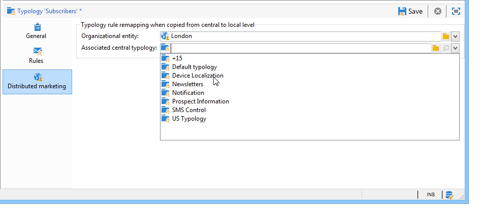

# Aplicar regras de tipologia{#applying-rules}

## Aplicar uma tipologia a um delivery {#apply-a-typology-to-a-delivery}

Para aplicar as regras de tipologia criadas, associe-as a uma tipologia e, em seguida, faça referência a essa tipologia no seu delivery.

Para fazer isso, siga as etapas abaixo:

1. Crie uma tipologia de campanha.

   As tipologias são acessadas pelo **[!UICONTROL Administration > Campaign Management > Typology management]** > **[!UICONTROL Typologies]** pasta do explorador do Campaign.

1. Vá para a guia **[!UICONTROL Rules]**, clique no botão **[!UICONTROL Add]** e selecione as regras a serem aplicadas com esta tipologia.

   

1. Salve a tipologia: ela será adicionada à lista de tipologias existentes.
1. Abra o delivery ao qual deseja aplicar as regras.
1. Navegue até as propriedades do delivery e abra a **[!UICONTROL Typology]** guia.
1. Selecione a tipologia na lista suspensa.

   

   >[!NOTE]
   >
   >A tipologia poderá ser definida no template de delivery para ser aplicada automaticamente a todos os deliveries criados usando esse template.

## Definir condições de aplicação {#define-application-conditions}

Você poderá restringir o campo de aplicação de uma regra de acordo com suas necessidades (exceto para regras de controle).

É possível configurar regras de tipologia para que elas se apliquem apenas a certos deliveries aos quais estejam vinculadas ou a certos recipients entre os alvos de um delivery.

Para definir as condições de aplicação de uma regra, clique no link **[!UICONTROL Edit the rule application conditions...]** na guia **[!UICONTROL General]**.

Em seguida, use o editor de query para definir as condições de filtragem. No exemplo a seguir, a regra de capacidade apresenta apenas os deliveries com a palavra &#39;oferta&#39; em seu rótulo ou deliveries criados antes de 1º de abril de 2013.

>[!NOTE]
>
>Nas regras de filtragem, é possível selecionar a condição do aplicativo de critérios de filtragem: eles podem depender do delivery ou do delivery outline. [Saiba mais](filtering-rules.md#condition-a-filtering-rule).

## Ajustar a frequência de cálculo {#adjust-calculation-frequency}

As arbitragens são reexecutadas automaticamente todas as noites através do workflow de limpeza de banco de dados. No entanto, os valores podem ser salvos além desse período.

De fato, alguns cálculos usam valores que não são alterados diariamente. Portanto, seria irrelevante para os dados recalcular todos os dias e sobrecarregar o banco de dados para nada. Por exemplo, se um processo enriquece o banco de dados de marketing com pontuações do cliente e informações de compra em uma base semanal, os dados baseados nesses valores não precisarão serem recalculados todos os dias.

Para fazer isso, o campo **[!UICONTROL Frequency]** da guia **[!UICONTROL General]** permite a definição de um período máximo durante o qual o targeting é salvo. Por padrão, o valor **0** indica que o cálculo permanece válido até a próxima execução de uma nova arbitragem diária.

Para salvar os resultados além deste período, insira um valor maior do que 12 no campo **[!UICONTROL Frequency]**: depois que esse período expirar, todas as regras serão reaplicadas.

A opção **[!UICONTROL Re-apply the rule at the start of personalization]** permite a aplicação automática da regra durante a fase de personalização, incluindo se o período declarado no campo **[!UICONTROL Frequency]** ainda for válido.

## Selecionar a fase de aplicação da regra {#selecting-the-rule-application-phase}

As regras de tipologia são aplicadas em uma sequência específica durante as fases de direcionamento, análise e personalização dos envios.

### Ordem de execução {#execution-order}

No modo de operação padrão, as regras são aplicadas na seguinte sequência:

1. Regras de controle, se elas forem aplicadas no início do direcionamento.
1. Regras de filtragem:

   * Regras de aplicações nativas para qualificação de endereço: endereço definido / endereço não verificado / endereço incluído na lista de bloqueios / endereço em quarentena / qualidade do endereço.
   * Filtrar regras definidas pelo usuário.
   * Regra de desduplicação no endereço ou identificador (aplicado se necessário).

1. Regras de pressão.
1. Regras de capacidade.
1. Regras de controle, se elas forem aplicadas no final do direcionamento.
1. Regras de controle, se elas forem aplicadas ao início da personalização. Se as regras dos usuários (filtragem/pressão/capacitive) expiraram e precisam de recálculo, elas são aplicadas durante esta etapa.
1. Regras de controle, se elas forem aplicadas ao final da personalização.

>[!NOTE]
>
>Ao trabalhar com o módulo Campaign Interaction, regras de elegibilidade de oferta são aplicadas ao mesmo tempo que as regras de filtragem (para ofertas encontradas em delivery outlines) ou durante a fase de personalização, durante a chamada para o mecanismo de oferta.

É possível adaptar a sequência da execução das regras que têm o mesmo tipo ao usar o campo apropriado na guia **[!UICONTROL General]** da regra. Quando várias regras são executadas durante a mesma fase de processamento de mensagens, é possível configurar a sequência de execução no campo **[!UICONTROL Execution sequence]**.

Por exemplo, uma regra de pressão com ordem de execução de 20 é executada antes de uma regra de pressão com ordem de execução de 30.

### Regras de controle {#control-rules}

Para **[!UICONTROL Control]** regras, é possível decidir em qual ponto do ciclo de vida do delivery ela é aplicada: antes ou depois do direcionamento, no início da personalização, no final da análise. Na guia **[!UICONTROL Phase]** da regra de tipologia, selecione o valor a ser aplicado na lista suspensa do campo **[!UICONTROL General]**.

Os valores possíveis são:

* **[!UICONTROL At the start of targeting]**

  Para evitar que a etapa de personalização seja executada no caso de erros, é possível aplicar a regra de controle aqui.

* **[!UICONTROL After targeting]**

  Se é necessário saber o target para aplicar a regra de controle, selecione essa fase.

  Por exemplo, a regra de controle **[!UICONTROL Check proof size]** se aplica após cada estágio do targeting: essa regra impede a personalização da mensagem se houver muitos recipients de prova.

* **[!UICONTROL At the start of personalization]**

  Essa fase deve ser selecionada se o controle envolver a aprovação da personalização da mensagem. A personalização da mensagem é realizada durante a fase de análise.

* **[!UICONTROL At the end of the analysis]**

  Quando uma verificação exige a personalização da mensagem para ser concluída, selecione essa fase.

## Configurações adicionais {#additional-configurations}

### Controle o tráfego SMTP de saída {#control-outgoing-smtp-traffic}

Como opção, é possível usar o campo **[!UICONTROL Managing affinities with IP addresses]** para vincular os deliveries ao servidor de deliveries (MTA) dessa afinidade. Isso permite a restrição do número de emails para envios específicas em máquinas ou endereços de saída.

>[!NOTE]
>
>O gerenciamento de afinidade não se aplica às tipologias de **[!UICONTROL Filtering]**.

<!--
>Affinities are defined in the instance configuration file, on the Adobe Campaign server. For more on this, refer to [this section](../../installation/using/about-initial-configuration.md).-->

### Otimização de campanha e Marketing distribuído {#campaign-optimization-and-distributed-marketing}

A guia **[!UICONTROL Distributed Marketing]** permite definir o remapeamento de tipologias e/ou regras que se aplicam quando uma campanha compartilhada é solicitada e/ou reservada. As tipologias/regras definidas para uma entidade local (vinculada àqueles definidos para a entidade central) substituem as regras/tipologias vinculadas à entidade central. O remapeamento permite adaptar regras da entidade central às entidades locais que solicitam a campanha.

>[!NOTE]
>
>Em tipologias e regras de tipologia, a guia **[!UICONTROL Distributed Marketing]** será adicionada caso a licença inclua essa opção: verifique o contrato de licença.\
>Para obter mais informações sobre Marketing distribuído, consulte [nesta seção](../distributed-marketing/about-distributed-marketing.md).
