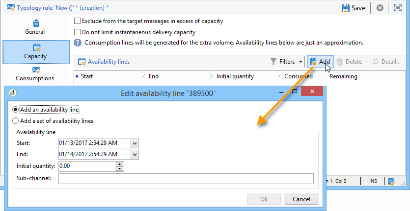
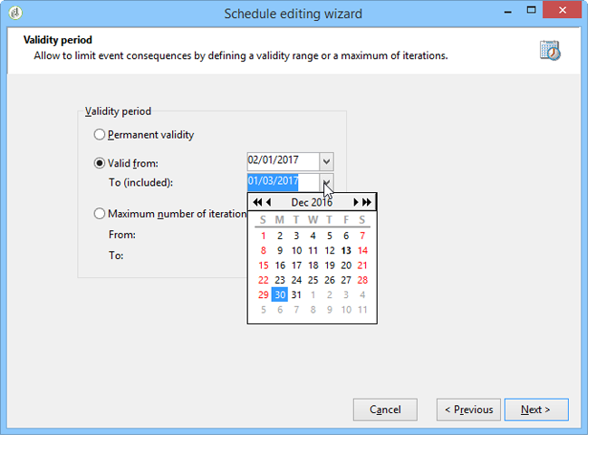
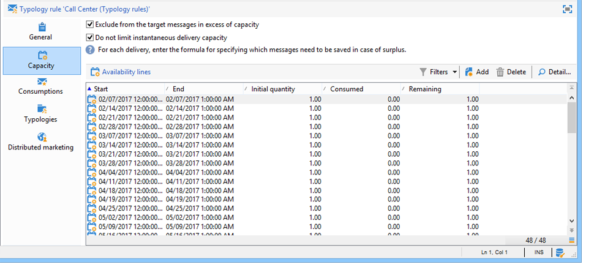

# Regras de consistência{#consistency-rules}

O Adobe Campaign garante comunicações consistentes graças a um conjunto de regras contidas nas tipologias de campanha. Seu objetivo é controlar as entregas enviadas aos destinatários, como volume, natureza, relevância etc.

As regras de **Capacidade** podem evitar sobrecarga na plataforma relacionada com a entrega de mensagens. Como exemplo, as ofertas especiais que contêm um link de download não devem ser enviadas para muitas pessoas de uma só vez, para evitar a saturação do servidor; as campanhas por telefone não devem exceder a capacidade de processamento das centrais de atendimento etc.

## Controlar capacidade {#control-capacity}

Antes de enviar mensagens, você precisa garantir que sua organização tenha a capacidade (infraestrutura física) para processar o delivery, as respostas que o delivery pode gerar (mensagens de entrada) e o número de chamadas a serem feitas para entrar em contato com assinantes (capacidade de processamento da central de chamadas), por exemplo.

Para fazer isso, crie **[!UICONTROL Capacity]** regras de tipologia.

No exemplo a seguir, criamos uma regra de tipologia para uma campanha de fidelidade por telefone. Restringimos o número de mensagens a 20 por dia, ou seja, a capacidade diária de processamento de uma central de chamadas. Uma vez que a regra tenha sido aplicada a duas entregas, poderemos monitorar o consumo por meio de logs.

Para projetar uma nova regra de capacidade, siga as etapas abaixo:

1. No **[!UICONTROL Administration > Campaign management > Typology management > Typology rules]** , clique em **[!UICONTROL New]**.
1. Selecione um tipo de regra **[!UICONTROL Capacity]**.

   

1. Na guia **[!UICONTROL Capacity]**, crie as linhas de disponibilidade: no nosso exemplo, há períodos durante os quais as chamadas podem ser feitas. Selecione um período de 24 horas e insira 150 na quantidade inicial, o que significa que a central de chamadas é capaz de atender 150 chamadas por dia.

   

   >[!NOTE]
   >
   >As linhas de disponibilidade são somente para fins de informação. Caso precise excluir mensagens quando o limite de capacidade for atingido, consulte [esta seção](#exclude-messages-when-capacity-limit-reached).

1. Associe esta regra a uma tipologia e, em seguida, faça referência à tipologia em sua entrega para aplicar essa regra de capacidade. Para obter mais informações, consulte [esta seção](apply-rules.md#apply-a-typology-to-a-delivery).
1. É possível monitorar o consumo a partir das guias de regra **[!UICONTROL Consumptions]** e **[!UICONTROL Capacity]**.

   Quando uma regra é usada em uma entrega, as colunas **[!UICONTROL Consumed]** e **[!UICONTROL Remaining]** fornecem informações sobre a carga, conforme mostrado abaixo:

   

   Para obter mais informações, consulte [esta seção](#monitor-consumption).

## Definir a carga máxima {#define-the-maximum-load}

Para definir a carga máxima, você precisa definir linhas de disponibilidade. Para fazer isso, duas opções estão disponíveis: você pode [criar uma ou mais linhas de disponibilidade](#add-availability-lines-one-by-one) ou crie intervalos de disponibilidade. A frequência desses períodos pode ser automatizada. [Saiba mais](#add-a-set-of-availability-lines).

### Adicionar linhas de disponibilidade uma por uma {#add-availability-lines-one-by-one}

Para criar uma linha de disponibilidade, clique no botão **[!UICONTROL Add]** e selecione **[!UICONTROL Add an availability line]**. Insira o período de disponibilidade e a carga disponível.

Adicione quantas linhas forem necessárias para atender a capacidade de processamento.

### Adicione um conjunto de linhas de disponibilidade {#add-a-set-of-availability-lines}

Para definir os períodos de disponibilidade por um tempo determinado, clique no botão **[!UICONTROL Add]** e selecione a opção **[!UICONTROL Add a set of availability lines]**. Indique uma duração para cada período e o número de períodos a serem criados.

Para automatizar a frequência de criação de página, clique no botão **[!UICONTROL Change]** e defina o cronograma do período.

Por exemplo, vamos definir um agendamento para criar períodos de disponibilidade para todos os dias de trabalho com uma taxa de 10 chamadas por hora entre as 9h e as 17h. Para fazer isso, siga as etapas abaixo:

1. Selecione o tipo de periodicidade e os dias e horas durante o qual é válido:

   

1. Indique as datas de validade:

   

1. Verifique o agendamento antes de aprovar:

   

O fluxo de trabalho **[!UICONTROL Forecasting]** cria automaticamente todas as linhas correspondentes.

>[!NOTE]
>
>Recomendamos a criação de linhas de disponibilidade por meio de importações de arquivo. Esta guia permite visualizar e verificar linhas de consumo.

## Excluir mensagens quando o limite de capacidade for atingido {#exclude-messages-when-capacity-limit-reached}

As linhas de disponibilidade são somente para fins de informação. Para excluir mensagens em excesso, marque a opção **[!UICONTROL Exclude from the target messages in excess of capacity]**. Isso evita que a capacidade seja excedida. Para a mesma população que no exemplo anterior, o consumo e a capacidade restantes não devem exceder a quantidade inicial:

O número máximo de mensagens que podem ser processadas é dividido uniformemente no intervalo de disponibilidade definido. Isso é particularmente relevante para centrais de atendimento, pois seu número máximo de chamadas por dia é limitado. No caso de entregas de email, a opção **[!UICONTROL Do not limit instantaneous delivery capacity]** permite ignorar esse intervalo de disponibilidade e enviar seus emails ao mesmo tempo.

>[!NOTE]
>
>No caso de uma sobrecarga, as mensagens salvas serão selecionadas de acordo com a fórmula definida nas propriedades da entrega.

## Monitorar consumo {#monitoring-consumption}

Por padrão, as regras de capacidade são somente para fins de indicação. Selecione a opção **[!UICONTROL Exclude messages in excess of capacity from the target]** para impedir que a carga definida seja excedida. Nesse caso, as mensagens em excesso serão excluídas automaticamente das entregas usando essa regra de tipologia.

Para monitorar o consumo, visualize os valores exibidos na coluna **[!UICONTROL Consumed]** da guia **[!UICONTROL Capacity]** na regra de tipologia.

Para exibir linhas de consumo, clique na guia **[!UICONTROL Consumptions]** na regra.
