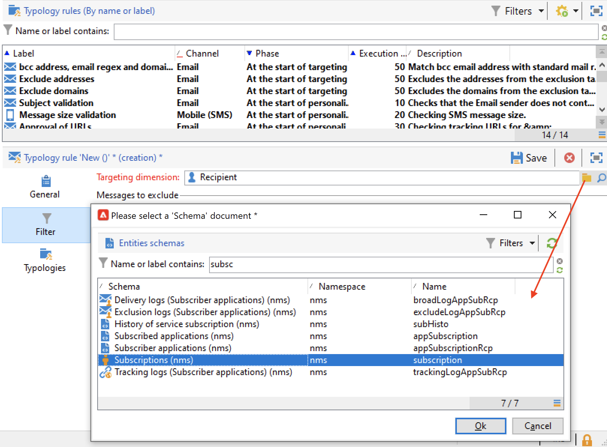
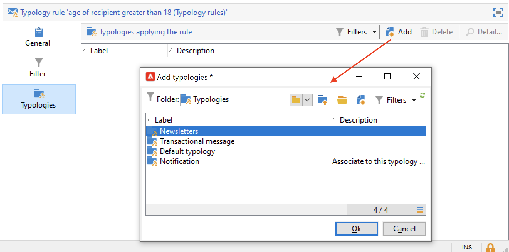

# Regras de filtragem{#filtering-rules}

Use as regras de filtragem para selecionar as mensagens a serem excluídas com base nos critérios definidos em uma query. Essas regras estão vinculadas a uma targeting dimension.

As regras de filtragem podem estar vinculadas a outros tipos de regras (controle, pressão etc.) em tipologias ou agrupadas em uma tipologia **Filtragem** dedicada. [Saiba mais](#create-and-use-a-filtering-typology).

## Criar uma regra de filtro {#create-a-filtering-rule}

Por exemplo, você pode filtrar os assinantes do boletim informativo para evitar que as comunicações sejam enviadas a destinatários menores de idade.

Para definir esse filtro, aplique as seguintes etapas:

1. Navegue até a pasta **[!UICONTROL Administration > Campaign management > Typology management > Typology rules]** do explorador do Campaign e clique no ícone **Novo** para criar uma regra de tipologia.
1. Crie uma regra de tipologia **[!UICONTROL Filtering]** aplicável a todos os canais.

   

1. Na guia **Filtro**, altere o targeting dimension padrão para **Assinaturas** (**nms:subscription**).

   

1. Crie o filtro usando o link **[!UICONTROL Edit the query from the targeting dimension...]**.

   

1. Filtre a página do recipient e salve a condição de filtragem.

   

1. Na guia **Typologies**, vincule esta regra a uma tipologia de campanha e salve-a.

   

Quando essa regra for usada em uma entrega, os assinantes menores de idade serão excluídos automaticamente. Uma mensagem específica indica quando a regra é aplicada:

## Condicionar uma regra de filtro {#condition-a-filtering-rule}

Você poderá restringir o campo da aplicação na regra de filtragem com base na entrega ou na estrutura de entrega vinculada.

Para fazer isso, vá para a guia **[!UICONTROL General]** da regra de tipologia, selecione o tipo de restrição a ser aplicado e crie o filtro.
<!--

-->

Nesse caso, mesmo que a regra esteja vinculada a todas as entregas, ela só será aplicada àquelas que correspondam aos critérios do filtro definido.

>[!NOTE]
>
>As regras de filtragem e tipologia podem ser usadas em um fluxo de trabalho, na atividade **[!UICONTROL Delivery outline]**. [Saiba mais](../workflow/delivery-outline.md).

## Criar e usar uma tipologia de filtro {#create-and-use-a-filtering-typology}

É possível criar tipologias **[!UICONTROL Filtering]**: elas contêm apenas regras de filtragem.

Essas tipologias específicas podem ser vinculadas a uma entrega quando o target for selecionado: no assistente da entrega, clique no link **[!UICONTROL To]** e, em seguida, na guia **[!UICONTROL Exclusions]**.

Em seguida, selecione o filtro a ser aplicado à entrega. Para fazer isso, clique no botão **[!UICONTROL Add]** e selecione as tipologias a serem aplicadas.

Você também poderá vincular regras de filtragem diretamente por meio desta guia, sem que sejam agrupadas em uma tipologia. Para fazer isso, use a seção inferior da janela.

>[!NOTE]
>
>Somente as regras de filtragem e de tipologia estarão disponíveis na janela de seleção.
>
>Essas configurações podem ser definidas no template de entrega a ser aplicado automaticamente a todas as novas entregas criadas usando o template.
>

## Regras padrão de exclusão de entrega {#default-deliverability-exclusion-rules}

Duas regras de filtragem estão disponíveis por padrão: **[!UICONTROL Exclude addresses]** ( **[!UICONTROL addressExclusions]** ) e **[!UICONTROL Exclude domains]** ( **[!UICONTROL domainExclusions]** ). Durante a análise de e-mail, essas regras comparam os endereços de e-mail do destinatário com os endereços proibidos ou nomes de domínio contidos em uma lista de supressão global criptografada gerenciada na instância de entrega. Se houver algum positivo, a mensagem não será enviada para esse destinatário.

Isso evita a inclusão na lista de bloqueios devido a atividades mal-intencionadas, especialmente o uso de um Spamtrap. Por exemplo, se um Spamtrap for usado para se inscrever em um dos seus formulários web, um email de confirmação será enviado automaticamente para esse Spamtrap e resultará na inclusão automática do endereço utilizado à lista de bloqueios.

>[!NOTE]
>
>Os endereços e os nomes de domínio contidos na lista de supressão global estão ocultos. Somente o número de destinatários excluídos é indicado nos logs de análise de entrega.
