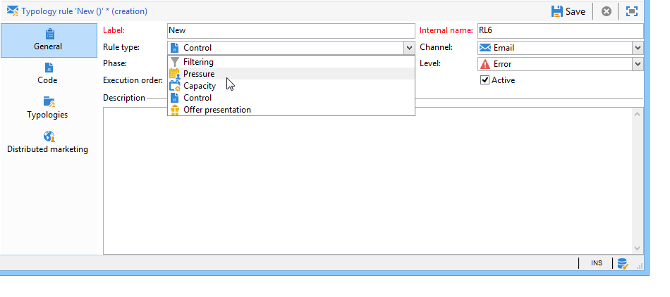
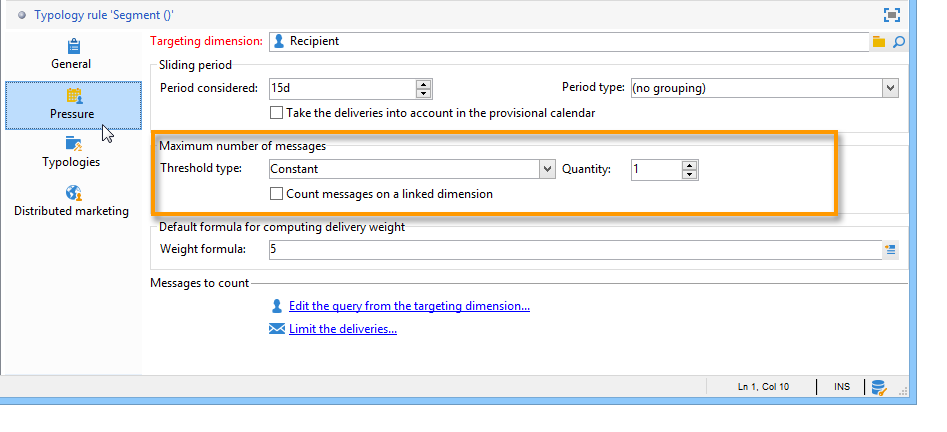
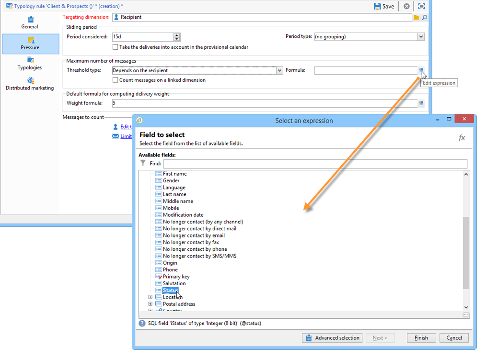
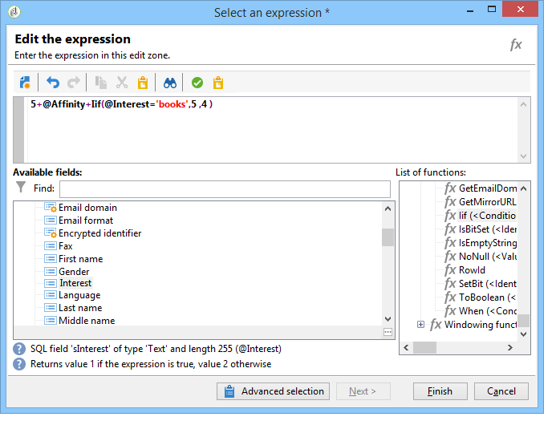

# Regras de pressão{#pressure-rules}

A implementação do gerenciamento de regras de pressão permite evitar o excesso de solicitações de população no banco de dados, também conhecido como fadiga da marca. Para fazer isso, você pode definir um número máximo de mensagens por recipient. Também permite implementar regras de arbitragem entre campanhas, para enviar a melhor mensagem para o público-alvo.

Regras de **pressão** para gerenciar a fadiga da marca, por exemplo: para restringir o número de cartas a serem enviadas a uma população, tanto para selecionar a comunicação que melhor corresponde aos interesses de um grupo de assinantes, quanto para evitar o envio de um SMS para um cliente insatisfeito etc.

As campanhas são selecionadas com base nos limites definidos e no peso da mensagem.

* Um limite é o número mais alto de deliveries autorizado para um determinado recipient dentro de um determinado período. Ele pode ser definido ou variável. Ele é definido ou calculado nas configurações da regra de tipologia. [Saiba mais](#maximum-number-of-messages).
* Os pesos do delivery permitem identificar deliveries de alta prioridade dentro da estrutura do gerenciamento de pressão. As mensagens com o peso mais alto têm prioridade. [Saiba mais](#message-weight).

A arbitragem consiste em garantir que campanhas agendadas com peso maior do que a campanha em andamento não gerem solicitações de perfil excessivas: se esse for o caso, o perfil será excluído do delivery.

Os critérios de arbitragem (peso e/ou limite da mensagem) podem variar com base em dois tipos de informações:

* preferência de recipient, que são informações declarativas: assinaturas de boletim informativo, status do recipient (cliente ou prospecto),
* comportamento do recipient: compras, links visitados etc.

A regra de arbitragem para definir mensagens qualificadas é aplicada durante o estágio de análise. Para cada recipient e para o período em questão, a mensagem será enviada se a seguinte fórmula for verdadeira: **(number of messages sent) + (number of messages with a greater weight) &lt; threshold**.

Caso contrário, o recipient será **[!UICONTROL Excluded by arbitration]**. [Saiba mais](#exclusion-after-arbitration).

## Criar uma regra de pressão {#create-a-pressure-rule}

Para configurar arbitragem entre campanhas usando o Adobe Campaign, comece criando tipologias de campanha e definindo regras de tipologia vinculadas (regras de **Pressão**).

Para criar e configurar uma regra de tipologia **[!UICONTROL Pressure]**, siga estas etapas:

1. Na lista de regras de tipologia de campanha, selecione o **[!UICONTROL New]** acima da lista.

   

1. Na guia **[!UICONTROL General]** da nova regra, selecione uma regra de tipo **Pressure** e digite um nome e uma descrição para ela.

   

1. Altere a ordem de execução se necessário. Quando várias regras de tipologia são aplicadas como um conjunto **[!UICONTROL Typology]**, as regras de menor posição são aplicadas primeiro. [Saiba mais](apply-rules.md#execution-order).
1. Na seção **[!UICONTROL Calculation parameters]**, defina uma frequência se quiser salvar o targeting para além da próxima execução diária de nova arbitragem. [Saiba mais](apply-rules.md#adjust-calculation-frequency).
1. Clique na guia **[!UICONTROL Pressure]** e escolha o período do calendário durante o qual a regra de tipologia se aplica.

   

   A regra será aplicada aos deliveries cuja data de contato está incluída no período relacionado.

   >[!NOTE]
   >
   >Os deliveries agendados não são considerados.

1. Defina o método para calcular o número mais alto de mensagens.

   O limite representa o número mais alto de mensagens que podem ser enviadas para um recipient durante o período relacionado.

   Por padrão, o limite é constante e você precisa indicar um número máximo de mensagens autorizadas pela regra.

   

   Para definir um limite de variável, selecione o valor **[!UICONTROL Depends on the recipient]** no campo **[!UICONTROL Type of threshold]** e use o ícone à direita para abrir o editor de expressão.

   

   Para obter mais informações, consulte [Número máximo de mensagens](#maximum-number-of-messages).

1. Especifique o método para calcular o peso do delivery.

   Cada delivery tem um peso, ou seja, um valor que representa seu nível de prioridade: isso permite a arbitragem entre campanhas. Os pesos são calculados usando a fórmula definida na regra de tipologia e/ou em suas propriedades. [Saiba mais](#message-weight).

1. Por padrão, todas as mensagens são consideradas para o cálculo do limite. A guia **[!UICONTROL Restriction]** permite filtrar as mensagens relacionadas à regra de tipologia:

   * A seção superior desta guia permite restringir os recipients relacionados.
   * A seção inferior desta guia permite que você filtre as mensagens a serem contadas.

      No exemplo a seguir, somente os recipients salvos na pasta **NewContacts** são considerados, sendo relacionados os deliveries que começam com **Newsletter**.
   

1. A guia **[!UICONTROL Typologies]** permite visualizar as tipologias de campanha que aplica essa regra ou vincular a regra a uma ou mais tipologias existentes. [Saiba mais](campaign-typologies.md#apply-typologies).

## Definir limites e pesos {#define-thresholds-and-weights}

### Número máximo de mensagens {#maximum-number-of-messages}

Cada regra de pressão define um limite, ou seja, o número máximo de mensagens que podem ser enviadas para um recipient em um determinado período de tempo. Depois que esse limite for atingido, não poderá ocorrer mais deliveries até que o final do período seja considerado. Esse processo permite que você exclua automaticamente um recipient de um delivery se uma mensagem exceder o limite definido, evitando assim um excesso de solicitações.

Os valores de limite podem ser constantes ou calculados por uma fórmula com variáveis. Isso significa que, para um determinado período, os limites podem variar de um recipient para outro ou até mesmo para o mesmo recipient.

>[!CAUTION]
>
>Inserir **0** como limite impede todos os deliveries ao público alvo durante o período considerado.

**Exemplo:**

Você pode indexar o número de mensagens autorizadas de acordo com o segmento ao qual pertence o recipient. Isso significa que um recipient pertencente ao segmento da web pode receber mais mensagens do que outros recipients. Uma fórmula do tipo **[!UICONTROL Iif (@origin='Web', 5, 3)]** autoriza o delivery de 5 mensagens a recipients e 3 para outros segmentos. A configuração será a seguinte:

Para definir o limite, você pode usar uma dimensão vinculada ao targeting dimension: por exemplo, para incluir mensagens enviadas aos perfis de recipients armazenados na tabela de visitantes (para saber mais sobre a tabela de visitantes, consulte (esta seção) (pesquisas/uso/caso de uso — criação-a-consulte-um-friend-form.md)) ou para evitar o envio de mais de uma mensagem por semana para a mesma família de recipients, (o que pode significar vários endereços de email) identificada em uma dimensão vinculada aos recipients.

Para fazer isso, selecione a opção **[!UICONTROL Count messages on a linked dimension]** e selecione a tabela de visitantes ou de contatos.

### Peso da mensagem {#message-weight}

Cada delivery tem um peso que representa seu nível de prioridade. Por padrão, o peso de um delivery é definido como 5. As regras de pressão permitem definir o peso dos deliveries aos quais serão aplicados.

Os pesos podem ser definidos ou calculados por meio de uma fórmula para se adequar aos recipients. Por exemplo, você pode definir o peso de um delivery com base nos interesses do recipient.

>[!CAUTION]
>
>O peso definido em uma regra de tipologia pode ser sobrecarregado individualmente para cada delivery, na guia **[!UICONTROL Properties]**. Clique na guia **[!UICONTROL Typology]** para selecionar a tipologia de campanha e, se necessário, especifique o peso a ser aplicado.\
>No entanto, o peso declarado em uma regra de tipologia A não será usado para calcular uma regra de tipologia B: esse peso irá se referir apenas aos deliveries que usam a regra A.

**Exemplo:**

No exemplo a seguir, queremos vincular o peso das newsletters sobre música ao escore de propensão dos recipients. Para fazer isso:

1. Crie um novo campo para armazenar escores de propensão do recipient. O campo, **@Music** neste caso, será enriquecido com respostas de pesquisas e questionários on-line, dados de rastreamento coletados, etc.
1. Crie uma regra de tipologia para calcular o peso da mensagem com base nesse campo.

   

1. Aplique esta regra a mensagens com os seguintes tópicos: newsletters, ofertas especiais etc. O peso desses deliveries e, portanto, o nível de prioridade, dependerão do escore de propensão de cada recipient.

## Definir o período {#setting-the-period}

As regras de pressão são definidas em períodos de **n** dias consecutivos.

O período é configurado na guia **[!UICONTROL Pressure]** da regra. Você pode especificar o número de dias e, se necessário, selecionar o tipo de agrupamento a ser aplicado (dia, semana, mês, trimestre, etc.).

O tipo de agrupamento permite estender o campo **[!UICONTROL Period considered]** para todo o dia, semana, mês ou ano para datas do período.

Por exemplo, uma regra de pressão que define um limite de 2 mensagens por semana, com um agrupamento para cada mês, impedirá o delivery de mais de 2 mensagens na mesma semana E no mesmo mês. Aviso, se o período se sobrepõe dois meses, o limite de cálculo leva em consideração os deliveries desses dois meses e, portanto, poderá impedir todos os novos deliveries durante o segundo mês.

>[!CAUTION]
>
>Somente os deliveries já enviados são considerados ao calcular o limite.

Para restringir os deliveries considerados para um período de 2 semanas, insira **15.º-D** no **[!UICONTROL Concerned period]** campo : os deliveries enviados até duas semanas antes da data do delivery no qual a regra é aplicada serão considerados no cálculo

A data de início do período depende de como o banco de dados está configurado.

Por exemplo, ao aplicar uma regra de pressão de 15 dias sem agrupar a um delivery com data 11/12, serão considerados os deliveries entre 27/11 e 12/12. Se a regra de pressão considerar os envios do calendário provisional, todas as programações entre 27/11 e 27/12 são consideradas. Por fim, ao configurar na regra um agrupamento por mês, todos os envios em novembro e dezembro são considerados para calcular o limite (de 01/11 a 31/12).

**Casos frequentes**

Para garantir que os deliveries da semana atual do calendário não sejam levados em conta, assim como também não correr o risco de considerar a semana anterior no limite de cálculo, especifique o **[!UICONTROL Period considered]** como &quot;0&quot; e selecione &quot;Grouping per calendar week&quot; como o **[!UICONTROL Period type]**.

Quando um período é maior que 0 (1 por exemplo), o limite de cálculo pode considerar os envios do dia anterior. Portanto, se o dia anterior corresponde à semana do calendário anterior e o tipo de período selecionado é o &#39;Agrupamento por semana do calendário&#39;, então toda a semana anterior é considerada para o limite de cálculo.

**Exemplo:**

Para criar uma regra de pressão que restringe a solicitação de 3 mensagens por período 2 semanas, com um agrupamento por mês do calendário.

São usados 6 boletins com o mesmo peso, programados para 30/05, 03/06, 08/06, 12/06, 22/06 e 30/06.

Os deliveries programados para os dias 12 e 30 de junho não podem ser realizados: o delivery de 12/06 excede o limite de 3 mensagens por período de 2 semanas e o delivery do dia 30 excede o limite de comunicações autorizadas por mês.

Todos os recipients desses envios são excluídos por arbitragem durante a fase de análise:

Para a mesma regra, ao agrupar os envios por trimestre, os recipients do **newsletter no.5** também devem ser excluídos e não podem ser enviados.

Finalmente, se nenhum agrupamento for selecionado, somente o **newsletter no.4** não pode ser enviado, já que foi programado para o mesmo período de 2 semanas que os três primeiros boletins.

>[!NOTE]
>
>Ao altera a definição de uma regra de tipologia, é possível criar uma **Simulation** para controlar o impacto sobre os envios aplicados e monitorar o impacto que os envios têm em cada um. [Saiba mais](campaign-simulations.md).

## Exclusão após arbitragem {#exclusion-after-arbitration}

A arbitragem é reaplicada todas as noites através do fluxo de trabalho técnico **[!UICONTROL Forecasting]** e do fluxo de trabalho **[!UICONTROL Campaign jobs]**.

O fluxo de trabalho **[!UICONTROL Forecasting]** pré-calcula os dados do período em andamento (da data de início para a data atual), que permite a aplicação das regras de tipologia durante a análise. Também recalcula os contadores de exclusão para arbitragem a cada noite.

Assim, para cada recipient, o Adobe Campaign verifica se o número de mensagens que devem ser enviadas não excede o limite e assim considera todas as que já foram enviadas no período relacionado. Estas informações são um **indicador**, já que todos os cálculos são atualizados no momento do delivery.

Se esse número excede o limite, as regras de arbitragem definidas na tipologia de campanha são aplicadas e os recipients são excluídos das campanhas com um peso menor.

>[!NOTE]
>
>Se várias entregas alcançam pontuações iguais, a campanha programada para a data mais antiga é enviada.

## Casos de uso em regras de pressão {#use-cases-on-pressure-rules}

### Adaptar o limite com base no critério {#adapt-the-threshold-based-on-criterion}

Criaremos uma regra de tipologia para evitar a entrega de mais de quatro mensagens por semana para clientes e duas mensagens por semana para clientes potenciais.

Para identificar clientes e prospectos, use o campo **[!UICONTROL Status]**, que contém 0 para prospectos e 1 para clientes.

Para criar a regra, aplique as seguintes etapas:

1. Crie uma nova regra de tipologia do tipo **Pressão**.
1. Edite a guia **[!UICONTROL Pressure]**: na seção **[!UICONTROL Maximum number of messages]**, queremos criar uma fórmula para calcular o limite de acordo com cada recipient. Selecione o valor **[!UICONTROL Depends on the recipient]** no campo **[!UICONTROL Threshold type]** e clique em **[!UICONTROL Edit expression]** à direita do campo **[!UICONTROL Formula]**.

   Clique no botão **[!UICONTROL Advanced parameters]** para definir a fórmula de cálculo.

   

1. Selecione a opção **[!UICONTROL Edit the formula using an expression]** e clique em **[!UICONTROL Next]**.

   

1. Na lista de funções, clique duas vezes na função **Iif** no nó **[!UICONTROL Others]**.

   Em seguida, selecione o **Status** dos recipients na seção **[!UICONTROL Available fields]**.

   

   Informe a seguinte fórmula: **Iif(@status=0,2,4)**

   

   Essa fórmula permite atribuir o valor 2 se o status for igual a 0, e o valor 4 para todos os outros status.

   Clique em **[!UICONTROL Finish]** para aprovar a fórmula.

1. Indicar o período durante o qual a regra será aplicada: 7 dias nesse caso, para contar o número de mensagens por semana.

   

1. Salve a regra para aprovar a criação.

Agora vincule a regra que acabou de criar a um tipologia para aplicá-la aos deliveries. Para fazer isso:

1. Crie uma tipologia de campanha.
1. Vá para a guia **[!UICONTROL Rules]**, clique no botão **[!UICONTROL Add]** e selecione a regra que você acabou de criar.

   

1. Salve a tipologia: ela será adicionada à lista de tipologias existentes.

Para usar essa tipologia em seus deliveries, selecione-a nas propriedades de delivery, na guia **[!UICONTROL Typology]**, conforme mostrado abaixo:

>[!NOTE]
>
>A tipologia poderá ser definida no template de delivery para ser aplicada automaticamente a todos os deliveries criados usando esse template.

Durante a análise de delivery, os recipients do delivery são excluídos, se aplicável, dependendo do número de deliveries já enviados para eles. Para visualizar essas informações, você poderá:

* Visualizar o resultado da análise:

   

* Edite o e clique na guia **[!UICONTROL Delivery]** Delivery e na subguia **[!UICONTROL Exclusions]**:

   

* Clique na guia **[!UICONTROL Audit]** e, em seguida, na subguia **[!UICONTROL Causes of exclusions]** para exibir o número de exclusões e as regras de tipologia aplicadas:

   

### Calcular o peso do delivery com base no comportamento {#calculate-the-delivery-weight-based-on-behavior}

Você pode definir regras de pressão com base no comportamento do recipient: assim, o peso de um delivery pode se adaptar a critérios que variam de um recipient a outro. Você pode decidir enviar uma mensagem dependendo se um recipient visitou o seu site de Internet, clicou em uma seção específica do último boletim informativo, se inscreveu em um serviço de informação ou até mesmo com base nas respostas de uma pesquisa, um jogo online etc.

No exemplo a seguir, um delivery com um peso de 5 é criado. Esse peso é melhorado com pontuações de propensão com base no comportamento do recipient: os clientes que já compraram neste site tem uma pontuação de 5, enquanto os clientes que nunca compraram online terão uma pontuação de 4.

Para executar esse tipo de configuração, é necessário usar uma fórmula para definir o peso da mensagem. As informações sobre pontuações de propensão e as respostas da pesquisa devem ser acessíveis no modelo de dados. No exemplo, o campo **Propensity** foi adicionado.

Aplique as seguintes etapas de configuração:

1. Crie uma nova regra de tipologia do tipo **Pressão**.
1. Edite a guia **[!UICONTROL Pressure]**. Para criar uma fórmula de limite que será baseada em cada recipient individual: clique no ícone **[!UICONTROL Edit expression]** à direita do campo **[!UICONTROL Weight formula]**.

   

1. Por padrão, o valor **5** é mostrado na seção superior do editor de expressão. Queremos adicionar a pontuação de propensão de cada recipient a esse peso: coloque o cursor à direita do 5, insira o caractere **+** e selecione o campo **Propensity** .

   

1. Em seguida, adicione um valor maior para recipients que já fizeram uma compra. Para eles, o peso do delivery deverá ser aumentado em 5, enquanto para os outros o aumento será de somente 4.

   

1. Clique em **[!UICONTROL Finish]** para salvar essa regra.
1. Vincule a regra a uma tipologia de campanha e faça referência a essa tipologia em uma entrega para aprová-la.

### Enviar somente as mensagens com maior peso {#send-only-the-highest-weighted-messages}

Você deseja enviar não mais do que 2 mensagens na mesma semana, com um limite de 2 mensagens por dia a cada um dos recipients, e você deseja que apenas as mensagens com pesos maiores sejam entregues.

Para fazer isso, é necessário agendar vários deliveries com pesos diferentes para o mesmo recipient e aplicar uma regra de pressão para excluir os deliveries com pesos menores.

Primeiro, configure a regra de pressão.

1. Criar uma regra de pressão. [Saiba mais](#create-a-pressure-rule).
1. Na guia **[!UICONTROL General]**, selecione a opção **[!UICONTROL Re-apply the rule at the start of personalization]**. 

   

   Essa opção anula o valor definido no campo **[!UICONTROL Frequency]** e aplica a regra automaticamente durante a fase de personalização. [Saiba mais](apply-rules.md#adjust-calculation-frequency).

1. Na guia **[!UICONTROL Pressure]**, defina **[!UICONTROL 7d]** como **[!UICONTROL Period considered]**, e **[!UICONTROL Grouping per day]** como **[!UICONTROL Period type]**.
1. Na guia **[!UICONTROL Typologies]**, vincule a regra a uma tipologia de campanha.
1. Salve as alterações.

Agora, crie e configure um workflow para cada delivery em que a regra de pressão é aplicada.

1. Crie uma campanha. [Saiba mais](../campaigns/marketing-campaign-create.md#create-a-campaign).
1. Na guia **[!UICONTROL Targeting and workflows]** da campanha, adicione uma atividade de **Query** ao workflow. Para obter mais informações sobre o uso dessa atividade, consulte [esta seção](../workflow/query.md).
1. Adicione uma atividade **[!UICONTROL Email delivery]** ao workflow e depois a abra. Para obter mais informações sobre o uso dessa atividade, consulte [esta seção](../workflow/delivery.md).
1. Acesse a guia **[!UICONTROL Approvals]** das **[!UICONTROL Delivery properties]** e desative todas as aprovações.

   

1. Na guia **[!UICONTROL Typology]** das **[!UICONTROL Delivery properties]**, consulte a tipologia de campanha à qual aplicar a regra. Defina um peso para o delivery.

   

1. No delivery, clique em **[!UICONTROL Scheduling]** e selecione **[!UICONTROL Schedule delivery (automatic execution when the scheduled date is reached)]**. Neste exemplo, selecione a opção **[!UICONTROL Use a calculation formula]**.
1. Defina a data de extração para 10 minutos (data atual + 10 minutos).
1. Defina a data de contato para o dia seguinte (data atual + 1 dia).

   

   Para implementar as exclusões da regra de pressão com êxito, certifique-se de definir a data e a hora da extração antes da data e hora do contato, assim como antes da arbitragem noturna ser reaplicada. [Saiba mais](#exclusion-after-arbitration).

1. Desmarque a opção **[!UICONTROL Confirm the delivery before sending]** e salve as alterações.
1. Continue de forma semelhante para cada delivery que deve ser enviado. Certifique-se de definir o peso desejado para cada delivery.
1. Execute os workflows relevantes para preparar e realizar os envios.

Quando a arbitragem noturna for aplicada, os deliveries com os pesos menores para o mesmo recipient serão excluídos. Somente os deliveries com o peso mais alto serão considerados para envio. [Saiba mais](#message-weight).

Considerando que um email já tenha sido enviado aos recipients relacionados anteriormente durante a semana, a tabela abaixo mostra um exemplo das configurações que poderão ser aplicadas para duas entregas adicionais.

<table> 
 <thead> 
  <tr> 
   <th> Delivery  </th> 
   <th> Aprovações  </th> 
   <th> Peso  </th> 
   <th> Data/hora de Extração  </th> 
   <th> Data de contato  </th> 
   <th> Data/hora de início do Delivery  </th> 
   <th> Data/hora de execução do workflow de arbitragem  </th> 
   <th> Status do Delivery  </th> 
   <th> Delivery enviado (data/hora)  </th> 
  </tr> 
 </thead> 
 <tbody> 
  <tr> 
   <td> Delivery 1  </td> 
   <td> Desabilitado  </td> 
   <td> 5  </td> 
   <td> 15h  </td> 
   <td> 8h (próximo dia)  </td> 
   <td> 14h  </td> 
   <td> Noturno  </td> 
   <td> Excluído  </td> 
   <td> Excluído  </td> 
  </tr> 
  <tr> 
   <td> Delivery 2  </td> 
   <td> Desabilitado  </td> 
   <td> 10  </td> 
   <td> 16h  </td> 
   <td> 9h (próximo dia)  </td> 
   <td> 14h  </td> 
   <td> Noturno  </td> 
   <td> Sent  </td> 
   <td> 9h (próximo dia)  </td> 
  </tr> 
 </tbody> 
</table>

Após a data de extração haver expirado para os dois deliveries, a arbitragem noturna será reaplicada antes das datas de contato de ambos os deliveries. Isso permite encontrar todos os deliveries já enviados (recipients para os quais um delivery é processado, registrado pelos logs amplos) ou agendados para ser enviados (recipients qualificados para receber um delivery, registrados pelos logs de previsão).

Depois que todos os deliveries enviados e potenciais tiverem sido listados para o período definido na regra de pressão, o Adobe Campaign os classificará por peso, com o maior valor em primeiro lugar. Quando o limite definido na regra de pressão for atingido (aqui, não mais do que 2 emails na mesma semana), os recipients serão excluídos do delivery.
