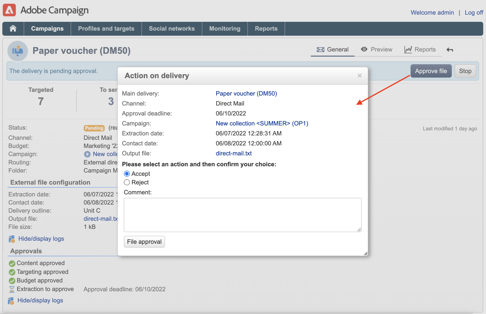

# Configurar e gerenciar o processo de aprovação {#approval-marketing-campaigns}

Métodos e pessoas envolvidas na criação e aprovação de campanhas de marketing são específicos para cada organização. O processo de aprovação de campanha envolve a coordenação de várias partes interessadas: profissionais de marketing digital, gerentes de delivery, gerentes de conteúdo e proprietários externos, como parceiros ou fornecedores.

Com o Adobe Campaign, você pode configurar um fluxo de aprovação para suas campanhas e notificar os operadores quando uma ação for necessária. Você pode definir aprovações para cada etapa de um delivery: direcionamento, conteúdo, orçamento, extração e envio de prova. À medida que os deliveries da campanha passam pelas várias etapas de validação, o Adobe Campaigns compila um histórico de modificações e aprovações, incluindo feedback, comentários, solicitações de alteração e comentários.

As mensagens de notificação são enviadas aos operadores do Adobe Campaign designados como revisores para informá-los de uma solicitação de aprovação.

Os operadores podem aprovar de várias maneiras:

* Na mensagem de notificação. O link no email leva o operador para o Campaign por meio de um navegador da Web. Após a conexão, o revisor pode optar por aprovar ou não o conteúdo.
  

* No painel de campanha.
  

* No painel de delivery.
  

Os operadores podem acessar a campanha e o delivery a partir da janela de aprovação. Eles também podem inserir um comentário.

Depois que um operador é validado, as informações são exibidas nos painéis da campanha e do delivery, bem como nos logs.

As informações também estão disponíveis nos logs de aprovação do delivery e no journal de aprovação da campanha. Esses logs são acessados por meio da variável **[!UICONTROL Edit > Audit > Approvals]** guias.

## Ativar aprovações{#enable-approvals}

As notificações de aprovação são enviadas aos operadores afetados para cada processo para o qual a aprovação foi habilitada.

Eles podem ser ativados para o template de campanha, para cada campanha individualmente ou para um delivery.

Todas as tarefas que exigem aprovação são selecionadas no template de campanha, por meio do  **[!UICONTROL Properties]** > **[!UICONTROL Advanced campaign parameters...]** > **[!UICONTROL Approvals]** guia. Os revisores ou grupos de revisores são selecionados nessa guia. Eles recebem notificações, a menos que essa opção não esteja ativada. [Saiba mais](#approving-processes).

Essas configurações podem ser substituídas para cada campanha criada usando este modelo e individualmente para cada delivery. Navegue pelo **[!UICONTROL Properties]** do delivery, depois o botão **[!UICONTROL Approvals]** guia.

No seguinte exemplo, o conteúdo do delivery não exigirá aprovações:

>[!CAUTION]
>
>Verifique se os revisores têm as **permissões apropriadas** para aprovação e se sua zona de segurança está definida corretamente. [Saiba mais](#selecting-reviewers).

O processo de aprovação de deliveries é detalhado em [nesta seção](#review-and-approve-deliveries).

## Selecionar revisores {#select-reviewers}

Para cada tipo de aprovação, os operadores ou grupos de operadores encarregados da aprovação são selecionados na lista suspensa no delivery. Mais operadores podem ser adicionados usando o link **[!UICONTROL Edit...]**. Essa janela também permite editar o prazo de aprovação. Por padrão, os revisores têm três dias a partir da data de envio para aprovar um processo. Para adicionar um lembrete automático, use o **[!UICONTROL Add a reminder]** link.

Se nenhum revisor for especificado, o proprietário da campanha será responsável pelas aprovações e receberá as notificações. O proprietário da campanha é especificado na variável **[!UICONTROL Edit > Properties]** da campanha:

Todos os outros operadores do Adobe Campaign com **[!UICONTROL Administrator]** Os direitos do também podem aprovar tarefas, mas não recebem notificações.

>[!NOTE]
>
>Por padrão, o proprietário da campanha não pode realizar a aprovação ou iniciar as remessas se os operadores de aprovação tiverem sido definidos. Como administrador do Adobe Campaign, você pode modificar esse comportamento e permitir que os proprietários da campanha aprovem/iniciem deliveries criando o **NmsCampaign_Ativate_OwnerConfirmation** , defina como **1**.

Se uma lista de revisores for definida, uma tarefa será aprovada quando um revisor aprová-la. Em seguida, o link de aprovação não fica mais disponível nos painéis da campanha e do delivery. Quando o envio de notificações estiver habilitado, se outro revisor clicar no link de aprovação na mensagem de notificação, será exibida uma notificação de que outro operador já aprovou a tarefa.

## Revisar e aprovar deliveries {#review-and-approve-deliveries}

Para cada campanha que você puder aprovar o target do delivery, [conteúdo do delivery](#approving-content) e custos. Os operadores do Adobe Campaign responsáveis pela aprovação podem ser notificados por email, podendo aceitar ou rejeitar a aprovação por meio do Console do cliente ou por meio de uma conexão com a web. [Saiba mais](#approving-processes).

Para remessas diretas de mala direta, os operadores do Adobe Campaign podem exibir o arquivo de extração antes que ele seja enviado ao roteador e, se necessário, podem alterar o formato e reenviar a extração. [Saiba mais](#approve-an-extraction-file).

Quando essas fases de validação estiverem concluídas, o delivery poderá ser iniciado. [Saiba mais](marketing-campaign-deliveries.md#starting-a-delivery).

>[!NOTE]
>
>Os processos que exigem uma aprovação são selecionados no template de campanha. [Saiba mais](marketing-campaign-templates.md).
>

### Etapas para aprovar um delivery {#approving-processes}

Os estágios que exigem aprovação aparecem no painel de campanha (por meio do Console do cliente ou da interface da Web). Eles também aparecem na tabela de rastreamento de delivery e no painel do delivery.

Para cada delivery na campanha, você pode aprovar os seguintes processos:

* **Definição de metas, conteúdo e orçamento**

  Quando a variável **[!UICONTROL Enable target approval]**, **[!UICONTROL Enable content approval]** ou **[!UICONTROL Enable budget approval]** forem selecionadas na janela de configurações de aprovação, os links relacionados serão exibidos nos painéis campanha e delivery.

  

  >[!NOTE]
  >
  >A aprovação de orçamento só estará disponível se a aprovação de target estiver habilitada na janela de configurações de aprovação. O link para aprovação do orçamento é exibido somente após o target ter sido analisado.

  Se as opções **[!UICONTROL Assign content editing]** ou **[!UICONTROL External content approval]** forem selecionadas na janela de configurações de aprovação, o painel exibirá os links **[!UICONTROL Available content]** e **[!UICONTROL External content approval]**.

  A aprovação de conteúdo permite que você acesse as provas enviadas.

* **Aprovação de extração (delivery de mala direta)**

  Quando a opção **[!UICONTROL Enable extraction approval]** está selecionada na janela de configurações de aprovação, o arquivo extraído deve ser aprovado antes que o roteador possa ser notificado.

  A variável **[!UICONTROL Approve file]** está disponível nos painéis campanha e delivery.

  

  Você pode visualizar o arquivo de saída antes da validação. A pré-visualização do arquivo de extração mostra apenas uma amostra de dados. O arquivo inteiro não está carregado.

* **Aprovar remessas associadas**

  A variável **[!UICONTROL Enable individual approval of each associated delivery]** for usada para uma entrega principal associada a entregas secundárias. Por padrão, essa opção não está selecionada, para que uma aprovação geral do delivery principal possa ser realizada. Se essa opção estiver selecionada, cada delivery deverá ser aprovado individualmente.

  

>[!NOTE]
>
>Em um workflow de direcionamento, se um erro vinculado a um problema de configuração ocorrer durante a preparação da mensagem, o link **[!UICONTROL Restart message preparation]** será mostrado no painel. Corrija o erro e use este link para reiniciar a preparação da mensagem, ignorando o estágio de definição de metas.

### Aprovar um conteúdo {#approve-content}

>[!CAUTION]
>
>Para aprovar um conteúdo, um ciclo de prova é obrigatório. As provas permitem aprovar a exibição de informações e dados de personalização e verificar se os links estão funcionando.
>
>As funcionalidades de aprovação de conteúdo detalhadas abaixo estão relacionadas ao delivery de prova.

É possível configurar um ciclo de aprovação de conteúdo. Para fazer isso, selecione a opção **[!UICONTROL Enable content approval]** na janela de configurações de aprovação. As principais etapas do ciclo de aprovação de conteúdo são:

1. Depois de criar um novo delivery, o gerente de campanha clica no link **[!UICONTROL Submit content]** no painel de campanha para iniciar o ciclo de aprovação de conteúdo.

   >[!NOTE]
   >
   >Se a opção **[!UICONTROL Enable the sending of proofs]** (para deliveries de email) ou **[!UICONTROL Enable the sending and approval of proofs]** (para deliveries de correspondência direta) foi selecionada na janela de configurações de aprovação, as provas serão enviadas automaticamente.

1. Um email de notificação é enviado para a pessoa responsável pelo conteúdo, que pode escolher se deve ou não aprová-lo:

   * pelo e-mail de notificação: o e-mail de notificação contém um link para as provas já enviadas e possivelmente a renderização da mensagem para os vários webmails se o **Capacidade de entrega** o complemento está habilitado para esta instância.

   * por meio do console do cliente ou da interface da Web, do rastreamento de delivery, do painel de delivery ou do painel de campanha. Este painel da campanha permite exibir a lista de provas que foram enviadas, clicando no link **[!UICONTROL Inbox rendering...]**. Para exibir o conteúdo, clique no ícone **[!UICONTROL Detail]** à direita da lista.

1. Um email de notificação é enviado para a pessoa responsável pela campanha informando se o conteúdo foi aprovado ou não. A pessoa responsável pela campanha pode reiniciar o ciclo de aprovação de conteúdo a qualquer momento. Para fazer isso, clique no link da linha **[!UICONTROL Content status]** do painel da campanha (no nível de delivery) e, em seguida, clique em **[!UICONTROL Reset content approval to submit it again]**.

#### Atribuir edição de conteúdo {#assign-content-editing}

Essa opção permite que você defina uma pessoa encarregada da edição de conteúdo, como um webmaster. Se a opção **[!UICONTROL Assign content editing]** estiver selecionada na janela de configurações de aprovação, várias etapas de aprovação serão adicionadas entre a criação de delivery e o delivery do e-mail de notificação à pessoa encarregada do conteúdo:

1. Depois de criar um novo delivery, a pessoa responsável pela campanha clica no link **[!UICONTROL Submit content editing]** no painel de campanha para iniciar o ciclo de edição de conteúdo.

1. A pessoa responsável pela edição de conteúdo receberá um e-mail informando que o conteúdo está disponível.

1. Em seguida, eles podem fazer logon no console do cliente, abrir o delivery e editá-lo usando um assistente simplificado para alterar o assunto, o conteúdo de HTML e de texto e enviar provas.

   >[!NOTE]
   >
   >Se a opção **[!UICONTROL Enable the sending of proofs]** (para deliveries de email) ou **[!UICONTROL Enable the sending and approval of proofs]** (para deliveries de correspondência direta) foi selecionada na janela de configurações de aprovação, as provas serão enviadas automaticamente.

1. Depois que a pessoa encarregada da edição de conteúdo terminar de fazer alterações no conteúdo do delivery, ela poderá tornar o conteúdo disponível.

   Para fazer isso, é possível usar:

   * o **[!UICONTROL Available content]** no Console do cliente do Adobe Campaign.
   * o link na mensagem de notificação.
O operador pode adicionar um comentário antes de enviar o conteúdo para a pessoa responsável pela campanha.
A mensagem de notificação permite que o revisor aprove ou rejeite o conteúdo.

#### Aprovação de conteúdo externo {#external-content-approval}

Essa opção permite que você defina um operador externo responsável por aprovar a renderização do delivery, como consistência de comunicação da marca, taxas etc. Se a opção **[!UICONTROL External content approval]** estiver selecionada na janela de configurações de aprovação, várias etapas de aprovação serão adicionadas entre a aprovação do conteúdo e o delivery da notificação à pessoa responsável pelo conteúdo:

1. O gerente de conteúdo externo recebe um e-mail de notificação informando que o conteúdo foi aprovado e solicitando aprovação externa.
1. O e-mail de notificação contém links para as provas enviadas, o que permite visualizar a renderização de delivery e um botão para aprovação ou rejeição do conteúdo do delivery.

Esses links só estarão disponíveis se uma ou mais provas tiverem sido enviadas. Caso contrário, a renderização do delivery só estará disponível através do Console do cliente ou da interface da Web.

### Aprovar um arquivo de extração {#approve-an-extraction-file}

Para entregas offline, o Adobe Campaign gera um arquivo de extração que, dependendo de como é configurado, é enviado ao roteador. Seu conteúdo depende do template de exportação usado.

Quando o conteúdo, o direcionamento e o orçamento são aprovados, o delivery é alterado para **[!UICONTROL Extraction pending]** até que o workflow de extração das campanhas seja iniciado.

Na data da solicitação de extração, o arquivo de extração é criado, e o status do delivery muda para **[!UICONTROL File to approve]**.

É possível visualizar o conteúdo do arquivo extraído (clicando no nome), aprová-lo ou, se necessário, alterar o formato e iniciar novamente a extração utilizando os links no painel.

Depois que o arquivo for aprovado, você poderá enviar o email de notificação para o roteador. [Saiba mais](marketing-campaign-deliveries.md#start-an-offline-delivery).

## Modos de aprovação {#approval-modes}

As tarefas podem ser aprovadas no painel de campanha, na guia de rastreamento de delivery, no painel de delivery ou na notificação por email enviada aos revisores.

### Aprovar no painel {#approval-via-the-dashboard}

Para aprovar uma tarefa através do Console do cliente ou da interface da Web, clique no link apropriado no painel de campanha.

Por exemplo, após a execução da análise de delivery:

1. Selecione **[!UICONTROL Approve targeting]**.

1. Na janela pop-up, verifique as informações a serem aprovadas.
1. Selecione **[!UICONTROL Accept]** ou **[!UICONTROL Reject]** e insira um comentário se necessário. Este comentário será exibido nos logs de validação.
1. Confirme sua escolha com o **[!UICONTROL Target approval]** botão.

Se um processo já tiver sido aprovado por outro operador, o link de aprovação não estará disponível.

Se um processo tiver sido rejeitado, as informações serão exibidas no painel de delivery da seguinte maneira:

### Aprovar nas mensagens de notificação {#approval-via-notification-messages}

Para aprovar uma tarefa na [mensagem de notificação](#notifications):

1. Clique no link na notificação.
1. Faça logon no Adobe Campaign.
1. Verifique as informações a serem aprovadas
1. Selecione **[!UICONTROL Accept]** ou **[!UICONTROL Reject]** e insira um comentário se necessário.
1. Validar. Sua escolha e comentário são exibidos nos logs de validação.

>[!NOTE]
>
>Se avisos forem gerados durante o processo, um aviso será exibido na notificação.

### Rastrear a aprovação{#approval-tracking}

Os logs de aprovação estão disponíveis na interface do usuário:

* No log de aprovação da campanha, na subguia **[!UICONTROL Approvals]** da guia **[!UICONTROL Edit > Audit]**:

  

* No log de delivery da campanha, na subguia **[!UICONTROL Deliveries]** da guia **[!UICONTROL Edit > Audit]**:

  

* Para aprovar o status de aprovação de cada delivery, clique na opção **[!UICONTROL Hide/display logs]** da guia **[!UICONTROL Summary]**.

  

* Essas informações também podem ser acessadas através da guia **[!UICONTROL Audit > Approvals]** de cada delivery:

  

>[!NOTE]
>
>Depois que um operador aprovar ou rejeitar uma tarefa, os outros revisores não poderão mais alterá-la.

### Aprovações automáticas/manuais {#automatic-and-manual-approval}

Ao criar um workflow de definição de metas, se a aprovação for automática (modo padrão), o Adobe Campaign exibe o link de aprovação ou envia uma notificação assim que uma aprovação é necessária.

Para escolher o modo de aprovação (manual ou automático), clique na guia **[!UICONTROL Edit > Properties]** da campanha ou do template da campanha e em seguida em **[!UICONTROL Advanced campaign parameters...]** e, por fim, na guia **[!UICONTROL Approvals]**.
par

>[!NOTE]
>
>O modo de aprovação se aplica a todos os deliveries da campanha.

Quando um workflow de direcionamento está sendo criado, a aprovação manual permite que você evite criar links de aprovação ou enviar notificações automaticamente. O painel de campanha oferece um link **[!UICONTROL Submit targeting for approval]** para iniciar o processo de aprovação manualmente.

As mensagens de confirmação permitem autorizar aprovações nas tarefas selecionadas para esse delivery.

Os botões de aprovação são exibidos no painel de campanha (para esse delivery), no painel de delivery e no controle de delivery. Se as notificações estiverem ativadas, elas serão enviadas em paralelo.

Esse método de ativação de aprovações permite que você trabalhe com o direcionamento sem enviar notificações falsas para os revisores.

## Notificações {#notifications}

As notificações são mensagens de e-mail específicas enviadas para os revisores para informá-los de que um processo está pendente de aprovação. Quando o operador clica no link da mensagem, é exibida uma página de autenticação. Após fazer logon, o operador pode exibir as informações e aprovar ou rejeitar a tarefa. Um comentário também pode ser inserido na janela de aprovação.

O conteúdo dos e-mails de notificação pode ser personalizado. Consulte [Conteúdo de notificação](#notification-content).

### Ativar/desativar notificação {#enabling-disabling-notification}

Por padrão, as mensagens de notificação são enviadas se a aprovação da tarefa relacionada estiver habilitada no template de campanha, da campanha ou do delivery. As notificações podem, no entanto, estar desativadas para autorizar aprovações somente do Console do cliente.

Para fazer isso, edite a janela de aprovação da campanha ou do template da campanha (guias **[!UICONTROL Edit > Properties]** > **[!UICONTROL Advanced campaign parameters...]** > **[!UICONTROL Approvals]**) e selecione **[!UICONTROL Do not enable notification sending]**.

### Conteúdo de notificação {#notification-content}

O conteúdo da notificação é definido em um template específico: **[!UICONTROL Notification of validations for the marketing campaign]**. Esse modelo é salvo na pasta **[!UICONTROL Administration > Campaign management > Technical delivery templates]** da árvore do Adobe Campaign.
