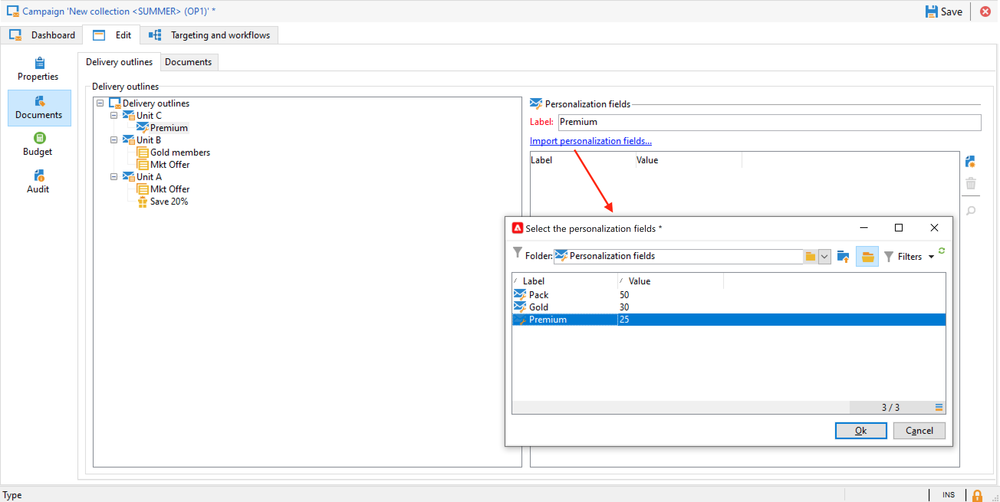

# Gerenciar ativos e documentos {#manage-assets-documents}

Você pode associar vários documentos a uma campanha: relatórios, fotos, páginas da Web, diagramas etc. Esses documentos podem estar em qualquer formato.

Em uma campanha, você também pode consultar outros itens, como cupons promocionais, ofertas especiais relacionadas a uma marca ou loja específica etc. Quando esses elementos são incluídos em um outline, eles podem ser associados a um delivery de correspondência direta. [Saiba mais](#associating-and-structuring-resources-linked-via-a-delivery-outline).

>[!CAUTION]
>
>Esse recurso foi projetado para ativos e documentos pequenos.

<!--
>[!NOTE]
>
>If you are using Campaign Marketing Resource Management module, you can also manage a library of marketing resources that are available for several users for collaborative work. [Learn more](../../mrm/using/managing-marketing-resources.md).
-->

## Adicionar documentos {#add-documents}

Os documentos podem ser associados no nível da campanha (documentos contextuais) ou no nível do programa (documentos gerais).

Para uma campanha, a variável **[!UICONTROL Documents]** contém:

* A lista de todos os documentos necessários para o conteúdo (template, imagens etc.) que pode ser baixado localmente pelos operadores do Adobe Campaign com direitos adequados,
* Documentos contendo informações para o roteador, se houver.

Os documentos são vinculados ao programa ou à campanha através da guia **[!UICONTROL Edit > Documents]**.

Você também pode adicionar um documento a uma campanha a partir do link dedicado no painel.

Clique no ícone **[!UICONTROL Detail...]** para exibir o conteúdo de um arquivo e adicionar informações:

No painel, os documentos associados à campanha são agrupados na seção **[!UICONTROL Document(s)]**, como no exemplo a seguir:

Eles também podem ser editados e modificados nessa visualização.

## Usar delivery outlines {#delivery-outlines}

Um delivery outline é um conjunto estruturado de elementos (documentos, lojas, cupons promocionais etc.) criado pela empresa e para uma campanha específica. Ela é usada no contexto de entregas de correspondência direta.

Esses elementos são agrupados em delivery outlines, e cada delivery outline será associado a um delivery; ele será referenciado no arquivo de extração enviado para o **provedor de serviço** para ser anexado ao delivery. Por exemplo, você pode criar um delivery outline que se refere a uma unidade e aos folhetos de marketing que ela usa.

Para uma campanha, delivery outlines permitem que você estruture elementos externos a serem associados ao delivery de acordo com determinados critérios: unidade relacionada, oferta promocional concedida, convite para um evento local etc.

>[!CAUTION]
>
>Delivery outlines são restritos a campanhas de mala direta.

### Criar um delivery outline {#create-an-outline}

Para criar um delivery outline, clique em **[!UICONTROL Delivery outlines]** subguia no **[!UICONTROL Edit > Documents]** da campanha relacionada.

>[!NOTE]
>
>Se não for possível ver essa guia, esse recurso não estará disponível para essa campanha ou o delivery de mala direta não estará ativado em sua instância. Consulte a [configuração do template de campanha](marketing-campaign-templates.md#campaign-templates) ou ao seu contrato de licença.

Em seguida, clique em **[!UICONTROL Add a delivery outline]** e crie a hierarquia de outlines para a campanha:

1. Clique com o botão direito do mouse na raiz da árvore e selecione **[!UICONTROL New > Delivery outlines]**.
1. Clique com o botão direito do mouse no outline recém criado e selecione **[!UICONTROL New > Item]** ou **[!UICONTROL New > Personalization fields]**.

Uma estrutura pode conter itens, campos de personalização e ofertas:

* Os itens podem ser documentos físicos, por exemplo, que são referenciados e descritos aqui e serão anexados ao delivery.
* Os campos de personalização permitem que você crie elementos de personalização relacionados a remessas em vez de recipients. Assim, é possível criar valores que serão usados em deliveries para um target específico (oferta de boas-vindas, desconto, etc.) Eles são criados no Adobe Campaign e importados para o outline por meio do link **[!UICONTROL Import personalization fields...]**.

   

   Eles também podem ser criados diretamente no outline clicando no ícone **[!UICONTROL Add]** à direita da zona de lista.

   

### Selecionar um outline {#select-an-outline}

Para cada delivery, você pode selecionar o outline para associar na seção reservada para o outline da extração, como no exemplo a seguir:

A estrutura selecionada é então exibida na seção inferior da janela. Ele pode ser editado usando o ícone à direita do campo ou alterado usando a lista suspensa:

A guia **[!UICONTROL Summary]** do delivery também exibe essas informações:

### Resultado da extração {#extraction-result}

No arquivo extraído e enviado ao provedor de serviços, o nome da estrutura e, quando apropriado, suas características (custo, descrição etc.) são adicionados ao conteúdo de acordo com as informações no template de exportação associado ao provedor de serviços.

No seguinte exemplo, o rótulo, custo estimado e descrição do outline associado ao delivery serão adicionados no arquivo de extração.

O modelo de exportação deve estar associado ao provedor de serviços selecionado para o delivery. Consulte [esta seção](providers--stocks-and-budgets.md#creating-service-providers-and-their-cost-structures).
