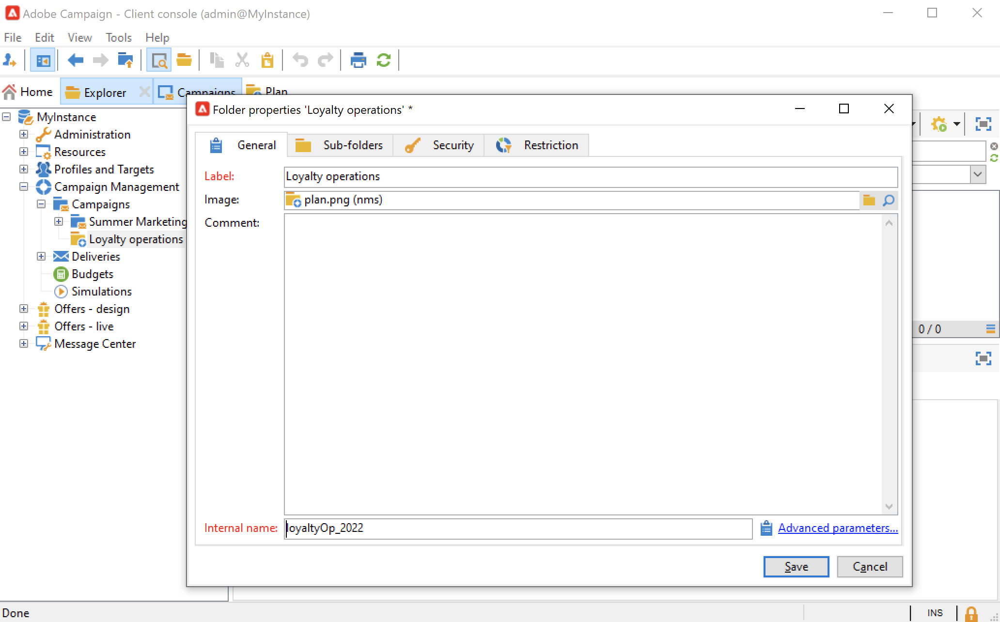
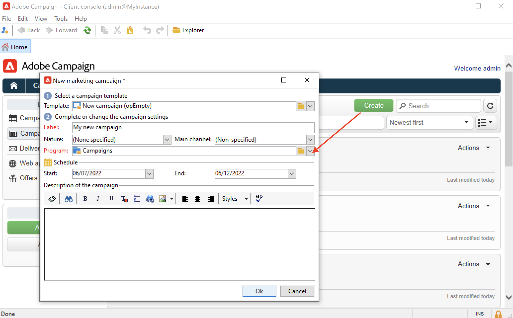

# Criar programas e campanhas{#create-programs-and-campaigns}

Os componentes da orquestração de campanha são encontrados no **[!UICONTROL Campaigns]** guia: aqui você pode ter uma visão geral dos programas e campanhas de marketing e seus elementos associados.

Um programa de marketing é composto por campanhas, que são compostas por deliveries, recursos etc. Todas as informações relacionadas aos deliveries, orçamentos, revisores e documentos vinculados são agrupadas na campanha.

 [Descubra programas e campanhas em vídeo](#video)

## Trabalhar com programas e planos{#work-with-plan-and-program}

### Criar a hierarquia de planos e programas {#create-plan-and-program}

Cada campanha pertence a um programa que pertence a um plano. Todos os planos, programas e campanhas estão disponíveis por meio do **[!UICONTROL Campaign calendar]** no menu **Campanhas** guia.

Antes de começar a criar suas campanhas e deliveries, configure a hierarquia de pastas para planos de marketing e programas.

1. Clique no ícone do **Explorer** na home page.
1. Clique com o botão direito na pasta em que deseja criar o plano.
1. Selecione **Add new folder > Campaign Management > Plan**.

   

1. Renomeie o plano.
1. Clique com o botão direito do mouse no plano recém-criado e selecione **Properties...**.
1. Na guia **General** , modifique o **nome interno** para evitar duplicidades durante exportações de pacote.

   

1. Clique em **Save**.
1. Clique com o botão direito do mouse no plano recém-criado e selecione **Create a new &#39;Program&#39; folder**.

   

1. Repita as etapas acima para renomear a nova pasta do programa e seu nome interno.

### Configurar um programa {#edit-a-program}

Ao editar um programa, use as guias descritas abaixo para procurar e configurar.

* A variável **Agendar** exibe o calendário de programas de um mês, semana ou dia, dependendo da guia que você clicar no cabeçalho do calendário. Você pode criar uma campanha, um programa ou uma tarefa nesta página. [Saiba mais](#campaign-calendar)

* A guia **Editar** permite personalizar o programa: nome, datas de início e término, orçamento, documentos vinculados etc.

  

## Trabalhar com campanhas{#work-with-campaigns}

### Criar uma campanha {#create-a-campaign}

Você pode criar uma campanha por meio da lista de campanhas. Para exibir essa visualização, selecione o **[!UICONTROL Campaigns]** no menu **[!UICONTROL Campaigns]** e clique em **[!UICONTROL Create]**.

O campo **[!UICONTROL Program]** permite selecionar o programa ao qual a campanha será anexada. Essas informações são obrigatórias.

As campanhas também podem ser criadas por meio do calendário da campanha ou do programa. [Saiba mais](#campaign-calendar)

Na janela de criação da campanha, selecione o modelo da campanha e adicione um nome e uma descrição da campanha. Você também pode especificar as datas de início e término da campanha.

Clique em **[!UICONTROL OK]** para criar a campanha. Ele é adicionado à programação e à lista de campanhas.

Você pode editar a campanha recém-criada e definir seus parâmetros. Para abrir e configurar essa campanha, você pode:

1. Navegue pelo calendário da campanha, selecione a campanha que deseja exibir e clique no link **[!UICONTROL Open]** link.
1. Navegue pelo **[!UICONTROL Schedule]** selecione a campanha e abra-a.
1. Navegue pela lista de campanhas e clique no nome da campanha a ser editada.

Todas essas ações direcionam você ao painel de campanha.

Acesse as seguintes seções para saber como configurar a campanha:

* [Adicionar entregas](marketing-campaign-deliveries.md)
* [Gerenciar ativos e documentos](marketing-campaign-assets.md)
* [Criar o público-alvo](marketing-campaign-target.md)
* [Configurar o processo de aprovação](marketing-campaign-approval.md)
* [Gerenciar estoques e orçamentos](providers-stocks-and-budgets.md)

### Editar configurações da campanha {#campaign-settings}

As campanhas são criadas por meio de templates de campanha. É possível configurar templates reutilizáveis para os quais algumas opções estão selecionadas e outras configurações já estão salvas.

Para cada campanha, os seguintes recursos estão disponíveis:

* Documentos e recursos de referência: é possível associar documentos à campanha (resumo, relatório, imagens etc.). Todos os formatos de documento são suportados. [Saiba mais](marketing-campaign-deliveries.md#manage-associated-documents).
* Definir custos: para cada campanha, o Adobe Campaign permite definir entradas de custo e estruturas de cálculo de custo que podem ser usadas ao criar a campanha de marketing. Por exemplo: custos de impressão, uso de uma agência externa, aluguel de sala etc. [Saiba mais](providers-stocks-and-budgets.md#defining-cost-categories).
* Definir objetivos: é possível definir objetivos quantificáveis para uma campanha, por exemplo, número de assinantes, volume de negócios etc. Essas informações são usadas posteriormente nos relatórios de campanha.
* Gerenciar seed addresses e grupos de controle. [Saiba mais](marketing-campaign-deliveries.md#defining-a-control-group).
* Gerenciar aprovações: é possível selecionar os tratamentos a serem aprovados e, se necessário, selecionar os operadores de revisão ou grupos de operadores. [Saiba mais](marketing-campaign-approval.md#checking-and-approving-deliveries).

>[!NOTE]
>
>Para acessar e atualizar as configurações da campanha, navegue até a **[!UICONTROL Advanced campaign parameters...]** no **[!UICONTROL Edit]** guia.

### Monitorar uma campanha {#monitor-a-campaign}

Para cada campanha, as tarefas, os recursos e as entregas são centralizados em um painel. Essa interface permite gerenciar e orquestrar ações de marketing.

Com o Adobe Campaign, você pode configurar processos colaborativos para a criação e aprovação das várias etapas de suas campanhas: aprovação do orçamento, destino, conteúdo etc. Essa orquestração é detalhada em [nesta seção](marketing-campaign-approval.md).

>[!NOTE]
>
>Os componentes disponíveis em uma campanha dependem do seu template. A configuração do template de campanha é apresentada em [nesta seção](marketing-campaign-templates.md#campaign-templates).

Depois que a campanha for realizada, use o **[!UICONTROL Reports]** link para acessar os relatórios da campanha.

## Calendário da campanha {#campaign-calendar}

O calendário da campanha mostra todos os programas, planos, campanhas e deliveries.

Para editar um plano, programa, campanha ou delivery, navegue até o nome no calendário e use o **[!UICONTROL Open]** link. Ele é exibido em uma nova guia, conforme mostrado abaixo:

Você pode filtrar as informações exibidas no calendário da campanha. Para fazer isso, clique no link **[!UICONTROL Filter]** e selecione os critérios de filtragem.

>[!NOTE]
>
>Quando você filtrar em uma data, todas as campanhas com uma data de início posterior à data especificada e/ou com uma data final anterior à data especificada serão exibidas. As datas são selecionadas usando os calendários à direita de cada campo.

Também é possível usar o campo **[!UICONTROL Search]** para filtrar os itens exibidos.

Os ícones vinculados a cada item permitem visualizar o status: concluído, em andamento, sendo editado etc.

Para filtrar as campanhas a serem exibidas, clique no link **[!UICONTROL Filter]** e selecione o status das campanhas a serem exibidas.

Como navegar pelo calendário, você também pode criar um programa ou uma campanha.

Ao criar uma campanha por meio da guia **[!UICONTROL Schedule]** de um programa, a campanha é vinculada automaticamente ao programa relacionado. O campo **[!UICONTROL Program]** está oculto nesse caso.

## Acessar o Campaign com um navegador da Web {#use-the-web-interface}

>[!AVAILABILITY]
>
>A partir do Campaign v8.6, o Campaign estará disponível em uma interface da Web. A maioria das ações de marketing pode ser executada nessa nova interface. [Saiba mais](../../v8/start/campaign-ui.md#discover-the-user-interface).

Você pode acessar algumas das telas do console do cliente Adobe Campaign por meio de um navegador da Internet para exibir todas as campanhas e deliveries, bem como relatórios e informações sobre os perfis em seu banco de dados. Não é possível criar componentes a partir desse acesso à web, mas, dependendo dos direitos de acesso, você pode visualizar e/ou agir nos dados no banco de dados. Normalmente, você pode aprovar conteúdo de campanha e segmentação, reiniciar ou parar um delivery etc.

1. Faça logon como de costume via https://`<your instance>:<port>/view/home`.
1. Use os menus para acessar as exibições.

   

Além de navegar entre campanhas e visualizá-las, é possível executar esses tipos de tarefas:

* Monitorar atividade em uma instância
* Participar de processos de validação como, por exemplo, aprovar ou rejeitar o conteúdo de uma entrega
* Executar outras ações rápidas como, por exemplo, pausar um fluxo de trabalho
* Acessar todos os recursos de relatório
* Participar das discussões do fórum

Esta tabela resume as ações que você pode realizar nas campanhas a partir de um navegador:

| Página  | Ação |
| --- | --- |
| Lista de campanhas, entregas, ofertas, etc. | Excluir um item da lista |
| Campanha | Cancelar uma campanha |
| Entrega | Aprovar o conteúdo e o target da entrega Enviar o conteúdo da entrega Confirmar uma entrega Pausar e parar uma entrega |
| Aplicativo web | Criar um aplicativo web Editar o conteúdo e as propriedades do aplicativo Salvar o conteúdo do aplicativo como um modelo Publicar o aplicativo |
| Oferta | Aprovar o conteúdo e a elegibilidade da oferta Desabilitar uma oferta online |
| Tarefa | Concluir uma tarefa Cancelar uma tarefa |
| Recursos de marketing | Aprovar um recurso Bloquear e desbloquear um recurso |
| Pacotes da campanha | Enviar um pacote para aprovação Aprovar ou rejeitar um pacote Cancelar um pacote |
| Pedidos da campanha | Criar um pedido Aceitar ou rejeitar um pedido |
| Estoque | Excluir uma linha do estoque |
| Simulação de oferta | Iniciar e parar uma simulação |
| Fluxo de trabalho de direcionamento | Iniciar, pausar e parar um fluxo de trabalho |
| Relatórios | Salvar os dados atuais no histórico do relatório |
| Fórum | Adicionar uma discussão Responder a uma mensagem em uma discussão Seguir uma discussão e cancelar a inscrição nela |

### Gerenciar aprovações

Aprovações de um target ou conteúdo de delivery podem ser realizadas via acesso à web.

Você também pode usar o link contido nas mensagens de notificação. Para obter mais informações, consulte [esta seção](marketing-campaign-approval.md#checking-and-approving-deliveries).

## Tutorial em vídeo {#video}

Este vídeo mostra como criar um plano de marketing, programas e campanhas.

>[!VIDEO](https://video.tv.adobe.com/v/333810?quality=12)
