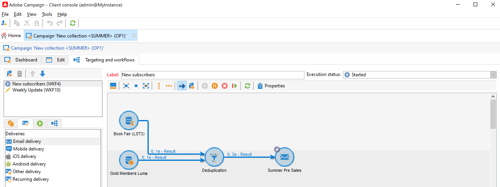

# Entregas de campanha de marketing {#marketing-campaign-deliveries}

Orquestrar suas entregas entre canais em suas campanhas: eles simplificam suas comunicações com o Adobe Campaign por meio de emails personalizados, SMS, notificações por push e mensagens no aplicativo. Você pode usar mídia avançada como vídeos, emojis ou GIF e integrá-los diretamente.

As entregas podem ser criadas por meio do painel da campanha, de um fluxo de trabalho de campanha ou diretamente na visão geral das entregas. Quando criados a partir de uma campanha, os deliveries serão vinculados a essa campanha e consolidados em seu nível.

## Criar entregas {#create-deliveries}

Você tem duas maneiras de adicionar deliveries às suas campanhas de marketing:

* No **[!UICONTROL Add a delivery]** no painel de campanha.

Depois de salvo, o delivery é adicionado ao painel de campanha.

* A partir de um workflow da campanha, na variável **[!UICONTROL Targeting and workflows]** adicionando o delivery.

   

   Depois que o workflow é iniciado, o delivery é adicionado ao painel de campanha.

Saiba como configurar e executar o fluxo de aprovação de entrega [nesta página](marketing-campaign-approval.md).

## Iniciar um delivery {#start-a-delivery}

Um delivery pode ser enviado assim que todas as aprovações forem concedidas. O processo de execução do delivery depende do canal.

* Para deliveries de email ou canais móveis, consulte [nesta seção](#start-an-online-delivery)

* Para deliveries de correspondência direta, consulte [nesta seção](#start-an-offline-delivery)

### Iniciar um delivery de email ou móvel {#start-an-online-delivery}

Depois que todas as solicitações de aprovação tiverem sido concedidas, o status do delivery será alterado para **[!UICONTROL Pending confirmation]** e podem ser iniciadas. Os revisores que podem iniciar o delivery são notificados de que um delivery está pronto para ser iniciado.

As informações também aparecem no painel de campanha. O link **[!UICONTROL Confirm delivery]** permite iniciar o delivery.

A confirmação do delivery é restrita aos administradores e ao operador ou grupo de operadores explicitamente mencionados nas propriedades de delivery ou campanha. Se nenhum operador for projetado, os administradores e o proprietário da campanha poderão aprovar.

No entanto, também é possível permitir que o proprietário da campanha confirme o envio, mesmo que revisores específicos tenham sido definidos nas propriedades de entrega ou campanha. Para fazer isso, como Administrador, crie a variável **NmsCampaign_Ativate_OwnerConfirmation** e defina-a como **1**. As opções são gerenciadas no **[!UICONTROL Administration]** > **[!UICONTROL Platform]** > **[!UICONTROL Options]** pasta do explorador do Campaign.

### Iniciar um delivery de correspondência direta {#start-an-offline-delivery}

Após todas as aprovações serem concedidas, o status do delivery será alterado para **[!UICONTROL Pending extraction]**. Os arquivos de extração são criados por meio de uma [fluxo de trabalho técnico](../workflow/technical-workflows.md) que, em uma configuração padrão, é iniciada automaticamente quando um delivery de mala direta está com extração pendente. Quando um processo está em andamento, ele é exibido no painel e pode ser editado através do link.

Após executar o workflow de extração com sucesso, o arquivo de extração deve ser aprovado (fornecido de forma que a aprovação do arquivo de extração tenha sido selecionada nas configurações do delivery). [Saiba mais](marketing-campaign-approval.md#approving-an-extraction-file).

Siga as etapas abaixo para validar o conteúdo e enviar o arquivo para o provedor:

1. Depois que o arquivo de extração for aprovado, é possível gerar a prova do email de notificação do roteador. Esta mensagem de email é construída com base em um template de delivery. Deve ser aprovado.

   Esta etapa só estará disponível se a variável **[!UICONTROL Enable the sending and validation of proofs (Direct mail)]** a opção foi ativada em **[!UICONTROL Approvals]** dos parâmetros avançados da campanha.

   

1. Clique no botão **[!UICONTROL Send a proof]** para criar as provas.

   O target da prova deve ser definido com antecedência.

   Você pode criar quantas provas forem necessárias. Elas são acessadas por meio do link **[!UICONTROL Direct mail...]** dos detalhes de delivery.

1. O status do delivery é alterado para **[!UICONTROL To submit]**. Clique no botão **[!UICONTROL Submit proofs]** para iniciar o processo de aprovação.

1. O status do delivery muda para **[!UICONTROL Proof to validate]**, e um botão permite aceitar ou rejeitar a aprovação.

   Você pode aceitar ou rejeitar esta aprovação ou retornar à etapa de extração.

1. Depois que a prova for aprovada, o arquivo de extração será enviado ao roteador e o delivery será concluído.

### Orçamento e cálculo de custos {#compute-costs-and-stocks}

A extração de arquivo inicia dois processos: cálculo de orçamento e cálculo de estoque. As entradas do orçamento são atualizadas.

* A guia **[!UICONTROL Budget]** permite gerenciar os orçamentos da campanha. O total das entradas de custo é exibido no campo **[!UICONTROL Calculated cost]** da guia principal da campanha e o programa ao qual ele pertence. Os montantes também são refletidos no orçamento da campanha.

   

   O custo real será calculado de acordo com as informações fornecidas pelo roteador. Apenas mensagens enviadas são faturadas.

* As existências são definidas no **[!UICONTROL Administration > Campaign management > Stocks]** nó da árvore.

   

   Estruturas de custo na **[!UICONTROL Administration > Campaign management > Service providers]** nó.

   

   As linhas de estoque estão visíveis na seção de estoque. Para definir o estoque inicial, abra uma linha de estoque. O estoque é reduzido sempre que um delivery ocorre. Você pode definir um nível de alerta e notificações.

   >[!NOTE]
   >
   >Saiba mais sobre orçamentos [nesta seção](providers--stocks-and-budgets.md).
