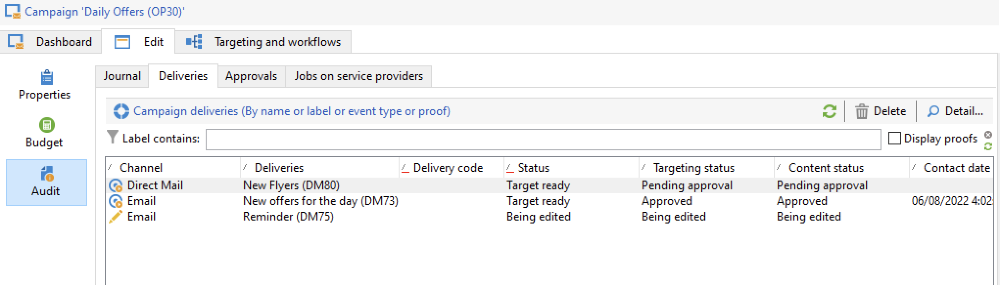

# Monitorar campanhas de marketing {#monitor-marketing-campaigns}

## Rastrear uma campanha {#tracking-a-campaign}

Para cada campanha, a guia **[!UICONTROL Tracking]** permite visualizar todos os processos e os status.

As seguintes informações podem ser acessadas por meio desta subguia:

* A subguia **[!UICONTROL Audit]** mostra o diário de atividades. Ele contém as tarefas executadas na campanha: criação ou início, aprovação, extração, gerenciamento de estoque etc. do workflow.

  

* A subguia **[!UICONTROL Deliveries]** contém todas as entregas da campanha. Eles podem ser editados nessa visualização. Para fazer isso, selecione a entrega e clique no ícone **[!UICONTROL Detail]**.

  

* A subguia **[!UICONTROL Approvals]** contém todo o processo de aprovação da campanha. Você pode verificar detalhes e comentários

* Os fluxos de trabalho criados para gerar mensagens para provedores de serviços são exibidos na subguia **[!UICONTROL Jobs on service providers]**. Clique no ícone **[!UICONTROL Detail]** para exibir o fluxo de trabalho selecionado.

## Rastrear entregas {#delivery-tracking}

A lista de entregas está disponível através do link **[!UICONTROL Deliveries]** do nó do Campaign.

Para cada entrega, essa lista permite acessar os indicadores-chave: status, número de destinatários direcionados, campanhas vinculadas, etc.

Para verificar o status de uma entrega, edite-a e exiba seu painel e guias.

<!--
>[!NOTE]
>
>Information concerning delivery details is available in [this section](../../delivery/using/about-message-tracking.md) section.
-->

## Rastrear a execução {#execution-tracking}

Você pode verificar o status dos deliveries clicando em **[!UICONTROL Deliveries]**, acessível na página inicial do Adobe Campaign.

Detalhes sobre processos executados em uma campanha são coletados na guia **[!UICONTROL Edit > Audit]** da campanha. Você pode visualizar a lista de deliveries na campanha. [Saiba mais](#tracking-a-campaign).
