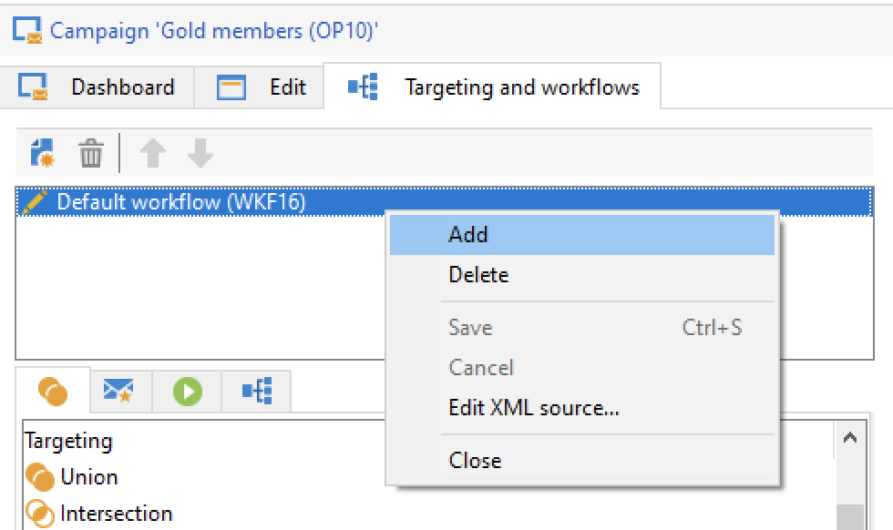
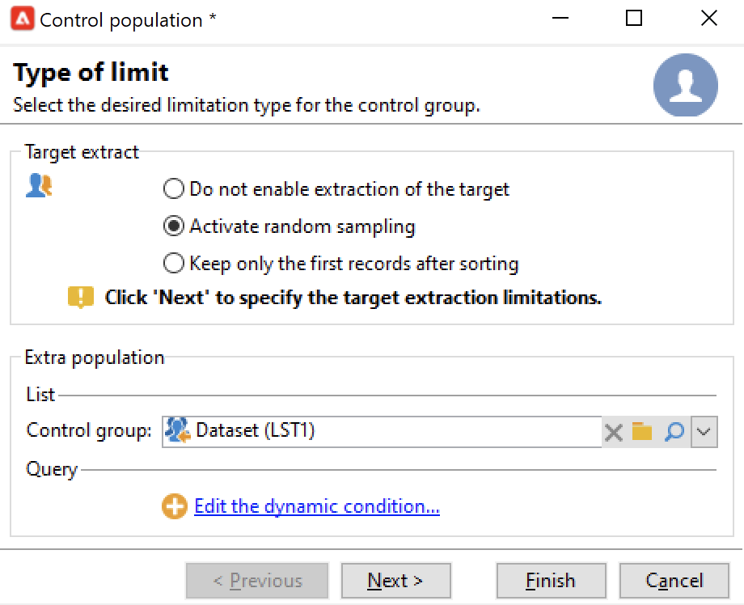

# Selecionar o público das campanhas {#marketing-campaign-deliveries}

Em uma campanha de marketing, para cada entrega, é possível definir:

* O público-alvo. Você pode enviar mensagens para uma [lista de destinatários](#send-to-a-group) ou criar um [público-alvo em um fluxo de trabalho](#build-the-main-target-in-a-workflow)
* Um grupo de controle. Você pode [adicionar um grupo de controle](#add-a-control-group) para monitorar o comportamento dos destinatários após a entrega da mensagem
* Seed addresses - saiba mais em [esta seção](../../v8/audiences/test-profiles.md).—>

Algumas dessas informações podem ser herdadas do [template de campanha](marketing-campaign-templates.md#campaign-templates).

<!--
To build the delivery target, you can define filtering criteria for the recipients in the database. This recipient selection mode is presented in [this section](../../delivery/using/steps-defining-the-target-population.md).
-->

## Enviar para um grupo{#send-to-a-group}

Você pode importar uma população para uma lista e, depois, direcionar essa lista nas entregas. Para fazer isso, siga as etapas abaixo:

1. Edite a entrega e clique no link **[!UICONTROL To]** para alterar a população direcionada.
1. Na guia **[!UICONTROL Main target]**, selecione a opção **[!UICONTROL Defined via the database]** e clique em **[!UICONTROL Add]** para selecionar os destinatários.

   

1. Escolha **[!UICONTROL A list of recipients]**.

   

1. Clique em **[!UICONTROL Next]** para selecionar a lista.

   

   Você pode refinar o target adicionando novos critérios de filtragem.

1. Clique em **[!UICONTROL Finish]** depois que todos os critérios forem definidos e salve o público alvo principal.

## Criar a audiência em um fluxo de trabalho de campanha {#build-the-main-target-in-a-workflow}

O objetivo principal de uma entrega também pode ser definido no fluxo de trabalho da campanha: este ambiente gráfico permite que você crie um destino usando consultas, testes e operadores: união, desduplicação, compartilhamento etc.

>[!IMPORTANT]
>
>Você não deve adicionar mais de 28 workflows a uma campanha. Acima desse limite, os workflows adicionais não ficam visíveis na interface e podem gerar erros.

### Criar o workflow {#create-a-targeting-workflow}

A definição de alvos pode ser criada por meio de uma combinação de condições de filtragem em uma sequência gráfica em um workflow. Você pode criar populações e subpopulações que serão direcionadas de acordo com suas necessidades. Para exibir o editor de workflow, clique na guia **[!UICONTROL Targeting and workflows]** no painel de campanha.

A população do target é extraída do banco de dados do Adobe Campaign através de uma ou mais queries colocadas em um workflow. Saiba como criar uma consulta em [esta seção](../workflow/query.md).

Você pode iniciar queries e compartilhar populações por meio de caixas como União, Intersecção, Compartilhamento, Exclusão, etc.

Selecione os objetos nas listas à esquerda do espaço de trabalho e vincule a eles para construir o target.

No diagrama, vincule as queries de definição de metas e agendamento necessárias para a construção de target no diagrama. Você pode executar o direcionamento enquanto a construção está em andamento para verificar a população extraída do banco de dados.

>[!NOTE]
>
>Os exemplos e o procedimento para definir consultas estão detalhados em [esta seção](../workflow/query.md).

A seção à esquerda do editor contém uma biblioteca de objetos gráficos que representam atividades. A primeira guia contém as atividades de definição de metas e a segunda contém as atividades de controle de fluxo, que são usadas ocasionalmente para coordenar as atividades de definição de metas.

As funções de execução e formatação do workflow de direcionamento são acessíveis pela barra de ferramentas do editor de diagrama.

>[!NOTE]
>
>As atividades disponíveis para criar o diagrama e todos os recursos de exibição e layout estão detalhados em [esta seção](../workflow/about-workflows.md).

Você pode criar vários workflows para construção do target para uma única campanha. Para adicionar um workflow:

1. Acesse a seção superior esquerda da área de criação do workflow, clique com o botão direito do mouse e clique em **[!UICONTROL Add]**. Você também pode usar o botão **[!UICONTROL New]** localizado acima dessa área.

   

1. Selecione o template **[!UICONTROL New workflow]** e o nome deste workflow.
1. Clique em **[!UICONTROL OK]** para confirmar a criação do workflow e, em seguida, crie o diagrama para esse workflow.

### Executar o workflow {#execute-a-workflow}

Os workflows para construção do target podem ser iniciados manualmente por meio do botão **[!UICONTROL Start]** na barra de ferramentas, desde que você tenha os direitos apropriados.

O direcionamento pode ser programado para execução automática de acordo com um agendamento (scheduler) ou um evento (sinal externo, importação de arquivo, etc.).

As ações relacionadas à execução do fluxo de trabalho de direcionamento (iniciar, parar, pausar etc.) são processos **assíncronos**: o comando é salvo e entrará em vigor assim que o servidor estiver disponível para aplicá-lo.

Os ícones da barra de ferramentas permitem realizar a ação referente à execução do workflow de direcionamento.

* Iniciar ou reiniciar

   * O ícone **[!UICONTROL Start]** permite iniciar o workflow para construção do target. Quando você clica nesse ícone, todas as atividades sem uma transição de entrada são ativadas (exceto saltos de ponto de extremidade).

     

     O servidor considera a solicitação, conforme mostrado pelo status: **[!UICONTROL Start as soon as possible]**.

   * Você pode reiniciar o workflow de definição de metas por meio do ícone de barra de ferramentas apropriado. Esse comando pode ser útil se o ícone **[!UICONTROL Start]** não estiver disponível, por exemplo, quando a interrupção do workflow para construção do target estiver em andamento. Nesse caso, clique no ícone **[!UICONTROL Restart]** para antecipar a reinicialização. O servidor considera a solicitação, como mostra o status: **[!UICONTROL Restart requested]**.

* Parar ou pausar

   * Os ícones da barra de ferramentas permitem interromper ou pausar um workflow de direcionamento em andamento.

     Ao clicar em **[!UICONTROL Pause]**, as operações em andamento **[!UICONTROL are not]** são pausadas, mas nenhuma outra atividade é iniciada até a próxima reinicialização.

     

     O servidor considera o comando, como mostra seu status: **[!UICONTROL Pause requested]**.

     Você também pode pausar um workflow de direcionamento automaticamente quando a execução atinge uma atividade específica. Para fazer isso, clique com o botão direito do mouse na atividade a partir da qual o workflow para construção do target deve ser pausado e selecione **[!UICONTROL Enable but do not execute]**.

     

     Essa configuração é exibida por um ícone especial.

     

     >[!NOTE]
     >
     >Essa opção é útil durante as fases avançadas de criação e teste de campanhas de definição de metas.

     Clique em **[!UICONTROL Start]** para retomar a execução.

   * Clique no ícone **[!UICONTROL Stop]** para interromper a execução em andamento.

     

     O servidor considera o comando, como mostra seu status: **[!UICONTROL Stop requested]**.

  Você também pode interromper um workflow de definição de metas automaticamente quando a execução atinge uma atividade. Para fazer isso, clique com o botão direito do mouse na atividade a partir da qual o workflow para construção do target será interrompido e selecione **[!UICONTROL Do not activate]**.

  

  Essa configuração é exibida por um ícone especial.

  

  >[!NOTE]
  >
  >Essa opção é útil durante as fases avançadas de criação e teste de campanhas de definição de metas.

* Interrupção incondicional

  No Explorer, selecione **[!UICONTROL Administration > Production > Object created automatically > Campaign workflows]** para acessar e atuar em todos os workflows da campanha.

  Você pode interromper o workflow definitivamente clicando no ícone **[!UICONTROL Actions]** e selecionando a interrupção **[!UICONTROL Unconditional]**. Esta ação encerra o fluxo de trabalho da campanha.

  

  >[!CAUTION]
  >
  >A interrupção incondicional está restrita aos usuários administradores.

## Adicionar um grupo de controle {#add-a-control-group}

Um grupo de controle é uma população que não receberá a entrega; ele é usado para rastrear o comportamento após a entrega e o impacto da campanha fazendo uma comparação com o comportamento da população do target, que recebeu a entrega.

O grupo de controle pode ser extraído do target principal e/ou vir de um grupo ou query específica.

### Ativar o grupo de controle para uma campanha {#activate-the-control-group-for-a-campaign}

Você pode definir um grupo de controle no nível da campanha. Nesse caso, o grupo de controle será aplicado a cada entrega da campanha em questão.

1. Edite a campanha relacionada e clique na guia **[!UICONTROL Edit]**.
1. Clique em **[!UICONTROL Advanced campaign parameters...]**.

   

1. Selecione a opção **[!UICONTROL Enable and edit control group configuration]**.
1. Clique em **[!UICONTROL Edit...]** para configurar o grupo de controle.

   

O procedimento completo está detalhado em [esta seção](#extract-the-control-group-from-the-main-target). Saiba mais sobre grupos de controle [nesta seção](#add-a-population).

### Ativar o grupo de controle para uma entrega {#activate-the-control-group-for-a-delivery}

Você pode definir um grupo de controle no nível da entrega, nesse caso, o grupo de controle será aplicado a cada entrega da campanha relacionada.

Por padrão, a configuração do grupo de controle definida no nível da campanha se aplica a cada entrega dessa campanha. Entretanto, você pode adaptar o grupo de controle de uma entrega individual.

>[!NOTE]
>
>Se você tiver definido um grupo de controle para uma campanha e também configurá-lo para uma entrega vinculada a essa campanha, somente o grupo de controle definido para a entrega será aplicado.

1. Edite a entrega relacionada e clique no link **[!UICONTROL To]**.
1. Clique na guia **[!UICONTROL Control group]** e selecione **[!UICONTROL Enable and edit control group configuration]**.

   

1. Clique em **[!UICONTROL Edit...]** para configurar o grupo de controle.

O procedimento completo está detalhado em [esta seção](#extract-the-control-group-from-the-main-target).

### Usar uma nova população como grupo de controle {#add-a-population}

Você pode usar uma população específica para o grupo de controle. Nesse caso, selecione a lista a ser usada como um grupo de controle no campo relacionado.

Essa população pode vir de uma lista de recipients ou você pode defini-la por meio de uma query específica.

>[!NOTE]
>
>O editor de query do Adobe Campaign é apresentado [nesta seção](../workflow/query.md).

### Extração do grupo de controle do target principal {#extract-the-control-group-from-the-main-target}

Você também pode extrair recipients do target principal do delivery. Nesse caso, os destinatários serão retirados do target das ações de entrega afetadas por essa configuração. Essa extração pode ser aleatória ou pode ser resultado da classificação de destinatários.

Para extrair um grupo de controle, ative o grupo de controle para a campanha ou entrega e selecione uma das seguintes opções: **[!UICONTROL Activate random sampling]** ou **[!UICONTROL Keep only the first records after sorting]**.

* Use a opção **[!UICONTROL Activate random sampling]** para aplicar amostragem aleatória aos recipients na população principal. Se você definir o limite como 100, o grupo de controle será constituído de 100 destinatários selecionados aleatoriamente da população direcionada. A amostragem aleatória depende do mecanismo de banco de dados.
* Use a opção **[!UICONTROL Keep only the first records after sorting]** para definir uma limitação baseada em uma ou mais ordens de classificação. Se você selecionar o campo **[!UICONTROL Age]** como um critério de classificação e, em seguida, definir 100 como limite, o grupo de controle será constituído dos 100 destinatários mais jovens. Por exemplo, pode ser interessante definir um grupo de controle que inclua destinatários que façam poucas compras ou destinatários que façam compras frequentes e comparar seu comportamento com os destinatários contatados.

Clique em **[!UICONTROL Next]** para definir a ordem de classificação (se necessário) e selecione o modo de limitação do destinatário.

Esta configuração é equivalente a uma atividade **[!UICONTROL Split]** no fluxo de trabalho, que permite dividir o público alvo em subconjuntos. O grupo de controle é um desses subconjuntos.

### Tutorial em vídeo {#create-email-video}

Este vídeo explica como adicionar um grupo de controle a uma campanha.

>[!VIDEO](https://video.tv.adobe.com/v/335606?quality=12)

Vídeos extras explicativos do Campaign estão disponíveis [aqui](https://experienceleague.adobe.com/docs/campaign-learn/tutorials/getting-started/introduction-to-adobe-campaign.html){target="_blank"}.
