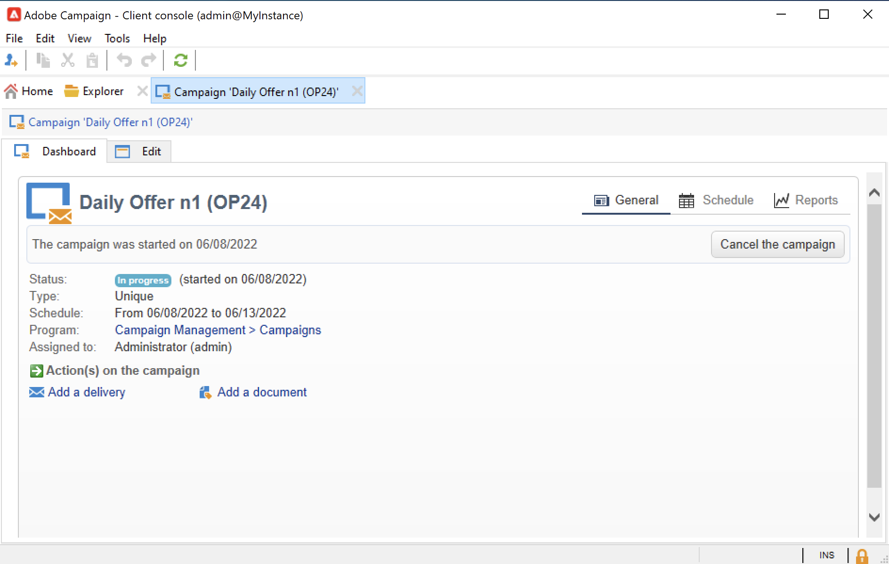
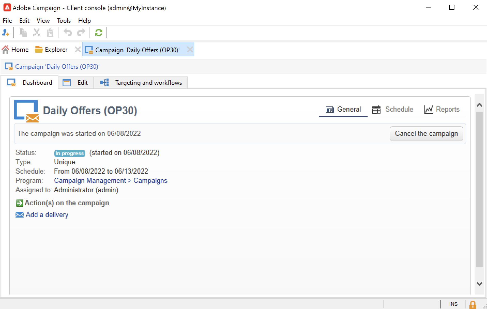
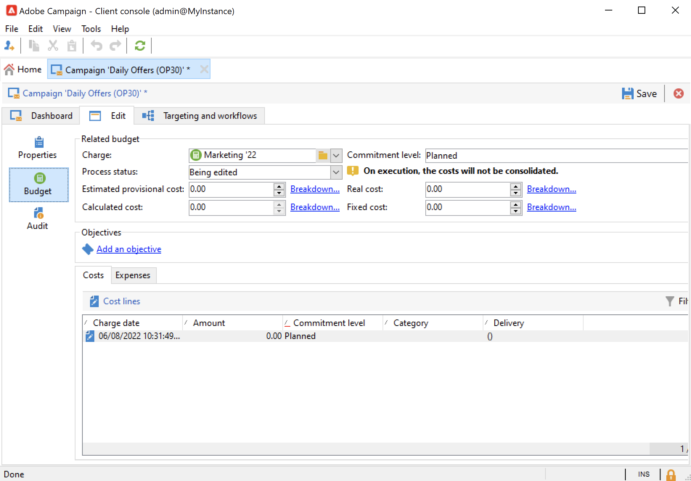

# Criar e configurar modelos de campanha {#campaign-templates}

Todas as campanhas de marketing são baseadas em um modelo, que armazena as principais características e recursos. O Campaign vem com um template incorporado para criar campanhas. Esse template tem todas as funcionalidades ativadas: Documentos, Seed addresses, Aprovações, Delivery outlines etc.

As funcionalidades disponíveis dependem das suas permissões, dos complementos e da configuração da sua plataforma Adobe Campaign.

>[!NOTE]
>
>A árvore é exibida ao clicar no ícone **[!UICONTROL Explorer]** na home page.

Um modelo integrado é fornecido para criar uma campanha para a qual nenhuma configuração específica foi definida. Você pode criar e configurar seus modelos de campanha e, em seguida, criar campanhas com base nesses modelos.

## Criar um modelo de campanha {#create-a-campaign-template}

Para criar um modelo de campanha, siga as etapas abaixo:

1. Abra o Campaign **Explorer** e navegue até **Recursos > Modelos > Modelos de campanha**.
1. Clique em **Novo** na barra de ferramentas acima da lista de modelos.

Você também pode **duplicar** o modelo interno para reutilizar e adaptar sua configuração. Para fazer isso, clique com o botão direito do mouse no modelo e selecione **Duplicar**.

1. Insira o rótulo do seu novo modelo de campanha.
1. Clique em **Save** e abra seu modelo novamente.
1. Na guia **Editar**, defina as propriedades do modelo.
1. Selecione o link **Advanced campaign parameters...** para adicionar um fluxo de trabalho ao seu template de campanha.

   

1. Altere o valor de **Targeting and workflows** para **Yes**. e confirme. Saiba como adicionar funcionalidades em [esta seção](#typology-of-enabled-modules).
1. A guia **Direcionamento e fluxos de trabalho** é adicionada ao modelo. Clique em **Adicionar um fluxo de trabalho...**, digite um **Rótulo** e clique em **Ok**.
1. Crie o fluxo de trabalho de acordo com suas necessidades.

   

1. Clique em **Save**. Seu template está pronto para ser usado para criar uma nova campanha.

As várias guias e subguias do modelo de campanha permitem que você acesse as configurações, descritas em [Configuração geral](#general-configuration).

## Selecionar módulos {#select-modules}

O link **[!UICONTROL Advanced campaign parameters...]** permite habilitar e desabilitar tarefas para as campanhas com base neste modelo. Selecione os recursos que deseja habilitar nas campanhas criadas com base neste modelo.

Se uma funcionalidade não estiver selecionada, os elementos relativos ao processo (menus, ícones, opções, guias, subguias etc.) não aparecerão na interface do template ou em campanhas baseadas nesse template. As guias à esquerda dos detalhes da campanha e as guias disponíveis coincidem com as funcionalidades selecionadas no template. Por exemplo, a funcionalidade **Despesas e objetivos** não está habilitada, a guia **[!UICONTROL Budget]** correspondente não é exibida em campanhas baseadas nesse modelo.

Além disso, os atalhos para as janelas de configuração são adicionados ao painel de campanha. Quando uma funcionalidade é habilitada, um link direto dá acesso a ela a partir do painel de campanha.

### Amostras de configuração

* Por exemplo, com as seguintes configurações:

  

  O painel de campanha mostra:

  

  A guia **[!UICONTROL Targeting and workflows]** está ausente.

  As seguintes funcionalidades estão disponíveis:

  

  A guia **[!UICONTROL Budget]** está ausente.

  As configurações avançadas do Campaign também refletem essa configuração.

  

  Observe que a guia **[!UICONTROL Approvals]** não está disponível.

* Com esta configuração:
  

  O painel de campanha mostra:

  

  A guia **[!UICONTROL Targeting and workflows]** está disponível, mas o link **Adicionar um documento** está ausente.

  As seguintes funcionalidades estão disponíveis:

  

  Observe que a guia **[!UICONTROL Budget]** está disponível.

  As configurações avançadas do Campaign também refletem essa configuração.

  

  Observe que a guia **[!UICONTROL Approvals]** está disponível, mas as guias **[!UICONTROL Control population]** e **[!UICONTROL Seed addresses]** não estão habilitadas.

## Tipologia de módulos {#typology-of-enabled-modules}

* **Grupo de controle**

  Quando este módulo está selecionado, uma guia adicional é adicionada às configurações avançadas do modelo e às campanhas baseadas nesse modelo. A configuração pode ser definida por meio do modelo ou individualmente para cada campanha. Saiba mais sobre grupos de controle [nesta seção](marketing-campaign-deliveries.md#defining-a-control-group).

  

* **Seed addresses**

  Quando este módulo está selecionado, uma guia adicional é adicionada às configurações avançadas do modelo e às campanhas baseadas nesse modelo. A configuração pode ser definida por meio do modelo ou individualmente para cada campanha.

  

* **Documentos**

  Quando este módulo é selecionado, uma guia adicional é adicionada à guia **[!UICONTROL Edit]** do modelo e às campanhas com base nesse modelo. Os documentos anexados podem ser adicionados do modelo ou individualmente para cada campanha. Saiba mais sobre documentos [nesta seção](marketing-campaign-deliveries.md#manage-associated-documents).

  

* **Outline de entrega**

  Quando esse módulo é selecionado, uma subguia **[!UICONTROL Delivery outlines]** é adicionada à guia **[!UICONTROL Documents]** para definir as descrições das entregas da campanha. Saiba mais sobre descrições das entregas [nesta seção](marketing-campaign-assets.md#delivery-outlines).

  

* **Segmentação e fluxos de trabalho**

  Ao selecionar o módulo **[!UICONTROL Targeting and workflows]**, uma guia é adicionada para permitir que você crie um ou mais fluxos de trabalho para campanhas com base nesse modelo. Os fluxos de trabalho também podem ser configurados individualmente para cada campanha com base neste modelo. Saiba mais sobre fluxos de trabalho da campanha [nesta seção](marketing-campaign-deliveries.md#build-the-main-target-in-a-workflow).

  

  Quando este módulo é habilitado, uma guia **[!UICONTROL Jobs]** é adicionada às configurações avançadas da campanha para definir a sequência de execução do processo.

* **Aprovações**

  Se você habilitar o **[!UICONTROL Approvals]**, poderá selecionar os processos a serem aprovados e os operadores de aprovação. Saiba mais sobre aprovações [nesta seção](marketing-campaign-approval.md#select-reviewers).

  

  Você pode optar por habilitar ou não a aprovação do processo por meio da guia **[!UICONTROL Approvals]** da seção de configurações avançadas dos modelos.

* **Despesas e objetivos**

  Quando esse módulo for selecionado, uma guia **[!UICONTROL Budget]** é adicionada aos detalhes do modelo e às campanhas com base nesse modelo para que o orçamento associado possa ser selecionado.

  

## Propriedades do modelo {#template-properties}

Ao criar um modelo de campanha, você precisa inserir as seguintes informações:

* Insira o **rótulo** do modelo: o rótulo é obrigatório e é o rótulo padrão para todas as campanhas baseadas neste modelo.
* Selecione a **natureza** da campanha na lista suspensa. Os valores disponíveis nesta lista são os que foram salvos na enumeração **[!UICONTROL natureOp]**.

  Saiba como acessar e configurar suas enumerações em [esta página](../../v8/config/enumerations.md).

* Selecione o **tipo de campanha**: exclusiva, recorrente ou periódica. Por padrão, os modelos de campanha se aplicam a campanhas exclusivas. As campanhas recorrentes e periódicas são detalhadas [nesta seção](recurring-periodic-campaigns.md).
* Especifique a duração da campanha, ou seja, o número de dias em que a campanha ocorrerá. Ao criar uma campanha com base nesse modelo, as datas inicial e final da campanha serão preenchidas automaticamente.

  Se a campanha for recorrente, você deverá especificar as datas inicial e final da campanha diretamente no modelo.

* Especifique o **programa relacionado** do modelo: campanhas baseadas neste modelo são vinculadas ao programa selecionado.

<!--
## Track campaign execution{#campaign-reverse-scheduling}

You can create a schedule for a campaign and track accomplishments, for instance to prepare an event schedule for a specific date. Campaign templates now let you calculate the start date of a task based on the end date of a campaign.

In the task configuration box, go to the **[!UICONTROL Implementation schedule]** area and check the **[!UICONTROL The start date is calculated based on the campaign end date]** box. (Here, "start date" is the task start date). Go to the **[!UICONTROL Start]** field and enter an interval: the task will start this long before the campaign end date. If you enter a period which is longer than the campaign is set to last, the task will begin before the campaign.

When you create a campaign using this template, the task start date will be calculated automatically. However, you can always change it later.-->
