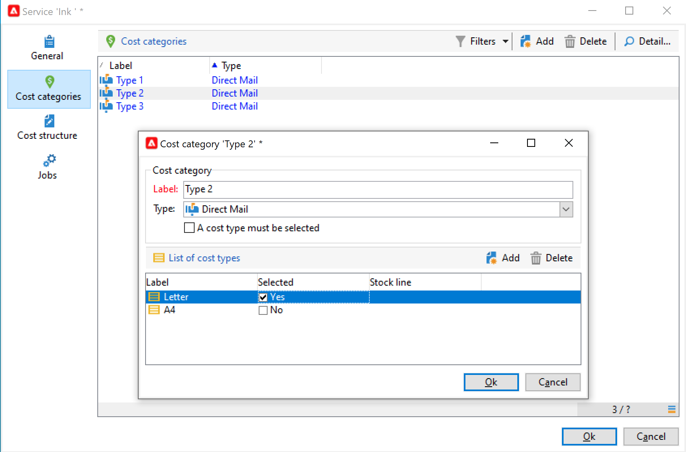
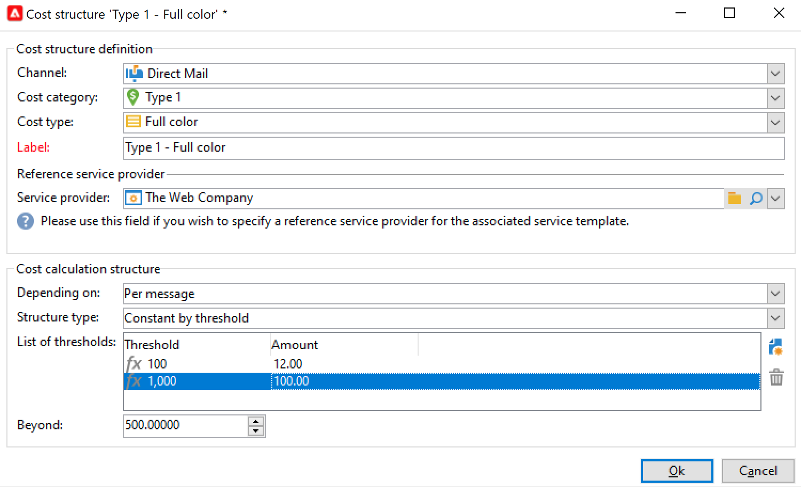

# Provedores, estoques e orçamentos{#providers-stocks-and-budgets}

O Adobe Campaign permite que você defina provedores de serviços que estarão envolvidos nas tarefas realizadas nas campanhas. As informações relacionadas aos provedores de serviços e as estruturas de custo relacionadas são definidas pelo administrador do Adobe Campaign a partir da visualização principal. O provedor de serviços é referenciado a partir da entrega e suas estruturas de custo permitem o cálculo de custos associados a essa entrega, bem como o gerenciamento do estoque.

## Criar provedores de serviços e estruturas de custo {#create-service-providers-and-their-cost-structures}

Cada provedor de serviços é salvo em um arquivo com detalhes de contato, modelos de serviço e tarefas relacionadas.

Os provedores de serviços estão configurados na pasta **[!UICONTROL Administration > Campaign management]** do explorador do Campaign.

As tarefas realizadas durante as entregas são realizadas por provedores de serviços, especialmente para mala direta e canais móveis. Esses provedores de serviços podem, por exemplo, estar envolvidos na impressão ou distribuição de mensagens. Essas tarefas envolvem configurações e custos que são específicos para cada provedor de serviços. A configuração dos provedores de serviços envolve quatro estágios:

1. Criação de um provedor de serviços no Adobe Campaign. [Saiba mais](#add-a-service-provider)

1. Definindo categorias de custo e estruturas de templates de serviço associados. [Saiba mais](#define-cost-categories)

1. Configuração de processos. [Saiba mais](#configure-processes-associated-with-a-service).

1. Fazer referência ao provedor de serviços no nível da campanha. [Saiba mais](#associate-a-service-with-a-campaign).

### Criar um provedor de serviços e categorias de custo {#create-a-service-provider-and-its-cost-categories}

#### Adicionar um provedor de serviços {#add-a-service-provider}

Você pode criar quantos provedores de serviços forem necessários para suas entregas. O procedimento para adicionar um provedor de serviços é o seguinte:

1. Clique no botão **[!UICONTROL New]** acima da lista de provedores de serviços.
1. Na seção inferior da janela, especifique o nome e os detalhes de contato do provedor de serviços.

   

1. Clique no botão **[!UICONTROL Save]** para adicionar o provedor de serviço à lista.

#### Definir categorias de custo {#define-cost-categories}

Agora você pode associar templates de serviço a cada provedor de serviços. Nesses templates, você deve primeiro identificar as categorias de custo e se necessário o estoque em questão. Em seguida, você pode criar as regras de cálculo de custo para cada categoria, por meio das estruturas de custo. [Saiba mais](#define-the-cost-structure).

Uma categoria de custo é uma entidade que contém um conjunto de custos qualificados para um tipo de delivery (email, correspondência direta, SMS, etc.). As categorias de custo são agrupadas nos templates de serviços associados aos provedores de serviço. Cada provedor de serviço pode referenciar um ou mais templates de serviço.

Para criar um template de serviço e definir seu conteúdo, siga as etapas abaixo:

1. Na guia **[!UICONTROL Services]** do provedor de serviço, clique no botão **[!UICONTROL Add]** e insira o nome do modelo de serviço.

   

1. Crie as categorias de custo para cada tipo de processo (tarefa ou entrega por correspondência direta/email/etc.). Para fazer isso, clique na guia **[!UICONTROL Cost categories]** e, em seguida, no botão **[!UICONTROL Add]** e insira os parâmetros de cada categoria de custo.

   

   * Insira um rótulo para esta categoria de custo e selecione o tipo de processo em questão: **[!UICONTROL Direct mail]**, **[!UICONTROL Email]**, **[!UICONTROL Mobile]**, etc.
   * Clique no botão **[!UICONTROL Add]** para definir os tipos de custo associados a esta categoria.
   * Se necessário, associada a uma linha de estoque com cada tipo de custo para que as quantidades usadas sejam relacionadas automaticamente aos estoques existentes.

     >[!NOTE]
     >
     >As linhas de estoque são definidas no nó **[!UICONTROL Stock management]**. [Saiba mais](#stock-and-order-management).

1. Você pode pré-selecionar um valor para essa categoria de custo, que é o padrão nas categorias de custo do provedor de serviços (em vez de uma vazia). Para fazer isso, habilite a opção **Sim** na coluna **[!UICONTROL Selected]** para o tipo de categoria em questão:

   

   No nível de delivery, o valor será selecionado por padrão.

### Definir a estrutura de custos {#define-the-cost-structure}

Para cada tipo de custo, a estrutura de custos especifica as regras de cálculo a serem aplicadas.

Clique na guia **[!UICONTROL Cost structure]** para configurar o cálculo de custo para cada categoria de custo e tipo. Clique em **[!UICONTROL Add]** e insira a estrutura de custos.

* Para criar a estrutura de custos, selecione o tipo de mensagem e a categoria de custo relacionada às listas suspensas, bem como o tipo de custo ao qual a regra de cálculo será aplicada. O conteúdo dessas listas suspensas é proveniente das informações inseridas por meio da guia **[!UICONTROL Cost categories]**.

  Você deve atribuir um rótulo à estrutura de custos. Por padrão, ela tem a seguinte descrição da entrega: **Cost category - Type of cost**.

  No entanto, você pode renomeá-la: digite o valor desejado diretamente no campo **[!UICONTROL Label]**.

* A fórmula de cálculo de custo é definida na seção inferior da janela.

  Essa fórmula pode ser corrigida (para qualquer número de mensagens) ou calculadas de acordo com o número de mensagens.

  Quando depender do número de mensagens, a estrutura de cálculo de custos pode ser **[!UICONTROL Linear]**, **[!UICONTROL Linear by threshold]** ou **[!UICONTROL Constant by threshold]**.

#### Estrutura linear {#linear-structure}

Se a quantidade for sempre a mesma para uma mensagem (ou um lote de mensagens) independentemente do número total de mensagens, selecione **[!UICONTROL Linear]** e insira o custo de cada mensagem.

Se essa quantia se aplicar a um lote de mensagens, especifique o número de mensagens relacionadas ao campo **[!UICONTROL for]**.

#### Estrutura linear por limite {#linear-structure-by-threshold}

Se a quantidade se aplicar ao limite de cada mensagem, você deve definir uma estrutura de cálculo **[!UICONTROL Linear by threshold]**. Neste tipo de estrutura de custo, cada mensagem custará 0.13, por exemplo, se o número total de mensagens estiver entre 1 e 100, e custará 0.12 de 100 a 1000 mensagens enviadas ou 0.11 acima de 1000 mensagens.

A configuração é a seguinte:

Para adicionar um limite, clique no botão **[!UICONTROL Add]** à direita da lista.

#### Estrutura constante por limite {#constant-structure-by-threshold}

Por fim, você pode configurar um cálculo de custo de acordo com o número total de mensagens. Para fazer isso, selecione uma estrutura de cálculo **[!UICONTROL Constant by threshold]**. Por exemplo, o custo será definido em uma quantidade fixa de 12,00 para 1 a 100 mensagens, de 100,00 para uma entrega de 101 a 1.000 mensagens e de 500,00 para qualquer entrega acima de 1.000 mensagens, independentemente do número total.

### Configurar trabalhos associados a um serviço {#configure-processes-associated-with-a-service}

Você pode associar informações nos processos associados ao provedor de serviços através da guia **[!UICONTROL Jobs]**. Esta seção permite configurar o envio de informações para o roteador.

* A seção **[!UICONTROL File extraction]** indica o modelo de exportação usado para a entrega quando esse serviço é selecionado. Você pode indicar o nome do arquivo de saída no campo **[!UICONTROL Extraction file]**. O botão à direita do campo permite inserir variáveis.

* A seção **[!UICONTROL Notification email]** permite especificar o modelo para notificar os provedores de serviço depois que os arquivos forem enviados. Selecione o template usado para criar a mensagem de alerta e o grupo de destinatários.

  Por padrão, os modelos de entrega para mensagens de notificação são salvos na pasta **[!UICONTROL Administration > Campaign management > Technical delivery templates]**, que é acessível no modo de exibição geral.

* A seção **[!UICONTROL Post-processing]** permite que você selecione o workflow a ser iniciado após a aprovação da entrega. Se um template de workflow for inserido, uma instância de workflow será criada automaticamente e será iniciada assim que a aprovação entrar em vigor. Esse workflow pode enviar o arquivo de extração para um provedor de serviços externos para processamento, por exemplo.

### Associar um serviço a uma campanha {#associate-a-service-with-a-campaign}

Os provedores de serviços estão associados às entregas de campanhas. Eles são referenciados em templates de delivery para oferecer seus serviços nos deliveries criados por meio desse template.

Quando um serviço é selecionado, as categorias de custo correspondentes ao tipo de entrega (correspondência direta, email, etc.) são automaticamente indicadas na tabela central juntamente com as opções de processamento definidas.

>[!NOTE]
>
>Se nenhuma categoria de custo for exibida quando um serviço for selecionado, isso significa que nenhuma categoria de custo foi definida para esse tipo de processo. Por exemplo, para uma entrega de email, se nenhuma categoria de custo do tipo **[!UICONTROL Email]** tiver sido definida, nenhuma categoria será exibida, e a seleção do serviço não terá efeito.

* Para uma entrega de mala direta, você pode selecionar o serviço na janela de configuração.

  

* Para um delivery em canais móveis, o mesmo modo de seleção se aplica.
* Para uma entrega de email, o serviço é selecionado na guia **[!UICONTROL Advanced]** nas propriedades da entrega, como no exemplo a seguir:

  

A coluna **[!UICONTROL Amount to surcharge]** permite que você adicione um custo para essa categoria no contexto da entrega ou tarefa relacionada.

Você pode definir uma seleção obrigatória de um tipo de custo durante a definição de categorias de custo para um delivery. Para fazer isso, selecione **[!UICONTROL A cost type must be selected]**.

## Gerenciamento de estoque e pedido {#stock-and-order-management}

Os tipos de custo podem ser associados a linhas de estoque para manipular alertas, controlar suprimentos e pedidos de lançamento.

O procedimento para configurar o estoque e o gerenciamento de pedidos no Adobe Campaign, e alertas os operadores no caso de fornecimentos insuficientes para uma entrega a ser realizada, é o seguinte:

1. Criação de estoque e referência de provedores de serviços associados. [Saiba mais](#create-a-stock).

1. Adicionar linhas de estoque. [Saiba mais](#add-stock-lines).

1. Notificar operadores no caso de um alerta. [Saiba mais](#alert-operators).

1. Pedidos e fornecimento. [Saiba mais](#orders).

### Gerenciamento de estoque {#stock-management}

O Adobe Campaign poderá alertar um grupo de operadores se o estoque tiver acabado ou atingido um limite mínimo. Os níveis de estoque podem ser acessados poe meio do link **[!UICONTROL Stocks]** da guia **[!UICONTROL Campaigns]** por meio do link **[!UICONTROL Other choices]** da área de navegação.

#### Criar um estoque {#creating-a-stock}

Execute as seguintes etapas para criar um novo estoque:

1. Clique no botão **[!UICONTROL Create]** acima da lista de estoques.
1. Insira o rótulo do estoque e selecione o provedor de serviços com o qual ele está associado na lista suspensa. [Saiba mais](#create-service-providers-and-their-cost-structures).

#### Adicionar linhas de estoque {#add-stock-lines}

Um estoque consiste em várias linhas de estoque. Uma linha de estoque contém uma quantidade inicial de recursos que serão consumidos pelas entregas. Cada linha de estoque indica a quantidade consumida, a quantidade em estoque e a quantidade solicitada.

Ao criar um estoque, clique na guia **[!UICONTROL Stock lines]** para adicionar novas linhas.

Depois que o estoque for criado, use seu painel para criar e monitorar linhas de estoque.

Clique no botão **[!UICONTROL Create]** para adicionar novas linhas de estoque.

* Indique a quantidade inicialmente em estoque no campo **[!UICONTROL Initial stock]**. Os campos **[!UICONTROL Consumed]** e **[!UICONTROL In stock]** são calculados automaticamente e atualizados conforme as campanhas avançam.

  

* Indique o limite do qual os operadores devem ser avisados no estoque de pedidos no campo **[!UICONTROL Alert level]**. Quando o nível de alerta for atingido, uma mensagem de aviso será exibida na janela de aprovação de entregas usando esse estoque.

#### Associar um estoque com categorias de custo {#associate-a-stock-with-cost-categories}

Para determinado provedor de serviços, em um serviço, uma linha de estoque pode ser referenciada por uma das classes de custo, da seguinte maneira:

### Rastreamento de estoque {#stock-tracking}

#### Operadores de alerta {#alert-operators}

Um alerta é exibido quando um estoque referenciado em uma entrega é insuficiente. Por exemplo, o alerta a seguir será exibido quando um arquivo de extração for aprovado:

#### Pedidos {#orders}

A subguia **[!UICONTROL Orders]** permite visualizar pedidos atuais e salvar novos pedidos.

Para salvar um pedido, edite a linha de estoque direcionada, clique no botão **[!UICONTROL Add]** e especifique a data e a quantidade da entrega.

>[!NOTE]
>
>Quando a data da entrega for atingida, a linha de estoque solicitada desaparecerá automaticamente, e a quantidade inserida no campo **[!UICONTROL Volume on order]** será adicionada à guia **[!UICONTROL Tracking]**. Essa quantidade é automaticamente adicionada ao volume de estoque.

A guia **[!UICONTROL Consumptions]** contém o volume consumido por campanha. As informações desta guia são inseridas automaticamente de acordo com as entregas realizadas. Clique no botão **[!UICONTROL Edit]** para abrir a campanha.

## Calcular orçamentos {#calculate-budgets}

### Princípio {#principle}

Os custos são gerenciados para remessas e campanha. De acordo com o progresso, esses custos são alocados para os orçamentos.

Os custos de entrega de uma campanha são consolidados no nível da campanha, e os custos de todas as campanhas de um programa são passados para o programa com o qual estão associados. Relatórios dedicados permitem rastrear os orçamentos para toda a plataforma ou para cada plano e cada programa.

### Implementação {#implementation}

Em uma campanha, ao selecionar o orçamento, você deve inserir o valor inicial. Os custos calculados serão atualizados automaticamente de acordo com o nível de compromisso dos valores inseridos (despesas feitas, esperadas, reservadas e confirmadas).

<!--
See [Calculating amounts](../../mrm/using/controlling-costs.md#calculating-amounts).

>[!NOTE]
>
>The procedure for creating budgets is presented in [Creating a budget](../../mrm/using/controlling-costs.md#creating-a-budget).
-->
