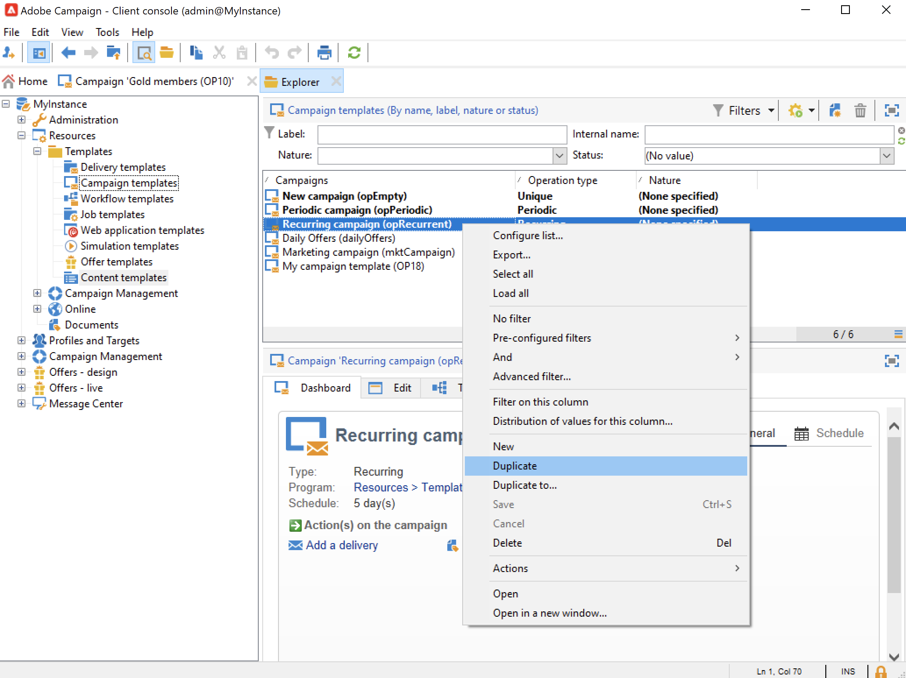

# Campanhas recorrentes e periódicas {#recurring-and-periodic-campaigns}

Uma **campanha recorrente** é uma campanha baseada em um modelo específico, cujos fluxos de trabalho são configurados para serem executados de acordo com um agendamento associado. O direcionamento é duplicado em cada execução e os vários processos e populações do target são rastreados.  Depois de configuradas, as campanhas recorrentes criam automaticamente um novo fluxo de trabalho (duplicando o modelo de fluxo de trabalho) e o executam. Por exemplo, se você precisar enviar um lembrete mensal para um segmento de público-alvo, configure uma campanha recorrente para que, no início de cada ano, ela crie 12 fluxos de trabalho, um para cada mês. [Saiba mais](#create-a-recurring-campaign)

Uma **campanha periódica** é uma campanha baseada em um modelo específico que permite criar instâncias de campanha com base em um agendamento de execução. As instâncias de campanha são criadas automaticamente com base em um template de campanha periódico, dependendo da frequência definida no agendamento do template. [Saiba mais](#create-a-periodic-campaign)

## Criar uma campanha recorrente {#create-a-recurring-campaign}

As campanhas recorrentes são criadas com base em um template específico que define o template do fluxo de trabalho que será executado e a programação de execução.

### Criar um template para campanhas recorrentes {#create-the-campaign-template}

Para criar um template para campanhas recorrentes, siga as etapas abaixo:

1. Abra o explorador do Campaign e navegue até **[!UICONTROL Resources > Templates > Campaign templates]**.
1. Duplique o modelo **[!UICONTROL Recurring campaign]** interno.
   
1. Insira o nome do template e a duração da campanha.
1. Para esse tipo de campanha, uma guia **[!UICONTROL Schedule]** é adicionada para criar o agendamento de execução do template. Use essa guia para definir as datas de execução das campanhas com base nesse template.
   

   O modo de configuração do agendamento de execução coincide com o objeto **[!UICONTROL Scheduler]** do workflow. [Saiba mais](../workflow/scheduler.md).

   >[!CAUTION]
   >
   >A configuração do cronograma de execução deve ser realizada com cuidado. As campanhas recorrentes duplicam o(s) fluxo(s) de trabalho de seu template dependendo do cronograma especificado. Esta operação pode sobrecarregar o banco de dados.

1. Especifique um valor no campo **[!UICONTROL Create in advance for]** para criar os workflows correspondentes ao período indicado.
1. Na guia **[!UICONTROL Targeting and workflows]**, crie o modelo de fluxo de trabalho que será usado em campanhas com base nesse modelo. Normalmente, esse fluxo de trabalho contém os parâmetros de direcionamento e uma ou mais entregas.

   >[!NOTE]
   >
   >Esse workflow deve ser salvo como um template de workflow recorrente. Para fazer isso, edite as propriedades do workflow e selecione na guia **[!UICONTROL Recurring workflow template]** a opção **[!UICONTROL Execution]**.

   

### Criar a campanha recorrente {#create-the-recurring-campaign}

Para criar a campanha recorrente e executar os workflows de acordo com o agendamento definido no template, você deve:

1. Crie uma nova campanha com base no seu template de campanha recorrente.
1. Preencha o agendamento de execução do fluxo de trabalho, na guia **[!UICONTROL Schedule]**. O agendamento da campanha permite que você insira uma data de início ou execução automática de workflow para cada linha.

   Para cada linha, você pode adicionar as seguintes opções adicionais:

   * Habilite a opção **[!UICONTROL To be approved]** para forçar as solicitações de aprovação de entrega no fluxo de trabalho.
   * Habilite a opção **[!UICONTROL To be started]** para iniciar o fluxo de trabalho quando a data de início for atingida.

   O campo **[!UICONTROL Create in advance for]** permite criar todos os workflows que abrangem o período inserido.

   Após a execução do workflow **[!UICONTROL Jobs on campaigns]**, os workflows dedicados são criados com base nas ocorrências definidas no agendamento da campanha. Um workflow é criado para cada data de execução.

1. Os workflows recorrentes são criados automaticamente a partir do template de workflow presente na campanha. Eles ficam visíveis na guia **[!UICONTROL Targeting and workflows]** da campanha.

   

   O rótulo de uma instância de workflow recorrente consiste no rótulo do seu template e no número do workflow, sendo que entre eles há o caractere &quot;#&quot;.

   Os workflows criados a partir do agendamento são associados automaticamente a ele na coluna **[!UICONTROL Workflow]** da guia **[!UICONTROL Schedule]**.

   

   Cada workflow pode ser editado desta guia.

   >[!NOTE]
   >
   >A data de início da linha de agendamento associada ao workflow está disponível em uma variável do workflow com a seguinte sintaxe:\
   >`$date(instance/vars/@startPlanningDate)`

## Criar uma campanha periódica {#create-a-periodic-campaign}

Uma campanha periódica é uma campanha baseada em um template específico que permite criar instâncias de campanha com base em um agendamento de execução. As instâncias de campanha são criadas automaticamente com base em um template de campanha periódico, dependendo da frequência definida no cronograma do template.

### Criar o template da campanha {#create-the-campaign-template-1}

1. Abra o explorador do Campaign e navegue até **[!UICONTROL Resources > Templates > Campaign templates]**.
1. Duplique o modelo **[!UICONTROL Periodic campaign]** interno.
1. Digite as propriedades do template.

   >[!NOTE]
   >
   >O operador que o template é atribuído deve ter as permissões apropriadas para criar campanhas no programa selecionado.

1. Crie o workflow associado a este template. Esse fluxo de trabalho é duplicado em cada campanha periódica criada pelo template.

   >[!NOTE]
   >
   >Este workflow é um template de workflow. Ele não pode ser executado do template de campanha.

1. Conclua o agendamento de execução como para um template de campanha recorrente: clique no botão **[!UICONTROL Add]** e defina as datas de início e término ou preencha o agendamento de execução por meio do link.

   >[!CAUTION]
   >
   >Os templates de campanha periódicos criam novas campanhas de acordo com o agendamento definido acima. Portanto, deve ser concluída com cuidado, para evitar sobrecarga do banco de dados do Adobe Campaign.

1. Quando a data de início da execução for atingida, a campanha correspondente será criada automaticamente. Leva em conta todas as características do template.

   Cada campanha pode ser editada por meio do agendamento do template.

   Cada campanha periódica contém os mesmos elementos. Uma vez criado, ele é gerenciado como uma campanha padrão.
