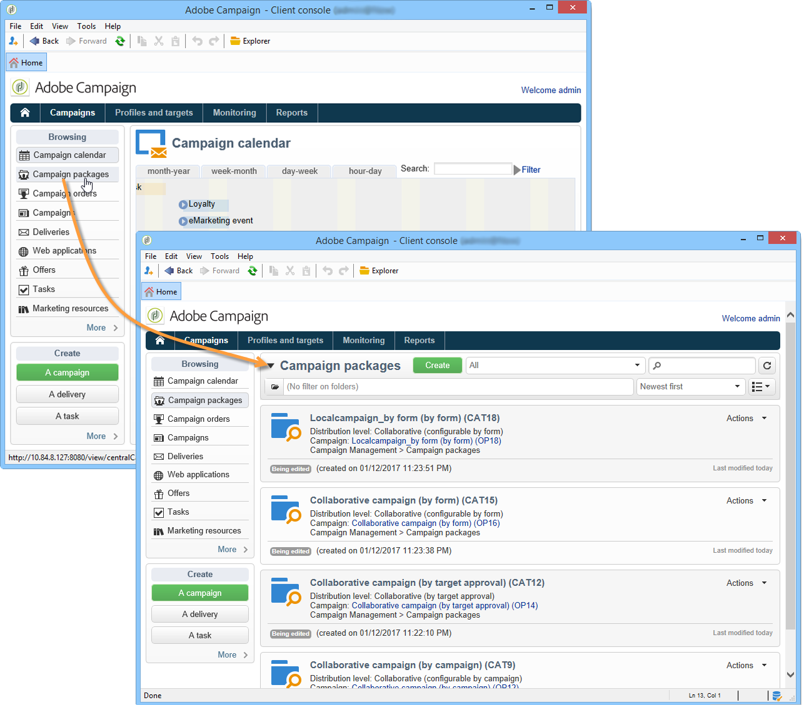
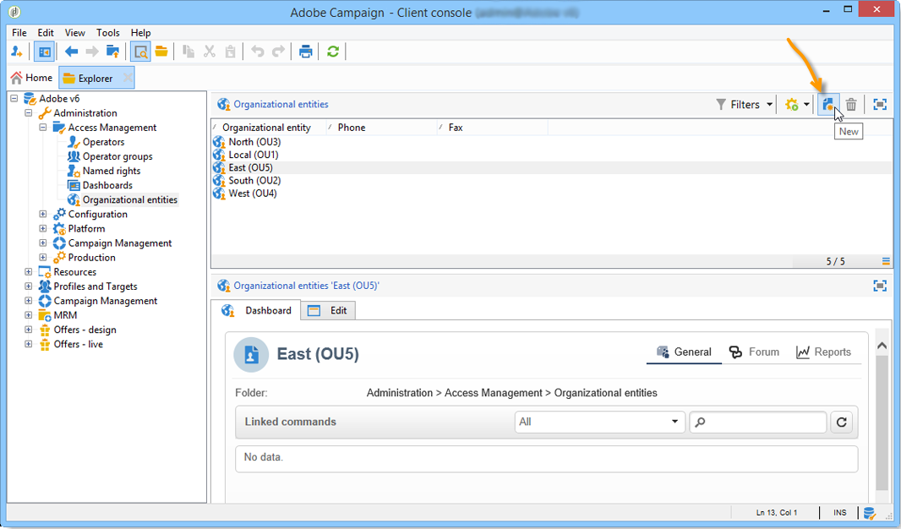

# Introdução ao marketing distribuído{#about-distributed-marketing}

O Adobe Campaign oferece um aplicativo de **Marketing distribuído** para implementar campanhas cooperativas entre entidades centrais (sedes, departamentos de marketing etc.) e entidades locais (pontos de vendas, agências regionais etc.). Essa cooperação é baseada em um espaço de trabalho compartilhado conhecido como **[!UICONTROL list of campaign packages]**, em que templates de campanha e instâncias criadas centralmente são oferecidos a entidades locais.

A entidade central fornece campanhas que entidades locais poderão usar. As campanhas são materializadas por pacotes que representam campanhas locais ou colaborativas. Para usar uma campanha, a entidade local deverá fazer solicitá-la e a solicitação deverá ser aprovada.

>[!CAUTION]
>
>O módulo de Marketing distribuído é uma opção de **Campanha** . Verifique o contrato de licença.

## Terminologia {#terminology}

* **Entidades centrais**

   As entidades centrais são compostas por operadores de marketing responsáveis por especificar comunicações e ajudar entidades locais a executar sua campanha de marketing.

   O módulo de marketing distribuído permite à entidade central:

   * configurar pacotes de campanha de marketing para entidades locais,
   * aumentar o grau de autonomia das entidades locais em relação à sua escolha para comunicação com cliente/prospecto, direcionamento, conteúdo etc.
   * gerenciar e controlar custos,
   * lidar com uma rede de agências.

* **Entidades locais**

   As entidades locais podem ser agências, lojas ou grupos de operadores locais específicos (gerentes regionais ou de país, gerentes de marca etc.).

   O Marketing distribuído permite que entidades locais tenham mais autonomia, enquanto otimizam os custos de execução.

* **Localização**

   Localização é a capacidade de uma entidade local modificar o target e o conteúdo de uma campanha. O nível possível de localização depende do tipo de campanha e sua implementação.

* **Lista de pacotes de campanha**

   A lista de pacotes de campanha contém as campanhas disponíveis para entidades locais.

* **Pacote de campanha**

   Modelo (ou instância de campanha) criado por uma entidade central e disponibilizado para um conjunto de entidades locais.

* **Campanha local**

   Uma campanha local é uma instância criada a partir de um modelo referenciado da lista de **[!UICONTROL campaign packages]** com um **cronograma de execução específico**. Seu objetivo é atender a uma comunicação local usando um template de campanha que foi criado e configurado pela entidade central.

   O grau de autonomia da entidade local depende da implementação usada.

   Consulte [Criar uma campanha local](creating-a-local-campaign.md).

* **Campanha colaborativa**

   Uma campanha colaborativa é uma campanha cujo **cronograma de execução é definido** pela entidade central, que a entidade local pode usar. O conteúdo permanece o mesmo para cada entidade local, mas os custos são compartilhados. Para participarem, as entidades locais se inscrevem na campanha colaborativa.

   * **[!UICONTROL Collaborative campaign (by form)]**: recomendado para campanhas que envolvam até 300 entidades locais. A entidade local pode inserir parâmetros predefinidos para definição de alvos e personalização de conteúdo em um formulário web. O formulário pode ser um formulário do Adobe Campaign ou um formulário externo (cliente extranet). Um administrador funcional pode definir e configurar o formulário com base em um template de formulário definido pelo integrador. Para solicitar a campanha, a entidade local precisa apenas de acesso à web.
   * **[!UICONTROL Collaborative campaign (by campaign)]**: recomendado para campanhas destinadas a dezenas de entidades locais. Esse tipo de campanha cria campanhas filho para cada entidade local. Quando o **[!UICONTROL collaborative campaign (by campaign)]** é aprovado pela entidade central, a campanha é disponibilizada à entidade local, que pode modificá-la. A execução é automaticamente sincronizada entre campanhas pai e filho. A entidade local deve ter acesso a uma instância para solicitar uma campanha e participar dela.
   * **[!UICONTROL Collaborative campaign (by target approval)]**: recomendado para campanhas destinadas a milhares de entidades locais. A entidade local recebe uma lista de contatos que foi predefinida pela entidade central. A entidade local decide se mantém determinados contatos com base no conteúdo da campanha por meio de um formulário web. As entidades locais são selecionadas da lista de contatos selecionados. Para participar da campanha, a entidade local só precisa de acesso à web.
   * **[!UICONTROL Collaborative campaign (simple)]**: esse modo garante a compatibilidade com os processos de execução específicos das versões anteriores.

   Consulte [Criar uma campanha colaborativa](creating-a-collaborative-campaign.md)

**Solicitar pacotes de campanha**

Se uma entidade local se registra para uma campanha, isso é feito em um pedido que reagrupa todas as informações relativas à localização da campanha.

## Workspace {#workspace}

A lista de pacotes da campanha pode ser acessada na guia **Campanhas**: clique no link **[!UICONTROL Campaign packages]**.

Essa janela permite que todos os operadores visualizem as campanhas disponíveis para sua agência local.

No caso de agências centrais, essa janela exibe todos os pacotes disponíveis na lista de pacotes de campanha e oferece links adicionais para edição da lista.

## Operadores e entidades {#operators-and-entities}

Comece especificando os operadores de entidade centrais e locais pela pasta **[!UICONTROL Access management]**.

### Operadores {#operators}

É preciso criar operadores centrais e locais.

Os operadores centrais devem pertencer ao grupo de operadores **[!UICONTROL Central management]** ou ter o direito nomeado **[!UICONTROL CENTRAL]**.

Os operadores locais devem pertencer ao grupo de operadores **[!UICONTROL Local management]** ou ter o direito nomeado **[!UICONTROL LOCAL]**. Eles também devem estar vinculados à sua entidade local.

### Entidades organizacionais {#organizational-entities}

Para criar uma entidade organizacional, clique no nó **[!UICONTROL Administration > Access management > Organizational entities]** e clique no ícone **[!UICONTROL New]**, acima da lista de entidades.

Cada entidade organizacional contém informações de identificação (etiqueta, nome interno, informações de contato etc.) e grupos envolvidos no processo de aprovação de pedidos. Eles são definidos na seção **[!UICONTROL Notifications and approvals]** localizada na guia **[!UICONTROL General]**.

* Definir um grupo de notificação de pacote: operadores neste grupo receberão uma notificação sempre que um novo pacote for adicionado à lista de pacites de campanha e cada vez que uma campanha estiver disponível.
* Selecione o grupo de revisores responsáveis pela aprovação de pedidos, ou seja, aqueles responsáveis pela aprovação de campanhas solicitadas pela entidade local.
* Finalmente, selecione o grupo de revisores responsáveis pela aprovação da campanha local (target, conteúdo, orçamento etc.). Esse grupo pode ser adicionado ao solicitar uma campanha, dependendo do template.

>[!NOTE]
>
>O processo de aprovação é apresentado na seção [Approval process](creating-a-local-campaign.md#approval-process).

## Implementação {#implementation}

As campanhas de Marketing Distribuído são criadas e publicadas pela entidade central. Eles podem ser usados por entidades locais e centrais conforme necessário.

O procedimento de implementação depende do tipo de pacote de campanha usado e dos níveis de delegação da entidade local.

### Tarefas do integrador {#integrator-side}

1. Criar entidades locais.
1. Vincule recipients com os operadores que gerenciam entidades locais.

   

1. Especificar direitos e regras de navegação para entidades locais
1. Especifique o conjunto de campos necessários para a localização da campanha:

   * definição de target e tamanho máximo,
   * definição de conteúdo,
   * cronograma de execução (data de contato e data de extração), **somente para operadores locais**,
   * extensão do schema do pedido com todos os campos adicionais necessários.

1. Crie um formulário web (Adobe ou extranet) que permita exibir parâmetros de localização, avalie o alvo e o orçamento, bem como pré-visualize o conteúdo e aprove o pedido.

   Para **campanhas colaborativas (por aprovação de target)**, crie a tabela em que as aprovações de cada entidade local serão salvas.

### Tarefas do administrador funcional {#functional-administrator-side}

Essas etapas devem ser executadas ao criar cada campanha.

1. Atualize o formulário com os campos usados para localização da campanha.
1. Crie uma instância de um template de campanha apropriado (campanha colaborativa) ou duplique o template de campanha (campanha local).
1. Configure a campanha com os campos de localização e a referência de formulário.
1. Publique a campanha.

### Tarefas do operador local {#local-operator-side}

Essas etapas devem ser executadas para cada campanha.

1. Após receber a notificação da disponibilidade do pacote de campanha, especifique o local da campanha (opcional).
1. Avalie o target, o orçamento, etc.
1. Pré-visualize o conteúdo da campanha.
1. Solicite a campanha.
