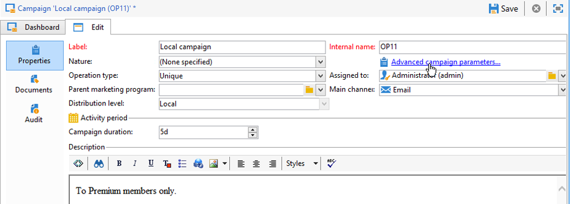
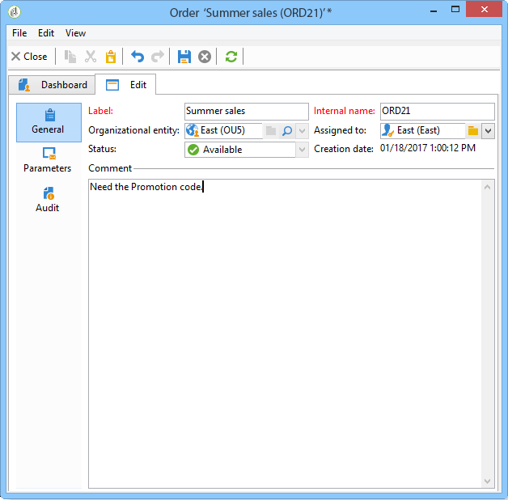

# Criar uma campanha local{#creating-a-local-campaign}

Uma campanha local é uma instância criada a partir de um modelo referenciado da lista de **[!UICONTROL campaign packages]** com um **cronograma de execução específico**. Seu objetivo é atender a uma comunicação local usando um template de campanha que foi criado e configurado pela entidade central. Os principais estágios para a implementação de uma operação local são:

**Para a entidade central**

1. Criar um template de campanha local.
1. Criar um pacote de campanha a partir de um template.
1. Publicar um pacote de campanha
1. Aprovar pedidos

**Para a entidade local**

1. Solicitar a campanha
1. Executar campanhas

## Criar um template de campanha local {#creating-a-local-campaign-template}

Para criar um pacote de campanha, primeiro crie o **modelo de campanha** por meio do nó **[!UICONTROL Resources > Templates]**.

Para criar um novo modelo local, duplique o template padrão **[!UICONTROL Local campaign (opLocal)]**.

Nomeie seu template de campanha e preencha os campos disponíveis.

Na janela da campanha, clique na guia **[!UICONTROL Edit]** e clique no link **[!UICONTROL Advanced campaign parameters...]**.

### Interface da Web {#web-interface}

Na guia **Marketing distribuído**, você pode escolher o tipo de interface da Web e especificar os valores e parâmetros padrões a serem inseridos quando uma entidade local enviar um pedido.

A interface da web corresponde a um formulário a ser preenchido pela entidade local ao solicitar a campanha.

Selecione o tipo de interface da web a ser aplicada às campanhas criadas a partir do template:

Há quatro tipos de interfaces da web disponíveis:

* **[!UICONTROL By brief]** : a entidade local deve fornecer uma descrição onde descreve as configurações da campanha. Uma vez aprovado o pedido, a entidade central configura e executa a campanha como um todo.

   

* **[!UICONTROL By form]** : a entidade local tem acesso a um formulário web onde, dependendo do template usado, podem editar o conteúdo, o público-alvo e o tamanho máximo, bem como datas de criação e extração usando campos de personalização. A entidade local pode avaliar o público-alvo e pré-visualizar o conteúdo desse formulário web.

   

   O formulário oferecido é especificado em um aplicativo web que deve ser selecionado em uma lista suspensa no campo **[!UICONTROL web Interface]** no link do template **[!UICONTROL Advanced campaign parameters...]**. Consulte [Criar uma campanha local (por formulário)](examples.md#creating-a-local-campaign--by-form-).

   >[!NOTE]
   >
   >A aplicação web utilizada é um exemplo. É necessário criar um aplicativo web específico para poder usar um formulário.

   

* **[!UICONTROL By external form]** : a entidade local tem acesso aos parâmetros da campanha em sua extranet (não do Adobe Campaign). Esses parâmetros são idênticos aos de uma **campanha local (por formulário)**.
* **[!UICONTROL Pre-set]** : entidade local solicita uma campanha usando o formulário padrão, sem localizá-lo.

   

### Valores padrão {#default-values}

Selecione o **[!UICONTROL Default values]** a ser completado por entidades locais. Por exemplo:

* contato e datas de extração,
* características do target (segmento de idade, etc.).

Preencha os campos **[!UICONTROL Parent marketing program]** e **[!UICONTROL Charge]**.

### Aprovações {#approvals}

No link **[!UICONTROL Advanced parameters for campaign entry]**, é possível especificar o número máximo de revisores.

Os revisores serão inseridos pela entidade local ao solicitar a campanha.

Se você não deseja nomear revisores para uma campanha, insira 0.

### Documentos {#documents}

Você pode permitir que operadores de entidades locais vinculem documentos (arquivos de texto, planilhas, imagens, descrições de campanha etc.) à campanha local ao criar o pedido. O link **[!UICONTROL Advanced parameters for campaign entry...]** permite restringir o número de documentos. Para fazer isso, basta inserir o número máximo permitido no campo **[!UICONTROL Number of documents]**.

Ao solicitar um pacote de campanha, o formulário sugere vincular quantos documentos forem indicados no campo correspondente no template.

Para não exibir um campo para fazer upload de documento, digite **[!UICONTROL 0]** no campo **[!UICONTROL Number of documents]**.

>[!NOTE]
>
>O **[!UICONTROL Advanced parameters for campaign entry]** pode ser desativado verificando o **[!UICONTROL Do not display the page used to enter the campaign parameters]**.

### Fluxo de trabalho {#workflow}

Na guia **[!UICONTROL Targeting and workflows]**, crie o fluxo de trabalho que coleta os **[!UICONTROL Default values]** especificados nas **[!UICONTROL Advanced campaign parameters...]** e cria os deliveries.

Clique duas vezes na atividade **[!UICONTROL Query]** para configurá-la de acordo com os **[!UICONTROL Default values]** especificados.

### Entrega {#delivery}

Na guia **[!UICONTROL Audit]**, clique no ícone **[!UICONTROL Detail...]** para visualizar o **[!UICONTROL Scheduling]** do delivery selecionado.

O ícone **[!UICONTROL Scheduling]** permite configurar o contato do delivery e a data de execução.

Se necessário, configure o tamanho máximo do delivery:

Localize o HTML do seu delivery. Por exemplo, no campo **[!UICONTROL Delivery > Current order > Additional fields]**, use o campo **[!UICONTROL Age segment]** para localizar o delivery de acordo com a idade do público-alvo.

Salve seu template de campanha. Agora você pode usá-lo na visualização **[!UICONTROL Campaign packages]** na guia **[!UICONTROL Campaigns]** clicando no botão **[!UICONTROL Create]**.

>[!NOTE]
>
>Os templates de campanha e suas configurações gerais estão detalhados em [esta página](../campaigns/marketing-campaign-templates.md).

## Criação do pacote de campanha {#creating-the-campaign-package}

Para que o template de campanha fique disponível para entidades locais, ele precisa ser adicionado à lista. Para fazer isso, a agência central precisa criar um novo pacote.

Siga as etapas abaixo:

1. Na seção **[!UICONTROL Navigation]** da página **Campaigns**, clique no link **[!UICONTROL Campaign packages]**.
1. Clique no botão **[!UICONTROL Create]**.

   

1. A seção acima da janela permite selecionar o template do pacote de campanha especificado [anteriormente](#creating-a-local-campaign-template).

   Por padrão, o template **[!UICONTROL New local campaign package (localEmpty)]** é usado para campanhas locais.

1. Especifique o rótulo, a pasta e a programação de execução do pacote de campanha.

### Datas {#dates}

As datas de início e término definem o período de visibilidade da campanha na lista de pacotes de campanha.

A data de disponibilidade é a data em que a campanha fica disponível para entidades locais (para solicitar).

>[!CAUTION]
>
>Se uma entidade local não reservar a campanha antes do prazo, ela não poderá usá-la.

Essas informações são encontradas na mensagem de notificação enviada para agências locais, conforme mostrado abaixo:

### Público-alvo {#audience}

Para uma campanha local, a entidade central pode especificar as entidades locais envolvidas marcando a opção **[!UICONTROL Limit the package to a set of local entities]**.

### Configurações adicionais {#additional-settings}

Depois que o pacote é salvo, a entidade central pode editá-la na guia **[!UICONTROL Edit]**.

Na guia **[!UICONTROL General]**, a entidade central pode:

* configurar o(s) revisor(es) do pacote de campanha no link **[!UICONTROL Approval parameters...]**,
* revisar o cronograma de execução,
* adicionar ou excluir entidades locais.

>[!NOTE]
>
>Por padrão, cada entidade pode solicitar uma **campanha local** apenas uma vez.
>   
>Marque a opção **[!UICONTROL Enable multiple creation]** para permitir que várias campanhas locais sejam criadas no pacote de campanha.

### Notificações {#notifications}

Quando uma campanha se torna disponível ou quando o prazo de registro é atingido, uma mensagem é enviada aos operadores do grupo de notificação local. Para obter mais informações, consulte [Entidades organizacionais](about-distributed-marketing.md#organizational-entities).

## Solicitar uma campanha {#ordering-a-campaign}

Os pacotes de campanha ficam acessíveis às entidades locais quando aprovados e quando seu período de implementação começou. As entidades locais recebem um e-mail informando que um novo pacote de campanha está disponível (assim que a data de disponibilidade é atingida).

>[!NOTE]
>
>Se algumas entidades locais foram especificadas ao criar o pacote de campanha, elas serão as únicas a receberem uma notificação. Se nenhuma entidade local tiver sido especificada, todas as entidades locais receberão uma notificação.

Para usar uma campanha oferecida pela entidade central, a entidade local deve solicitá-la.

Para solicitar uma campanha:

1. Clique em **[!UICONTROL Order campaign]** na mensagem de notificação ou no botão correspondente no Adobe Campaign.

   Digite sua ID e senha para solicitar a campanha. A interface é composta de um conjunto de páginas definidas em uma aplicação Web.

1. Insira as informações necessárias na primeira página (rótulo do pedido e comentário) e clique em **[!UICONTROL Next]**.

   

1. Complete os parâmetros disponíveis e aprove o pedido.

1. Uma notificação é enviada ao gerente da entidade organizacional à qual a entidade local pertence, para aprovar esse pedido.

   

1. As informações são retornadas às entidades locais e centrais. Embora entidades locais possam exibir apenas seus próprios pedidos, a entidade central pode visualizar todos os pedidos por qualquer entidade local, conforme mostrado abaixo:

   

   Os operadores podem exibir detalhes do pedido:

   

   A guia **[!UICONTROL Edit]** contém as informações inseridas pela entidade local ao solicitar a campanha.

   

1. O pedido deve ser aprovado pela entidade central para ser finalizado.

   

   Para obter mais informações, consulte a seção [Approval process](#approval-process).

1. O operador local é, então, notificado de que a campanha está disponível: a disponibilidade da campanha pode ser encontrada na lista de pacotes de campanha na guia **Campanhas**. A campanha pode ser usada. Para obter mais informações, consulte [Como acessar campanhas](accessing-campaigns.md).

   A opção **[!UICONTROL Start targeting with order approval]** permite que a entidade local execute a campanha assim que o pedido for aprovado.

   

## Aprovar um pedido {#approving-an-order}

Para confirmar um pedido de campanha, a entidade central deve aprová-lo.

A visão geral **[!UICONTROL Campaign orders]**, acessada pela guia **Campanhas** permite visualizar o status dos pedidos da campanha e aprová-los.

>[!NOTE]
>
>As entidades locais podem fazer alterações no pedido até que ele seja aprovado.

### Processo de aprovação {#approval-process}

#### Notificação por e-mail {#email-notification}

Quando uma campanha é solicitada por uma entidade local, seus revisores são notificados por e-mail, conforme mostrado abaixo:

>[!NOTE]
>
>A seleção de revisores é apresentada na seção [Revisores](#reviewers). Eles podem aceitar ou rejeitar o pedido.

#### Aprovar via console do cliente {#approving-via-the-adobe-campaign-console}

O pedido também pode ser aprovado por meio do Console do cliente, na visão geral do pedido de campanha. Para aprovar um pedido, selecione-o e clique em **[!UICONTROL Approve the order]**.

>[!NOTE]
>
>A campanha ainda pode ser editada e reconfigurada até a data de disponibilidade da campanha. As entidades locais também podem rejeitar a campanha clicando no botão **[!UICONTROL Cancel]**.

#### Criação de uma campanha {#creating-a-campaign}

Uma vez aprovado o pedido de campanha, ele pode ser configurado e executado pela entidade local.

Para obter mais informações, consulte [Como acessar campanhas](accessing-campaigns.md).

### Recusar uma aprovação {#rejecting-an-approval}

O operador encarregado da aprovação pode rejeitar um pedido ou um pacote de campanha.

Se o revisor rejeitar um pedido, a notificação relevante será automaticamente enviada às entidades locais relacionadas: ela exibirá o comentário inserido pelo operador que rejeitou a aprovação.

As informações são exibidas na lista da página de pacotes de campanha ou na página do pedido da campanha.. Se tiverem acesso ao Console do cliente do Adobe Campaign, entidades locais serão informadas dessa rejeição.

Eles podem exibir o comentário relacionado do pacote de campanha na guia **[!UICONTROL Edit]**.

### Revisores {#reviewers}

Toda vez que uma aprovação é necessária, os revisores são notificados por e-mail.

Para cada entidade local, os revisores são selecionados para aprovação de pedido de campanha e aprovação de campanha. Para obter mais informações sobre a seleção de revisores locais, consulte [Entidades organizacionais](about-distributed-marketing.md#organizational-entities).

>[!NOTE]
>
>Para que essa seleção seja possível, a aprovação de pedidos ainda não deve estar ativa.

### Cancelar um pedido {#canceling-an-order}

A agência central pode cancelar um pedido com o botão **[!UICONTROL Delete]**, localizado no painel de pedidos.

Isso cancela a campanha na visualização **[!UICONTROL Campaign orders]**.
