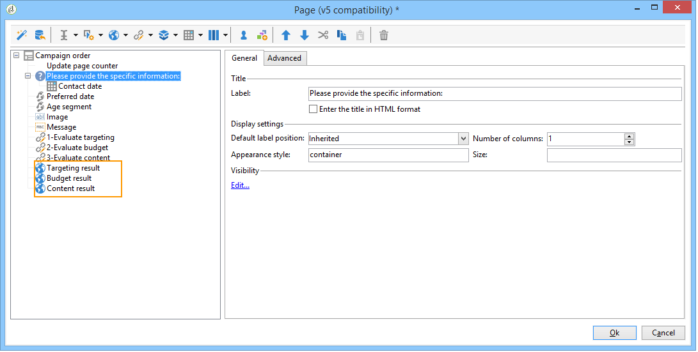

# Amostras de marketing distribuído{#distributed-marketing-samples}


## Criar uma campanha local (por formulário) {#creating-a-local-campaign--by-form-}

A interface web tipo **By form** envolve o uso de um **aplicativo web**. Dependendo da configuração, essa aplicação web pode conter qualquer tipo de elementos personalizados definidos. Por exemplo, você pode sugerir links para avaliar o target, o orçamento, o conteúdo, etc. por meio de APIs dedicadas.

>[!NOTE]
>
>O aplicativo web usado neste exemplo não é fornecido com o Adobe Campaign. Para usar um formulário em uma campanha, você deve criar o aplicativo web dedicado.

Ao criar o template de campanha, clique no ícone **[!UICONTROL Zoom]** dentro da opção **[!UICONTROL Web interface]** do link **[!UICONTROL Advanced campaign parameters...]** para acessar os detalhes do aplicativo web.


>[!NOTE]
>
>Os parâmetros da aplicação Web estão disponíveis somente no template de campanha.

Na guia **[!UICONTROL Edit]**, selecione a atividade **Campaign order** e a abra para acessar o conteúdo.


Neste exemplo, a atividade da **Campaign order** inclui:

* campos a serem inseridos pela entidade local durante o pedido,

  

* links que permitirão à entidade local avaliar a campanha (por exemplo, o target, o orçamento, o conteúdo, etc.),

  

* scripts que permitem calcular e exibir o resultado destas avaliações.

  

Neste exemplo, as seguintes APIs são usadas:

* Para a avaliação de target,

  ```
  var res = nms.localOrder.EvaluateTarget(ctx.localOrder);
  ```

* Para a avaliação do orçamento,

  ```
  var res = nms.localOrder.EvaluateDeliveryBudget(ctx.@deliveryId, NL.XTK.parseNumber(ctx.@compt));
  ```

* Para a avaliação de conteúdo,

  ```
  var res = nms.localOrder.EvaluateContent(ctx.localOrder, ctx.@deliveryId, "html", resSeed.@id);
  ```

## Criar uma campanha colaborativa (por aprovação de target) {#creating-a-collaborative-campaign--by-target-approval-}

### Introdução {#introduction}

Você é o gerente de marketing de uma marca grande de roupas que tem uma loja online e várias boutiques em todos os EUA. Agora que a primavera chegou, você decide criar uma oferta especial que dará aos seus melhores clientes 50% de desconto em todos os vestidos em seu catálogo.

Essa oferta é voltada para os melhores clientes de suas lojas dos EUA, o que significa que eles gastaram mais de US$ 300 desde o início do ano.

Portanto, você decide usar o Marketing Distribuído para criar uma campanha colaborativa (por aprovação de alvo) que permitirá selecionar os melhores clientes das suas lojas (agrupados por região), que receberão a entrega do e-mail com a oferta especial.

A primeira parte deste exemplo ilustra suas entidades locais que recebem a notificação de criação de campanha e como elas podem usá-lo para avaliar a campanha e a solicitarem.

A segunda parte deste exemplo explica como criar sua campanha.

As etapas são as seguintes:

**Para a entidade local**

1. Use a notificação de criação de campanha para acessar a lista de contatos selecionados pela entidade central.
1. Selecione os contatos e aprove a participação.

**Para a entidade central:**

1. Crie uma atividade **[!UICONTROL Data distribution]**.
1. Crie a campanha colaborativa.
1. Publique a campanha.

### Lado da entidade local {#local-entity-side}

1. As entidades locais que foram escolhidas para participar da campanha receberão uma notificação por e-mail.

   

1. Ao clicar no link **[!UICONTROL Access your contact list and approve targeting]**, a entidade local recebe acesso (via navegador da web) à lista de clientes selecionados para a campanha.

   

1. A entidade local desmarca determinados contatos da lista porque já foram contatados para uma oferta semelhante desde o início do ano.

   

Depois que as verificações foram aprovadas, a campanha poderá iniciar automaticamente.

### Lado da entidade central {#central-entity-side}

#### Criar uma atividade de distribuição de dados {#creating-a-data-distribution-activity}

1. Para configurar uma campanha colaborativa (por aprovação de target), primeiro você deve criar um **[!UICONTROL Data distribution activity]**. Clique no ícone **[!UICONTROL New]** na pasta **[!UICONTROL Resources > Campaign management > Data distribution]** do explorador do Campaign.

   

1. Na guia **[!UICONTROL General]**, você deve especificar:

   * o **[!UICONTROL Targeting dimension]**. Aqui, a **distribuição de dados** é executada com os **Recipients**.
   * o **[!UICONTROL Distribution type]**. Você pode escolher um **tamanho fixo** ou um **tamanho como uma porcentagem**.
   * o **[!UICONTROL Assignment type]**. Selecione a opção **Local entity**.
   * o **[!UICONTROL Distribution type]**. Aqui, ele é o campo **[!UICONTROL Origin (@origin)]** presente na tabela Destinatário que permite identificar a relação entre o contato e a entidade local.
   * O campo **[!UICONTROL Approval storage]**. Selecione a opção **Local approval of recipient**.

1. Na guia **[!UICONTROL Breakdown]**, especifique:

   * o **[!UICONTROL Distribution field value]**, que corresponde às entidades locais envolvidas na campanha futura.
   * a entidade local **[!UICONTROL label]**.
   * o **[!UICONTROL Size]** (fixo ou como uma porcentagem). O **valor padrão 0** envolve selecionar todos os destinatários vinculados à entidade local.

   

1. Salve a nova distribuição de dados.

#### Criar uma campanha colaborativa {#creating-a-collaborative-campaign}

1. Na pasta **[!UICONTROL Campaign management > Campaign]** do explorador do Campaign, crie um novo **[!UICONTROL collaborative campaign (by target approval)]**.
1. Na guia **[!UICONTROL Targeting and workflows]**, crie um workflow para sua campanha. Deve conter uma atividade **Split** na qual o **[!UICONTROL Record count limitation]** é definido pela atividade **[!UICONTROL Data distribution]**.

   

1. Adicione uma ação **[!UICONTROL Local approval]** onde você pode especificar:

   * o conteúdo da mensagem que será enviado para entidades locais na notificação,
   * o lembrete de aprovação,
   * o processamento esperado da campanha.

   

1. Salve seu registro.

#### Publicar a campanha {#publishing-the-campaign}

Agora você pode adicionar um **pacote de campanha** na guia **[!UICONTROL Campaigns]**.

1. Escolha a **[!UICONTROL Reference campaign]**. Na guia **[!UICONTROL Edit]** do pacote, é possível selecionar o **[!UICONTROL Approval mode]** para usar na campanha:

   * no modo **Manual** , as entidades locais participam da campanha se aceitarem o convite da entidade central. Eles podem excluir os contatos pré-selecionados se desejarem e a aprovação do gerente é necessária para confirmar a participação na campanha.
   * no modo **Automatic** , as entidades locais devem participar da campanha, a menos que ela cancelem a inscrição. Elas podem excluir contatos sem precisar de aprovação.

   

1. Na guia **[!UICONTROL Description]**, é possível adicionar uma descrição para a campanha, bem como quaisquer documentos a serem enviados às entidades locais.

   

1. Aprove seu pacote de campanha e inicie o fluxo de trabalho para publicar o pacote e disponibilizá-lo a todas as entidades locais na lista de pacotes.

   

## Criar uma campanha colaborativa (por formulário) {#creating-a-collaborative-campaign--by-form-}

### Introdução {#introduction-1}

Você é o gerente de marketing de uma grande marca de maquiagem que tem uma loja online e várias boutiques em todos os EUA. Para liquidar seu estoque de inverno e liberar espaço para seu novo estoque, você decide criar uma oferta especial que vai direcionar duas categorias de cliente: acima dos 30, para quem você oferecerá produtos de cuidados de pele sensíveis pela idade e o abaixo dos 30, para quem oferecerá os produtos mais básicos de tratamento de pele.

Portanto, você decide usar o Marketing Distribuído para criar uma campanha colaborativa (por formulário) que permitirá selecionar clientes de suas diferentes lojas por faixa etária. Esses clientes receberão uma entrega de e-mail com uma oferta especial que terá sido personalizada de acordo com suas faixas etárias.

A primeira parte deste exemplo ilustra suas entidades locais que recebem a notificação de criação de campanha e como elas podem usá-lo para avaliar a campanha e a solicitarem.

A segunda parte deste exemplo explica como criar sua campanha.

As etapas são as seguintes:

**Para a entidade local**

1. Use a notificação de criação de campanha para acessar o formulário online.
1. Personalize a campanha (target, conteúdo, volume de entrega).
1. Verifique estes campos e os modifique se necessário.
1. Aprove sua participação.
1. O gerente da entidade local (ou da entidade central) aprova sua configuração e participação.

**Para a entidade central:**

1. Crie a campanha colaborativa.
1. Configure **[!UICONTROL Advanced campaign parameters...]** da mesma maneira que uma campanha local.
1. Configure o workflow da campanha e a entrega da mesma forma que para uma campanha local.
1. Atualize o formulário da Web.
1. Crie o pacote de campanha e publique-o.

### Lado da entidade local {#local-entity-side-1}

1. As entidades locais selecionadas para participar da campanha recebem uma notificação por e-mail informando sobre suas participações na campanha.

   

1. As entidades locais preenchem o formulário personalizado e, em seguida:

   * avaliam o target e o orçamento,
   * pré-visualizam o conteúdo da entrega,
   * aprovam sua participação.

     

1. O operador encarregado de validar pedidos aprova a participação.

   

### Lado da entidade central {#central-entity-side-1}

1. Para implementar uma campanha colaborativa (por formulário), você deve criar uma campanha usando a template **Campanha colaborativa (por formulário)**.

   

1. Na guia **[!UICONTROL Edit]** da campanha, clique no link **[!UICONTROL Advanced campaign parameters...]** para configurá-la como uma campanha local. Consulte [Criar uma campanha local (por formulário)](#creating-a-local-campaign--by-form-).

   

1. Configure o workflow da campanha e o formulário da Web. Consulte [Criar uma campanha local (por formulário)](#creating-a-local-campaign--by-form-).
1. Crie seu pacote de campanha especificando o cronograma de execução e as entidades locais envolvidas.

   

1. Finalize a configuração do pacote selecionando o modo de aprovação na guia **[!UICONTROL Edit]**.

   

1. Na guia **[!UICONTROL Description]**, é possível inserir uma descrição do pacote de campanha, uma mensagem de notificação a ser enviada às entidades locais quando o pacote é publicado e anexar quaisquer documentos informativos ao seu pacote de campanha.

   

1. Aprove o pacote para publicá-lo.

   
