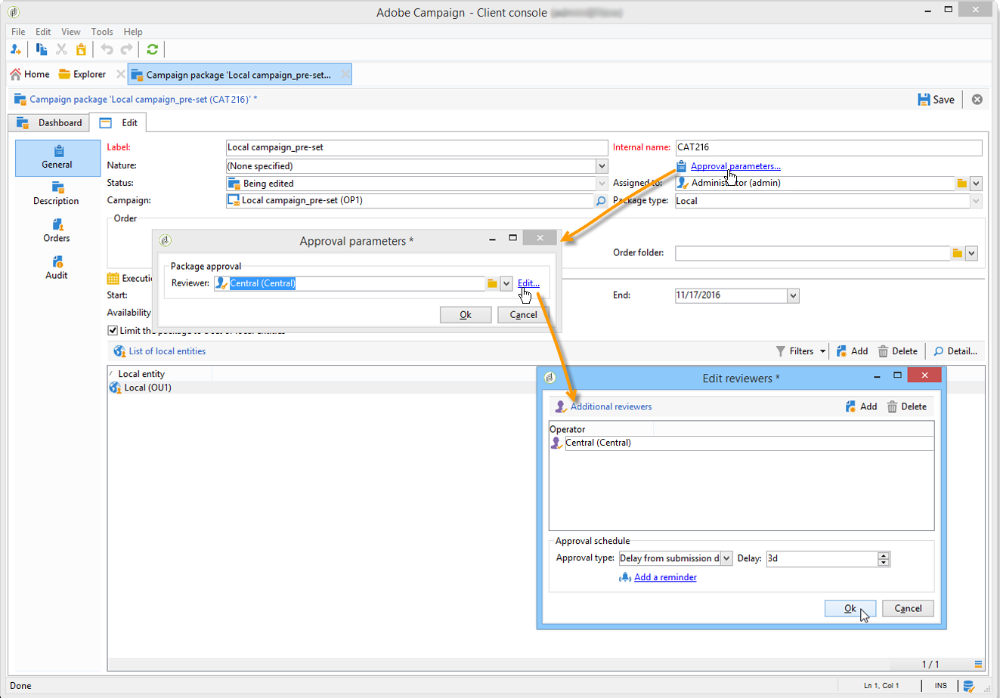

# Publicar o pacote da campanha{#publishing-the-campaign-package}

Operadores de entidades centrais publicam campanhas que desejam oferecer às entidades locais na **[!UICONTROL list of campaign packages]**.

Antes de serem publicados na lista de pacotes de campanha, os pacotes de campanha devem ser aprovados pela entidade central. Para fazer isso, é possível especificar um revisor ou grupo de revisores por meio do link **[!UICONTROL Approval parameters]** no pacote de campanha.

## Atribuir um revisor {#assigning-a-reviewer}

Para selecionar o revisor, clique no link **[!UICONTROL Approval parameters]** do pacote de campanha e escolha o revisor relevante na lista suspensa.

Você pode iniciar o processo de aprovação clicando em **[!UICONTROL Submit for approval]**.

Uma mensagem de notificação é enviada ao revisor para confirmar a disponibilidade desse pacote de campanha. A mensagem contém um link para aceitar ou rejeitar a aprovação via acesso à web.

>[!NOTE]
>
>No nível da entidade organizacional, você também pode especificar os revisores para aprovar pedidos. Para obter mais informações, consulte [Entidades organizacionais](about-distributed-marketing.md#organizational-entities).

## Adicionar outros revisores {#adding-other-reviewers}

É possível adicionar outros revisores a partir do link **[!UICONTROL Edit...]**, localizado na guia **[!UICONTROL Approval parameters...]** do pacote da campanha.

## Cronograma de aprovação {#approval-periods}

Por padrão, os revisores recebem três dias a partir da data de envio para processar a aprovação.

Na janela dos revisores de edição, é possível definir lembretes para enviar uma ou várias mensagens se um pacote de campanha não tiver sido aprovado. Para fazer isso, clique no link **[!UICONTROL Add reminder]** e, em seguida, no botão **[!UICONTROL Add]**.

Os lembretes podem ser enviados em uma determinada data e/ou **x** dias após a data de envio. O tipo de lembrete pode ser configurado na primeira coluna da tabela de lembretes. No exemplo abaixo, os revisores receberão uma mensagem de lembrete em 01/11/2023, ou seja, dois dias antes da data selecionada na coluna **[!UICONTROL Date]**, e um segundo lembrete um dia antes do final do período de aprovação, ou seja, dois dias após a data de envio para aprovação.

Depois que estiver definido e o pacote for enviado para aprovação, o cronograma de execução é exibido na guia **[!UICONTROL Audit]**. Ele mostra o prazo de processamento calculado com base na configuração anterior, bem como nas datas de todos os lembretes configurados.

## Aprovar via console do cliente {#approving-via-the-adobe-campaign-console}

Se nenhum revisor tiver sido especificado ou se nenhum dos operadores notificados tiver aprovado o pacote, o botão **[!UICONTROL Approve the package]** permitirá prosseguir diretamente para a aprovação no **[!UICONTROL Dashboard]** do pacote da campanha ou da visão geral dos pacotes.

Após a aprovação, a campanha é publicada, adicionada à lista e, assim que sua data de disponibilidade é alcançada, as entidades locais podem usá-la. Se as entidades locais foram especificadas ao criar a campanha, uma mensagem é enviada aos operadores no grupo de notificação para saberem que a campanha está disponível. Se nenhuma entidade foi especificada anteriormente, a campanha estará disponível para todas as entidades locais, por padrão. Para obter mais informações, consulte [Entidades organizacionais](about-distributed-marketing.md#organizational-entities).
