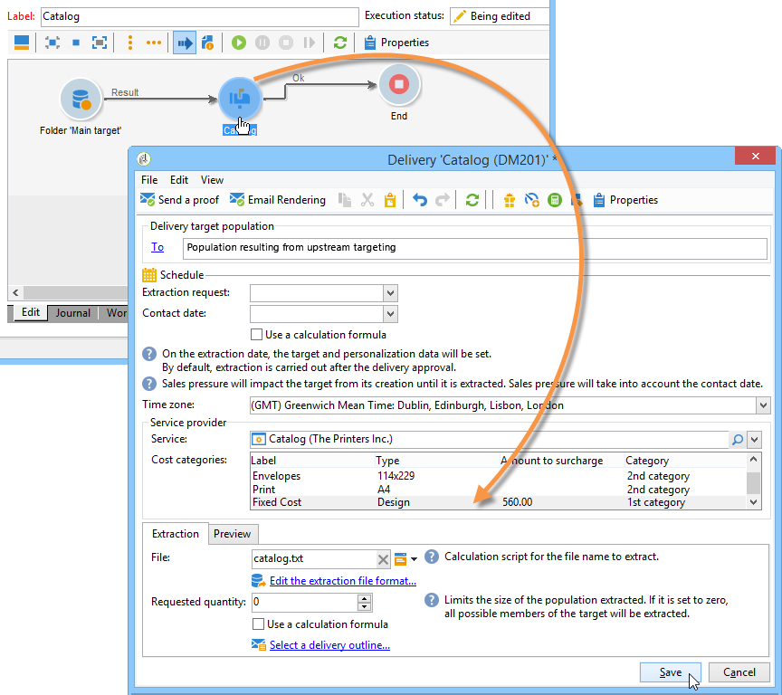
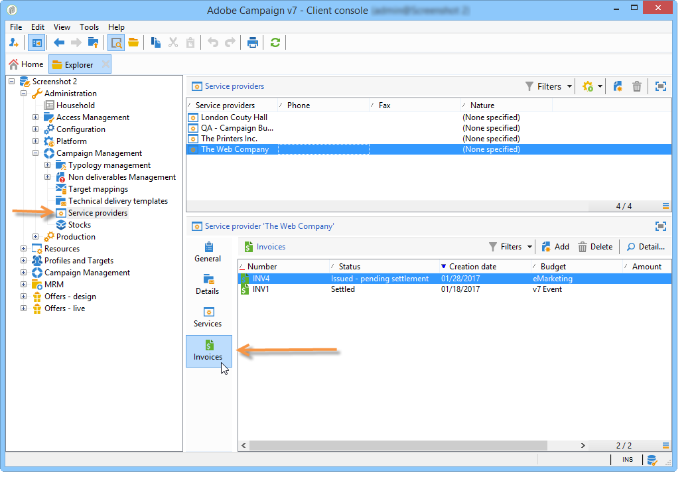

# Controlar custos{#controlling-costs}

O Adobe Campaign permite controlar os custos de marketing programados, confirmados e faturados e separá-los por categoria usando o módulo Gerenciamento de recursos de marketing.

Os custos comprometidos com os vários processos de uma campanha são cobrados de um orçamento definido antecipadamente pelo departamento de marketing. Os valores podem ser divididos em várias categorias para tornar as informações mais legíveis e fornecer relatórios mais detalhados dos investimentos em marketing.

O gerenciamento e o acompanhamento dos orçamentos são centralizados em um nó dedicado da árvore do Adobe Campaign. Isso permite monitorar os valores alocados, reservados, comprometidos e gastos na mesma visão e para todos os orçamentos.

As etapas a seguir devem ser aplicadas para implementar o gerenciamento de orçamento usando MRM:

1. Defina o orçamento. [Saiba mais](#creating-a-budget).

1. Defina o método de cálculo de custo: as estruturas de custo são definidas para os provedores de serviços. [Saiba mais](../campaigns/providers-stocks-and-budgets.md).

1. Definir os custos da campanha (entregas/tarefas): os custos incorridos pelas entregas e tarefas são inseridos individualmente ou globalmente para o template de campanha. [Saiba mais](../campaigns/marketing-campaign-deliveries.md#compute-costs-and-stocks).

1. Consolidar: de acordo com o status do progresso das tarefas, remessas e campanhas, os custos serão calculados e passados para o orçamento correspondente. Quando a criação da campanha está suficientemente avançada, o status do progresso do orçamento pode ser alterado para **[!UICONTROL Specified]**. O custo calculado do programa é então inserido automaticamente com os custos calculados na campanha. [Saiba mais](#cost-commitment--calculation-and-charging).

## Criar um orçamento {#creating-a-budget}

Para criar um orçamento, siga as etapas abaixo:

1. Navegue até a pasta **[!UICONTROL Campaign management > Budgets]** do explorador do Campaign.
1. Clique no ícone **[!UICONTROL New]**, nomeie o orçamento e o salve.
1. Informe a quantia inicial: indique a quantia alocada no campo relevante. Os outros montantes são inseridos automaticamente. [Saiba mais](#calculating-amounts).
1. Defina o período de validade inserindo as datas inicial e final. Estas informações são apenas indicativas.
1. Crie as categorias de despesas às quais os custos atribuídos a esse orçamento para campanhas, tarefas etc. podem ser vinculados. [Saiba mais](#expense-categories).

>[!NOTE]
>
>Você pode selecionar um orçamento relacionado. Para obter mais informações, consulte [esta seção](#linking-a-budget-to-another).
>

### Calcular valores {#calculating-amounts}

Cada orçamento é definido por um valor inicial que será diminuído com os custos das várias campanhas, entregas ou tarefas relacionadas a eles após terem sido agendadas ou realizadas. O status dos valores (planejado, reservado, comprometido, gasto ou faturado) depende do tipo de custo e do nível de comprometimento definido na campanha, na entrega ou na tarefa.

>[!NOTE]
>
>Os valores inseridos para as categorias devem corresponder ao envelope de orçamento definido no campo **[!UICONTROL Allocated]**.

Para campanhas, de acordo com o nível de compromisso, um custo pode ser planejado, comprometido ou reservado para uma ação futura.

>[!CAUTION]
>
>Quando uma campanha é criada, o status do progresso em **[!UICONTROL Budget]** deve ser definido para **[!UICONTROL Defined]** para que os custos sejam considerados na execução. Se o status for **[!UICONTROL Being edited]**, os custos não são consolidados.
>   
>A opção **[!UICONTROL Commitment level]** representa uma projeção de custos no futuro antes de serem cobradas no orçamento. De acordo com o progresso de uma campanha, tarefa ou entrega, pode-se decidir atribuir um nível de compromisso mais alto ou mais baixo (1. Planejado, 2. Reservado, 3. Comprometido) usando a caixa de combinação.

Por exemplo, o custo planejado estimado de uma campanha da web é 45.000 Euros.

Para a campanha, quando o status de criação do orçamento é estabelecido como **[!UICONTROL Defined]**, o custo real da campanha (ou o custo calculado) é inserido nos totais do orçamento.

De acordo com o nível de compromisso do orçamento da campanha, o valor é inserido nos campos **[!UICONTROL Planned]**, **[!UICONTROL Reserved]** ou **[!UICONTROL Committed]**.

O nível de comprometimento pode ser modificado:

* no nível da **campanha**, na janela **[!UICONTROL Budget]**, encontrada na guia **[!UICONTROL Edit]**. É onde os orçamentos, custos e despesas são configurados.
* no nível de **tarefas**, na janela **[!UICONTROL Expenses and revenues]**.

Quando o status for **[!UICONTROL Reserved]**, a atualização é executada automaticamente para o orçamento cobrado.

O procedimento é o mesmo em nível de tarefa.

Quando uma despesa cria uma fatura e o pagamento é efetuado, seu valor é inserido no campo **[!UICONTROL Invoiced]**.

### Categorias de despesas {#expense-categories}

Os valores podem ser distribuídos em várias categorias de despesas para melhorar a legibilidade dos dados e para ter relatórios mais detalhados dos investimentos em marketing. As categorias de despesas são definidas durante a criação do orçamento, por meio do nó **[!UICONTROL Budgets]** da árvore.

Para adicionar uma categoria, clique no botão **[!UICONTROL Add]** na seção inferior da janela.

É possível selecionar uma categoria dentre as existentes ou definir uma nova categoria, digitando-a diretamente no campo. Quando confirmar a entrada, uma mensagem de confirmação permite adicionar essa categoria à lista de categorias existentes e associá-la a uma Natureza, se necessário. Essas informações serão usadas nos relatórios de orçamento.

### Vincular um orçamento a outro {#linking-a-budget-to-another}

É possível vincular um orçamento a um orçamento principal. Para fazer isso, selecione o orçamento principal no campo **[!UICONTROL related budget]** dos orçamentos secundários.

Uma guia adicional será adicionada ao orçamento principal para exibir a lista de orçamentos relacionados.

Essas informações são inseridas nos relatórios de orçamento.

## Adicionar linhas de despesa {#adding-expense-lines}

As linhas de despesa são adicionadas automaticamente ao orçamento. Elas são criadas durante a análise de entrega e quando uma tarefa é concluída.

Para cada campanha, entrega ou tarefa, os custos gerados são agrupados nas linhas de despesa do orçamento ao qual são descontadas. Essas linhas de despesas são criadas de acordo com as linhas de custo do provedor de serviços relacionadas e calculadas por meio das estruturas de custo associadas.

Cada linha de despesa contém as seguintes informações:

* A campanha e a entrega ou a tarefa à qual está relacionada
* A quantia calculada com base nas estruturas de custo ou no custo provisional estimado.
* Custo real da entrega ou da tarefa
* A linha correspondente da fatura (somente MRM).
* Lista de custos calculados pela categoria de custo (se existir uma estrutura de custos).

No exemplo acima, a linha de despesa editada contém os custos calculados para a entrega de **Novos cartões** para a campanha do **Loyalty Spring Pack.** Quando a entrega é editado, a guia **[!UICONTROL Direct Mail]** permite ver como a linha de despesa é calculada.

O cálculo de custo para essa entrega baseia-se nas categorias de custo selecionadas para o provedor de serviços relacionado:

De acordo com as categorias de custo selecionadas, as estruturas de custo correspondentes são aplicadas a fim de calcular as linhas de custo. Neste exemplo, para o provedor de serviços relacionado, as estruturas de custo são as seguintes:

>[!NOTE]
>
>As categorias e estruturas de custo são apresentadas em [esta página](../campaigns/providers-stocks-and-budgets.md#create-a-service-provider-and-its-cost-categories)

## Compromisso de custo, cálculo e cobrança {#cost-commitment--calculation-and-charging}

Os custos podem ser confirmados para entregas e tarefas. De acordo com o progresso do processo ao qual está relacionada, o status de um custo é atualizado.

### Processo de cálculo de custo {#cost-calculation-process}

Os custos dividem-se em três categorias:

1. Custo estimado provisional.

   O custo provisional estimado é uma estimativa dos custos dos processos da campanha. Contanto que seja editado, os valores de entrada não são consolidados. Ele deve ter o status **[!UICONTROL Specified]** para que os valores sejam considerados nos cálculos.

   Essa quantia é entrada manualmente e pode ser dividida em várias categorias de despesas. Para o detalhamento de um custo, clique no link **[!UICONTROL Breakdown...]** e, em seguida, no botão **[!UICONTROL Add]** para definir uma novo valor.

   

   É possível associar cada custo com uma categoria para que a divisão de custos por categoria de despesa possa ser visualizada posteriormente no orçamento relacionado e nos relatórios de orçamento.

1. Custo calculado

   O custo calculado depende do elemento relacionado (campanha, entrega, tarefa etc.) e seu status (sendo editado, em andamento, concluído). Em qualquer caso, se o custo real for especificado, o custo calculado usará essa quantia.

   Se o custo real não for fornecido, as seguintes regras se aplicam:

   * Para uma campanha que está sendo editada, o custo calculado é o custo provisional estimado da campanha ou, se esse custo não for definido, o custo calculado será a soma de todos os custos provisional das entregas e tarefas da campanha. Se a campanha estiver concluída, o custo calculado da campanha será a soma de todos os custos calculados.
   * Para uma entrega que ainda não foi analisada, o custo calculado é o custo estimado provisional. Se a análise já tiver sido executada, o custo calculado será a soma de todos os custos calculados da estrutura de custos do provedor de serviços e o número de destinatários.
   * Para uma tarefa em andamento, o custo calculado usa o custo provisional estimado. Se a tarefa for concluída, o custo calculado será a soma de todos os custos calculados nas estruturas de custo do provedor de serviços e o número de dias concluídos.
   * Para o plano de marketing, como para o programa, o custo calculado é a soma dos custos calculados para as campanhas. Se esses custos não forem especificados, o custo calculado usará os custos provisional estimados.

   >[!NOTE]
   >
   >O link **[!UICONTROL Breakdown]** permite visualizar os detalhes e a última data de cálculo do custo.

1. Custo real

   O custo real é alimentado manualmente e, se necessário, é dividido em diferentes categorias de despesas.

### Cálculo e cobrança {#calculation-and-charging}

Os custos são calculados por meio de estruturas de custo e cobrados nos orçamentos selecionados nas campanhas, entregas ou tarefas.

Uma verificação pode ser realizada nos valores comprometidos com as campanhas por meio da aprovação do orçamento. Tarefas estilo marcos adicionais podem ser criadas em uma campanha para configurar outras aprovações. Consulte [Tipos de tarefa](creating-and-managing-tasks.md#types-of-task).

### Exemplo {#example}

Vamos criar uma campanha com:

* Uma entrega de mala direta usando as estruturas de custo de um provedor de serviços.
* Uma tarefa com um custo fixo.
* Uma tarefa com um custo diário.

#### Etapa 1 - Criar o orçamento {#step-1---creating-the-budget}

1. Crie um novo orçamento por meio do nó **[!UICONTROL Campaign management > Budgets]**.

1. Defina um orçamento de 10.000 euros no campo **[!UICONTROL Allocated]** da seção **[!UICONTROL Amounts]**. Adicione duas categorias de despesas na seção inferior da janela:

#### Etapa 2 - Configurar o provedor de serviços e definir as estruturas de custo {#step-2---configuring-the-service-provider-and-defining-the-cost-structures}

1. Crie um provedor de serviços e um modelo de serviço com a estrutura de custo do nó **[!UICONTROL Administration > Campaigns]**. Para obter mais informações, consulte [esta seção](../campaigns/providers-stocks-and-budgets.md#create-a-service-provider-and-its-cost-categories).

   Para entregas de correspondência direta, crie **[!UICONTROL Envelopes]** de categorias de custo (tipos 114x229 e 162x229), **[!UICONTROL Postage]** e **[!UICONTROL Print]** (tipos A3 e A4). E, em seguida, crie as seguintes estruturas de custo:

   

1. Adicione um custo fixo (nas categorias de custo) cujo cálculo é fixo e cuja quantidade está em branco (na estrutura de custo correspondente) e que será especificada individualmente para cada entrega.

   

   Para tarefas, crie as duas categorias de custo a seguir:

   * **[!UICONTROL Room reservation]** (Pequena sala e Sala grande), com uma estrutura de custo **fixa** na quantidade de 300 e 500 euros:

   

   * **[!UICONTROL Creation]** (**tipo de template de conteúdo**), com uma estrutura de custo **diária** de 300 euros:

   

#### Etapa 3 — carregar o orçamento na campanha {#step-3---charging-the-budget-in-the-campaign}

1. Crie uma campanha e selecione o orçamento criado na Etapa 1.

   >[!NOTE]
   >
   >Por padrão, o orçamento selecionado para o programa é aplicado em todas as campanhas do programa.

   

1. Especifique o custo provisional estimado, com detalhamento:

   

1. Clique em **[!UICONTROL Ok]** e então, **[!UICONTROL Save]** para confirmar essas informações. O custo calculado da campanha é, então, atualizado com o custo provisional estimado.

#### Etapa 4 - Criar a entrega de correspondência direta {#step-4---creating-the-direct-mail-delivery}

1. Crie um workflow para a campanha e posicione as atividades de query para selecionar o alvo (aviso, os endereços postais dos destinatários devem ser especificados).

1. Crie uma entrega de mala direta e selecione o provedor de serviços criado na Etapa 2: as categorias de custo são exibidas automaticamente.

1. Substitua o custo dos envelopes e adicione um custo fixo. Além disso, selecione as categorias, relacionadas a esses custos.

   

   >[!NOTE]
   >
   >Se uma das categorias de custo não for usada, ela não gerará nenhuma despesa.

1. Inicie o workflow que acabou de criar para iniciar a análise e calcular os custos.

   

1. Se a aprovação do orçamento for habilitada para esta campanha, aprove o orçamento através do painel. É possível verificar a aprovação de categorias de custo.

   

A linha de despesas com relação a entrega é adicionada na guia **[!UICONTROL Edit > Budget]** da campanha. Edite-a para exibir os detalhes do cálculo.

O custo calculado para a entrega é atualizado com estas informações:

Ao editar o custo calculado, é possível verificar a divisão de custo e o status e a data do cálculo de custo.

#### Etapa 5 - Criar tarefas {#step-5---creating-tasks}

Vamos adicionar a esta campanha as duas tarefas cujas estruturas de custo foram [criadas anteriormente](#step-2---configuring-the-service-provider-and-defining-the-cost-structures).

Para fazer isso, no painel de campanha, clique no botão **[!UICONTROL Add a task]**. Nomeie a tarefa e clique em **[!UICONTROL Save]**.

1. A tarefa é, então, adicionada à lista de tarefas. É necessário editá-la para configurá-la.

1. Na guia **[!UICONTROL Properties]**, selecione o serviço e a categoria de custo correspondente:

   

1. Em seguida, clique no ícone **[!UICONTROL Expenses and revenue]** da tarefa e especifique o custo provisional estimado.

   

   Quando a tarefa for salva, o custo calculado é especificado com o valor inserido para o custo provisional estimado.

   Quando a tarefa for concluída (com o status **[!UICONTROL Finished]**), o custo calculado é atualizado automaticamente com o custo do Quarto grande, conforme inserido na estrutura de custos. Esse custo também aparece nesta categoria da divisão de custos.

1. Em seguida, crie uma segunda tarefa de acordo com o mesmo procedimento; agendada por cinco dias e relacionada à estrutura de custos criada anteriormente.

   

   Quando a tarefa é concluída, o custo calculado é especificado com o valor da estrutura de custo relacionada, ou seja 1500 euros em nosso exemplo (5 dias x 300 euros):

   

#### Etapa 6 — atualizar o status do orçamento da campanha {#step-6---update-the-campaign-budget-status}

Quando a campanha é configurada, é possível atualizar o status ao alterá-lo para **[!UICONTROL Specified]**. O custo calculado da campanha indicará a soma dos custos calculados da entrega e das tarefas da campanha:

#### Aprovação de orçamento {#budget-approval}

Quando a aprovação é ativada, um link especial permite aprovar o orçamento do painel de campanha. Esse link é exibido quando o workflow de segmentação foi iniciado e uma entrega de mala direta precisa ser aprovada.

É possível clicar no link para conceder ou rejeitar a aprovação, ou usar o link no email de notificação, se a notificação tiver sido ativada para esta campanha.

Quando o orçamento tiver sido aprovado e a entrega for concluída, os custos serão automaticamente carregados por meio de um workflow técnico especial.

## Pedidos e faturas {#orders-and-invoices}

No contexto de MRM, é possível salvar pedidos com um provedor de serviços e emitir faturas. O ciclo de vida completo desses pedidos e faturas pode ser gerenciado pela interface do Adobe Campaign.

### Criação de pedidos {#order-creation}

Para salvar um novo pedido com um provedor de serviços, clique no nó **[!UICONTROL MRM > Orders]** da árvore e clique no botão **[!UICONTROL New]**.

Especifique o número do pedido, o provedor de serviços e o valor total do pedido.

### Emitir e rastrear faturas {#issuing-and-tracking-invoices}

Para cada provedor de serviços, é possível salvar faturas e definir seus status e o orçamento cobrado.

As faturas são criadas e armazenadas no nó **[!UICONTROL MRM > Invoices]** da árvore do Adobe Campaign.

Uma fatura consiste em linhas de fatura cujo total permite que o valor seja calculado automaticamente. Essas linhas são criadas manualmente na guia **[!UICONTROL Invoice lines]**. Elas podem ser associados a um pedido para carregar as informações nos pedidos.

As faturas de cada provedor de serviços são exibidas na guia **[!UICONTROL Invoices]** do perfil:

A guia **[!UICONTROL Details]** permite visualizar o conteúdo da fatura.

Clique em **[!UICONTROL Add]** para criar uma nova fatura.
