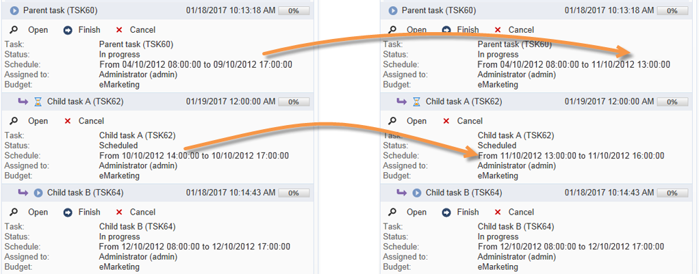
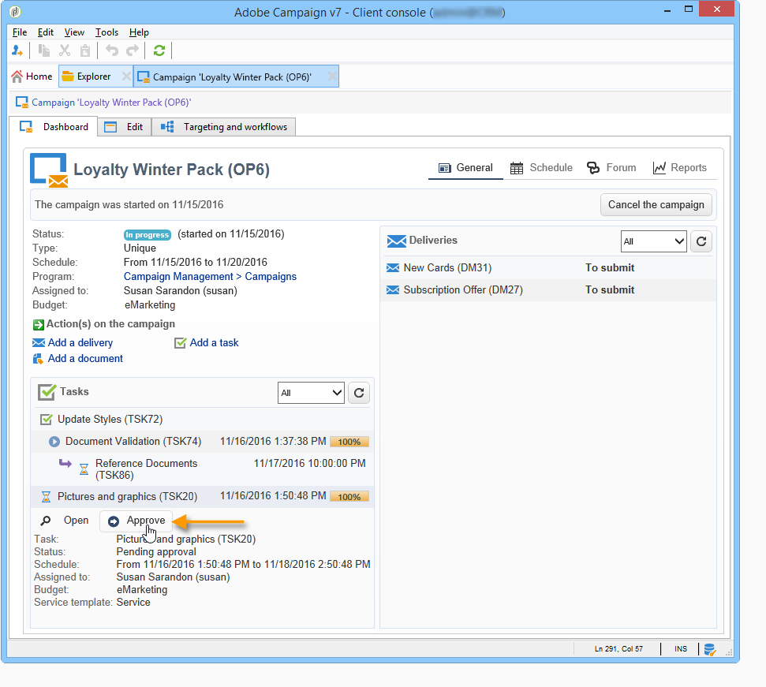

# Criar e gerenciar tarefas{#creating-and-managing-tasks}

O Adobe Campaign permite criar tarefas e gerenciar seu ciclo de vida completo diretamente no aplicativo. A implementação de programas e campanhas pode ser dividida em tarefas atribuídas aos operadores do Adobe Campaign ou aos provedores de serviços externos. Esse modo de operação permite criar um ambiente de colaboração aberto que inclui todos os participantes do programa e participantes externos.

As tarefas podem ser criadas, exibidas e monitoradas a partir da lista de tarefas ou do painel de campanha. Elas também podem ser visualizadas e rastreadas nas agendas do plano de marketing, programas e campanhas.

As tarefas são anexadas à campanha e podem ter dependências, ou seja, tarefas associadas. Cada tarefa tem um status, prioridade, carga estimada e custos relacionados.

Todas as tarefas são agrupadas em uma lista acessível pela guia **Campanhas**. Para obter mais informações, consulte [Acessar tarefas](#accessing-tasks).

Elas podem ser exibidas na programação do programa ao qual pertencem.

## Acessar tarefas {#accessing-tasks}

### Exibir tarefas {#displaying-tasks}

As tarefas são exibidas na lista de tarefas acessível por meio da guia **[!UICONTROL Campaigns]**.

É possível exibir todas as tarefas do operador atual.

Para obter mais informações, consulte [Status de execução de uma tarefa](#execution-status-of-a-task) e [Status de progresso de uma tarefa](#progress-status-of-a-task).

### Filtrar tarefas {#filtering-tasks}

Ao utilizar essa visualização, ela é automaticamente filtrada para exibir somente as **tarefas atuais do operador**. Também é possível filtrar as tarefas usando os campos na seção superior da janela.

### Editar tarefas {#editing-tasks}

Clique em uma tarefa para editá-la.

## Criar uma nova tarefa {#creating-a-new-task}

Para criar uma tarefa, siga as etapas abaixo:

1. Navegue até o **[!UICONTROL Tasks]** no **[!UICONTROL Campaigns]** e clique em **[!UICONTROL Create]**.

   

1. Insira o nome da tarefa e selecione a campanha à qual ela está vinculada.
1. Defina as datas de início e término.
1. Clique em **[!UICONTROL Save]** para criar a tarefa.

   

Também é possível criar uma tarefa através do painel de uma campanha: neste caso, ela é vinculada automaticamente à campanha em que foi criada.

Depois que uma tarefa é criada, ela é adicionada ao agendamento da campanha, ao painel de campanha e à lista de tarefas. Para editar uma tarefa, clique no nome na lista de tarefas ou selecione-a no cronograma ou no painel de campanha e clique em **[!UICONTROL Open]**.

Depois de criada, é possível configurar a tarefa definindo:

* O gerente e os participantes. [Saiba mais](#manager-and-participants)
* O cronograma de criação. [Saiba mais](#execution-schedule)
* Os custos comprometidos. [Saiba mais](#expenses-and-revenues)

Também é possível adicionar [revisores](#reviewers) e [documentos de referência](#documents-referenced).

O ciclo de vida da tarefa é apresentado em [nesta seção](#life-cycle).

### Gerente e participantes {#manager-and-participants}

Por padrão, a tarefa é atribuída ao operador que a criou. Esse operador é notificado quando uma ação é necessária para essa tarefa.

É possível selecionar um operador diferente do **[!UICONTROL Assigned to]** lista suspensa.

>[!NOTE]
>
>A gestão do operador é apresentada em [nesta seção](../../v8/start/gs-permissions.md).
>
>Somente o operador encarregado de uma tarefa tem permissão para fechá-la.

Você pode especificar mais operadores envolvidos na realização da tarefa. Esses operadores não têm permissão para fechar a tarefa: eles só podem aprovar a tarefa atribuída a eles.

Para adicionar operadores de tarefa, siga as etapas abaixo:

1. Clique em **[!UICONTROL Resources]** ícone na barra de ferramentas de tarefas.

   

1. Clique em **[!UICONTROL Add]** e selecione os operadores relacionados.
1. Insira a taxa de uso: isso representa a carga de trabalho atribuída ao operador durante a execução da tarefa. Essa taxa é apenas uma indicação e é expressa como uma porcentagem.

   

   Por exemplo, para uma tarefa cuja programação de execução foi definida como 10 dias, um operador cuja taxa de utilização é de 50% estará mobilizado nessa tarefa pela metade do tempo de trabalho dele, durante os 10 dias.

   Para cada operador, você pode inserir uma carga de trabalho agendada e uma carga de trabalho real. Essas durações também são somente para fins de informação.

1. Você pode configurar um lembrete do **[!UICONTROL Add a reminder...]** link. Uma notificação por e-mail será enviada a todos os operadores envolvidos na tarefa antes de sua data final.

   

1. Você também pode enviar uma notificação antes que a tarefa seja iniciada. Para configurar, selecione a data no campo **[!UICONTROL Initial notification]** campo.
1. Quando a data de término é atingida e a tarefa não está fechada, uma notificação pode ser enviada ao destinatário ou grupo de destinatários selecionados na **[!UICONTROL Assignee]** lista suspensa.

O painel do operador permite verificar a carga de trabalho (outras tarefas em andamento).

### Aprovação de tarefa {#reviewers}

Além dos participantes, você pode definir operadores que revisarão a tarefa assim que ela for fechada.

Para fazer isso, clique no link **[!UICONTROL Enable task approval]** na seção inferior da caixa **[!UICONTROL Resources]** janela. Pode ser um operador individual, um grupo de operadores ou uma lista de operadores.

Para especificar uma lista de operadores, clique no link **[!UICONTROL Edit...]** à direita do primeiro revisor e adicione quantos operadores forem necessários, conforme mostrado abaixo:

Você pode definir um agendamento de aprovação para a tarefa na seção inferior da janela de configuração. Por padrão, os revisores têm três dias a partir da data de envio para aprovar a tarefa. Você também pode adicionar um lembrete, que será enviado para os operadores relacionados automaticamente antes do prazo de aprovação.

A pessoa encarregada da tarefa pode atribuir a si mesmo a tarefa de aprovação, mesmo que outros operadores já tenham sido atribuídos a isso. Se nenhum revisor tiver sido definido, as notificações serão enviadas à pessoa encarregada da tarefa. Todos os outros operadores do Adobe Campaign com direitos de **[!UICONTROL Administrator]** também podem aprovar a tarefa. No entanto, eles não recebem notificações.

### Documentos referenciados {#documents-referenced}

Você pode adicionar [documentos e recursos de marketing](managing-marketing-resources.md) para uma tarefa.

Para fazer isso:

1. Abra a tarefa e clique no link **[!UICONTROL Documents]** ícone na barra de ferramentas de tarefas.

   

1. Clique em **[!UICONTROL Add]** e selecione o documento a ser adicionado à sua tarefa. Faça o mesmo processo para recursos de marketing.

Os documentos referenciados são adicionados às notificações enviadas aos operadores envolvidos na tarefa. Elas também são adicionadas no painel de tarefas.

### Programação de execução {#execution-schedule}

O período de validade de uma tarefa é indicado nos campos **[!UICONTROL Start]** e **[!UICONTROL End]**. A carga agendada expressa a carga de trabalho a ser executada durante o período. É expresso em dias ou horas.

>[!NOTE]
>
>O ciclo de vida de uma tarefa é apresentado em [Life cycle](#life-cycle).

O campo **[!UICONTROL Workload performed]** também é expresso em dias e horas, e permite atualizar manualmente o progresso da tarefa em relação à carga de trabalho agendada.

O **[!UICONTROL Progress status]** da tarefa, expresso como uma porcentagem, é atualizado automaticamente com base nas tarefas realizadas pelos operadores envolvidos. Ele pode ser alterado manualmente.

Essas informações podem ser visualizadas no painel de tarefas.

Também são visíveis na guia da campanha.

Se a data de término do cronograma de execução da tarefa tiver sido atingida, mas a tarefa não estiver concluída, a tarefa terá o status **[!UICONTROL Late]**. Uma mensagem de aviso também será exibida para alertar os operadores.

Para obter mais informações, consulte [Status de progresso de uma tarefa](#progress-status-of-a-task).

### Despesas e receitas {#expenses-and-revenues}

É possível definir despesas relacionadas e prever a receita para cada tarefa. Elas serão calculadas e consolidadas para a campanha à qual a tarefa está anexada.

Para especificar essas informações, clique no ícone **[!UICONTROL Expenses and revenue]** na barra de ferramentas da tarefa.

Por padrão, o orçamento cobrado é o orçamento da campanha à qual a tarefa está anexada. Ele é exibido nos detalhes da tarefa.

>[!NOTE]
>
>Para obter mais informações sobre despesas e orçamentos, consulte [nesta seção](../campaigns/providers--stocks-and-budgets.md#cost-commitment--calculation-and-charging).

Nessa janela, você também pode definir os objetivos a serem atingidos. Os objetivos são expressos em termos de previsão de receita para a tarefa.

### Provedores de serviços {#service-providers}

Um provedor de serviços externos pode ser envolvido no gerenciamento de uma tarefa.

Para fazer isso, edite as propriedades da tarefa e selecione o provedor de serviços. As classes de custo associadas ao provedor de serviços são listadas automaticamente na seção central da janela.

Selecione as categorias de custo relacionadas à execução da tarefa. Para fazer isso, selecione o tipo de custo e, se necessário, adicione uma quantidade como sobretaxa.

>[!NOTE]
>
>O método para gerenciar orçamentos e custos é apresentado em [Controlar custos](controlling-costs.md).

Quando selecionado, o provedor de serviços é exibido no painel de tarefas:

### Tarefas atrasadas {#late-tasks}

Uma tarefa está atrasada se tiver atingido sua data final sem seu status mudar para **[!UICONTROL Finished]**. Por padrão, nenhum operador é avisado quando uma tarefa está atrasada. É possível configurar o delivery de um e-mail de notificação: todos os operadores podem ser notificados mesmo se não estiverem envolvidos na tarefa.

Vá para a caixa **[!UICONTROL Resources]** e adicione o operador ao campo **[!UICONTROL Assignation]**. Para notificar várias pessoas, selecione um grupo de operadores.

### Notificações iniciais {#initial-notifications}

Quando uma tarefa é criada ou modificada com uma data de início no futuro, o Adobe Campaign oferece enviar um e-mail para a pessoa encarregada da tarefa para que saibam quando ela é iniciada.

No entanto, se a tarefa que criada estiver muito longe do início, pode ser preferível agendar a notificação para ser enviada antes que a tarefa seja iniciada. Por exemplo, se a tarefa iniciar em um mês, pode-se notificar a pessoa encarregada dela uma semana antes dela começar.

Para agendar uma notificação, vá para a caixa **[!UICONTROL Resources]** e use o campo **[!UICONTROL Initial notification]**.

* Para tarefas em campanhas, selecione uma data e hora específica.
* Para tarefas em templates de campanha, o tempo de notificação é expresso como o tempo restante antes que a tarefa seja iniciada (por exemplo, se inserido 2d no campo **[!UICONTROL Initial notification]**, o email será enviado 2 dias antes da data de início da tarefa).

Quando agendada uma notificação, ao salvar a tarefa, o Adobe Campaign ainda oferece enviar uma notificação imediatamente. É possível enviá-lo e isso não substituirá a notificação agendada.

### Tarefa vinculada a um programa {#task-linked-to-a-program}

Você pode criar tarefas diretamente em um programa para gerenciar ações relacionadas à sua organização geral e não a uma campanha específica (por exemplo, uma reunião para discutir o tema das campanhas futuras dentro do programa). A tarefa aparecerá no cronograma do programa.

Para criar uma tarefa vinculada diretamente a um programa:

1. Abra o cronograma do programa: na home page, vá para **[!UICONTROL Campaigns > Browse > Other choices > Programs]**. O cronograma geral do programa é aberto na seção à direita da janela.
1. No agendamento, clique no programa desejado: uma janela aparece com o programa nela.
1. Nesta janela, clique em **[!UICONTROL Open]**. O cronograma do programa é aberto.
1. Clique no botão **[!UICONTROL Add]** acima da agenda à direita e clique em **[!UICONTROL Add a task]**.

### Disponibilidade do operador {#operator-availability}

No painel de tarefas, um ícone ao lado do nome do operador indica que ele já está trabalhando em outra tarefa ou evento durante o período abrangido pela tarefa. A tarefa da qual o operador está encarregado ou na qual ele está envolvido aparece no campo **[!UICONTROL Assigned to]** ou na caixa **[!UICONTROL Resources]** da tarefa.

### Tarefa em um fluxo de trabalho {#task-in-a-workflow}

O uso de um elemento **[!UICONTROL Task]** em um fluxo de trabalho de campanha permite definir dois cenários, dependendo se a tarefa é aprovada ou não.

Nos fluxos de trabalho da campanha, a atividade **[!UICONTROL Task]** é encontrada na guia **[!UICONTROL Flow control]**.

## Tipos de tarefa {#types-of-task}

Ao criar tarefas por meio de uma campanha, pode-se criar tarefas específicas. O tipo de tarefa é definido no template selecionado.

As seguintes tarefas podem ser agendadas:

* [Tarefas de controle](#control-tasks),
* [Tarefa de agrupamento](#grouping-task),
* [Tarefa de agrupamento](#grouping-task),
* [Tarefa de notificação](#notification-task).

>[!NOTE]
>
>**[!UICONTROL Control task]** e tarefas **[!UICONTROL Grouping]** **só** podem ser criadas por meio do painel de campanha.\
>Elas são exibidas no mapa de tarefas do operador ao qual estão atribuídas. Consulte [Acessar tarefas](#accessing-tasks).

### Controlar tarefas {#control-tasks}

Uma **[!UICONTROL Control task]** é vinculada à aprovação de delivery: aprovação de direcionamento, conteúdo, arquivo de extração, orçamento ou prova.

Depois de criada, a tarefa é adicionada ao painel de campanha.

É possível, então, editá-la e especificar seus parâmetros.

### Tarefa de criação de recursos de marketing {#marketing-resource-creation-task}

Uma tarefa de criação de recursos de marketing pode ser usada para gerenciar a criação e a publicação de um recurso de marketing. Se estiver gerenciando um recurso por meio de uma tarefa e não por meio do próprio recurso, é possível:

* Controlar o processo de criação de recursos por meio de uma campanha.
* Exibir o processo de criação de recursos em uma agenda.
* Gerenciar o processo de criação de recursos (lembretes, notificações).
* Calcular e controlar os custos vinculados à criação de recursos.
* Aprovar e publicar o recurso por meio da tarefa (se a opção relevante estiver habilitada).

#### Interação entre a tarefa e seu recurso vinculado {#interaction-between-the-task-and-its-linked-resource}

A tarefa de criação de recursos de marketing interage com o recurso vinculado à ela. Isso significa:

* O agendamento de criação de recursos e os custos vinculados à ela são gerenciados por meio da tarefa.
* Os operadores podem trabalhar no recurso normalmente (download ou upload, bloquear e desbloquear): isso não afeta a tarefa.
* A aprovação e a publicação de recursos pode ser realizada por meio da tarefa: se a opção **[!UICONTROL Publish the marketing resource]** estiver habilitada, o recurso será aprovado e publicado automaticamente após a conclusão da tarefa. Se a opção não estiver habilitada, a tarefa e o recurso não interagem: atuando em um não afetará o outro.

   É possível usar uma série de tarefas vinculadas para definir um ciclo de aprovação completo. Marque a opção **[!UICONTROL Publish the marketing resource]** somente para a última tarefa: todas as tarefas precisarão ser concluídas para que o recurso seja publicado. Além disso, quando você cria uma tarefa de recurso de marketing filho, o recurso será selecionado automaticamente na tarefa filho.

   * **Por meio do recurso**: se enviar o recurso para aprovação ou aprová-lo, essas ações não afetarão a tarefa.
   * **Via the task**: se a opção **[!UICONTROL Publish the marketing resource]** estiver marcada na tarefa, o recurso será aprovado e publicado automaticamente após a conclusão da tarefa (veja acima). Se a opção não estiver marcada, a tarefa e o recurso não irão interagir: atuando em um não afetará o outro.

#### Configurar uma tarefa de criação de recurso de marketing {#configuring-a-marketing-resource-creation-task}

A pessoa que analisa a tarefa não é necessariamente a mesma pessoa que analisa o conteúdo definido no recurso. No entanto, se a opção **[!UICONTROL Publish the marketing resource]** estiver marcada (veja abaixo), o revisor da tarefa está autorizado a aprovar o conteúdo do recurso, já que a finalização da tarefa automaticamente aprova o recurso (ou, se nenhum revisor for definido, o gerente da tarefa).

No campo **[!UICONTROL Marketing resource]**, defina o recurso que deseja gerenciar por meio desta tarefa. É possível:

* Selecionar um recurso existente: a lista suspensa oferece todos os recursos com o status **[!UICONTROL Being edited]**.
* Criar um recurso: clique no ícone **[!UICONTROL Select the link]** e clique no ícone **[!UICONTROL Create]**.

A opção **[!UICONTROL Publish the marketing resource]** permite automatizar a publicação de recursos: uma vez que a tarefa é **[!UICONTROL Finished]**, o status do recurso alterna automaticamente para **[!UICONTROL Published]**, mesmo que não tenha sido enviado para aprovação ou tenha sido aprovada, incluindo se o revisor que conclui a tarefa não é o revisor de conteúdo definido no recurso.

O botão **[!UICONTROL Publish the resource]** é disponibilizado e o revisor de publicação de recursos recebe um email de notificação para que saiba que o recurso está pronto para ser publicado. Na guia **[!UICONTROL Edit > Tracking]**, a revisão e a publicação pelo revisor da tarefa ficam visíveis. Se um fluxo de trabalho de pós-processamento de recurso tiver sido definido, ele será executado agora.

### Tarefa de grupo {#grouping-task}

A tarefa do tipo **[!UICONTROL Grouping task]** permite agrupar várias tarefas e sincronizar o gerenciamento de seus progressos e suas aprovações.

As tarefas de agrupamento não têm nenhuma despesa ou recurso vinculado.

Todas as tarefas agrupadas em uma tarefa de agrupamento podem ser vistas em seus próprios painéis. Isso permite filtrar a lista de tarefas para exibir apenas aquelas que necessita.

As tarefas de agrupamento têm um link que permite criar facilmente uma tarefa agrupada.

Para criar uma tarefa agrupada com base em uma tarefa de agrupamento, vá para o painel de campanha e clique no nome da tarefa de agrupamento para exibir sua descrição e, em seguida, clique em **[!UICONTROL Add a task]**.

No entanto, se uma tarefa que deseja vincular a uma tarefa de agrupamento já tiver sido criada, é possível fazê-lo por meio do campo **[!UICONTROL Linked to]** na caixa **[!UICONTROL Properties]**.

### Tarefa de notificação {#notification-task}

As tarefas de notificação permitem agendar entregas de e-mail (a um operador, um grupo de operadores, um provedor de serviços etc.). Isso permite agendar lembretes, por exemplo, para notificar alguém que uma campanha está terminando em breve ou enviar documentos antes de uma campanha começar para que os operadores possam prepará-los. Isso significa que é possível acompanhar as comunicações dentro da campanha ou programa e monitorar de perto as ações realizadas.

#### Ciclo de vida {#life-cycle}

As tarefas de notificação não exigem aprovação. Isso significa que o ciclo de vida é mais simples do que uma tarefa padrão:

Uma tarefa de notificação pode ter os seguintes status:

* **[!UICONTROL Scheduled]** até que o email tenha sido enviado
* **[!UICONTROL In progress]** após o email ser enviado e até que a data final seja alcançada
* **[!UICONTROL Finished]** assim que a data final é alcançada.

#### Configuração {#configuration}

Durante a criação, os seguintes elementos devem ser inseridos na tarefa:

* **[!UICONTROL Assigned to]**: o operador ou grupo de operadores que receberá o email. Se reatribuir a tarefa quando o e-mail tiver sido enviado, o e-mail não será enviado para o novo operador (para que isso aconteça, é necessário reiniciar a tarefa e alterar sua data de início).
* **Task start date**: data em que o e-mail de notificação será enviado. Essa data deve ocorrer no futuro a partir momento da gravação da tarefa.
* **Task end date**: data na qual o status da tarefa é alterado para **[!UICONTROL Finished]**. Por padrão, a data final é idêntica à data de início. No entanto, atribuir uma duração à tarefa permite que simbolizar a quantidade de tempo que o operador tem para agir no cronograma, se necessário.
* **[!UICONTROL Description]**: o texto inserido aqui aparecerá no corpo do email de notificação.

   

É possível adicionar um anexo à tarefa e ao email de notificação. Para fazer isso, clique no ícone **[!UICONTROL Documents]** na barra de ferramentas no canto superior direito.

## Ciclo de vida {#life-cycle-1}

### Links entre tarefas {#links-between-tasks}

O botão **[!UICONTROL Properties]** em cada tarefa permite definir os vínculos entre tarefas em uma campanha. É possível dividir tarefas em subtarefas usando uma tarefa de agrupamento (consulte [Tarefas vinculadas](#linked-tasks)) ou definir dependências entre as tarefas (consulte [Agrupamento de tarefas](#grouping-tasks)).

#### Tarefas vinculadas {#linked-tasks}

Use o campo **[!UICONTROL Linked task]** para associar tarefas a uma tarefa de agrupamento. Consulte [Tipos de tarefa](#types-of-task).

No exemplo a seguir, a aprovação de definição de alvos é dividida em quatro subtarefas.

Cada subtarefa é uma tarefa padrão vinculada à tarefa principal.

#### Agrupar tarefas {#grouping-tasks}

Use o campo **[!UICONTROL Grouped to]** para fazer a execução de uma tarefa depender da execução de outra tarefa.

A dependência entre tarefas é representada por setas no painel de campanha.

No caso de tarefas agrupadas, o Adobe Campaign atribui automaticamente a data de término da tarefa pai à tarefa filho como data de início. Por exemplo, se uma tarefa de **Criação de convite** terminar em 15 de outubro às 3:30 P.M., a tarefa filho **Enviar e-mail de convite** será iniciada em 15 de outubro às 3:30 P.M.

Além disso, se adiar o fim de uma tarefa pai, algumas de suas tarefas filho poderão ser afetadas: essas são as tarefas filho cujo status é **[!UICONTROL Scheduled]** e cuja data de início é anterior à nova data de término da tarefa pai. A duração da tarefa permanece a mesma. Se a data de início de uma tarefa filho for posterior à nova data de término da tarefa pai, a tarefa filho não será afetada.

**Exemplo**

Uma tarefa pai agendada para terminar em 9 de outubro às 5 P.M. tem duas tarefas filho, tarefa A e tarefa B. A tarefa A é agendada para iniciar em 10 de outubro às 2 P.M. e a tarefa B está agendada para iniciar em 12 de outubro de às 8 A.M.

Vamos adiar a tarefa pai: ela agora termina em 11 de outubro às 1 P.M. Somente a tarefa A é adiada e será iniciada em 11 de outubro às 1 P.M.

### Status de execução de uma tarefa {#execution-status-of-a-task}

Os status da tarefa podem ser visualizados no mapa de tarefas. O status de execução de uma tarefa é atualizado automaticamente de acordo com as ações do operador.

Uma tarefa pode ser: **[!UICONTROL Scheduled]**, **[!UICONTROL In progress]**, **[!UICONTROL Finished]**, **[!UICONTROL Canceled]**, **[!UICONTROL Pending approval]** ou **[!UICONTROL Rejected]**.

* Quando uma tarefa é criada, ela é **[!UICONTROL Scheduled]** se a data de início estiver no futuro. Ela mantém esse status até que a data de início seja alcançada.
* Depois de iniciada, a tarefa é **[!UICONTROL In progress]**. Quando a pessoa encarregada da tarefa a fecha, ela muda para **[!UICONTROL Finished]**.
* Se um revisor tiver sido definido, a tarefa será **[!UICONTROL Pending approval]** assim que a pessoa encarregada dela a feche e até que o revisor a aprove. Se o revisor a rejeitar, a tarefa será **[!UICONTROL Rejected]**.
* Uma tarefa pode ser cancelada pela pessoa responsável por meio do painel ou pelo **[!UICONTROL Task map]** clicando no botão **[!UICONTROL Cancel]**.
* Para agendar uma tarefa, insira uma data de início no futuro. É possível enviar uma primeira notificação para os operadores do Adobe Campaign envolvidos na execução da tarefa. Consulte [Ciclo de vida completo da tarefa](#complete-task-life-cycle).

>[!NOTE]
>
>* O status da tarefa é atualizado automaticamente.
>* Mesmo que o período de validade seja concluído, as tarefas que não foram fechadas ainda aparecerão na lista de tarefas em andamento. Um aviso notifica os operadores que a tarefa está atrasada.
>

### Status de progresso de uma tarefa {#progress-status-of-a-task}

Além do status de execução, uma tarefa pode ser associada a um status de progresso: **[!UICONTROL Late]**, **[!UICONTROL To approve]**, **[!UICONTROL To do today]** ou **[!UICONTROL To do this week]**. Essas informações são inseridas automaticamente de acordo com o agendamento da tarefa.

É possível filtrar a lista de tarefas por status de processo ou andamento.

Para obter mais informações, consulte [Acesso a tarefas](#accessing-tasks).

### Ciclo completo de vida da tarefa {#complete-task-life-cycle}

Abaixo estão os estágios de um ciclo completo de vida de tarefa para o qual a pessoa encarregada tenha definido os participantes e revisores.

1. A pessoa encarregada cria a tarefa e preenche os vários campos. Para obter mais informações, consulte [Criar uma nova tarefa](#creating-a-new-task).

   Ao criar e editar uma tarefa **agendada no futuro** (desde que a data de início da tarefa não seja atingida), é possível enviar uma notificação aos participantes e gerentes para que eles saibam que uma nova tarefa foi agendada.

   

   Para enviar esta primeira notificação, clique em **[!UICONTROL Yes]**. Esta notificação informa sobre a próxima tarefa e inclui detalhes sobre o conteúdo e o número de dias restantes até seu prazo final.

   Quando uma tarefa é criada e agendada para o futuro, seu status é **[!UICONTROL Scheduled]**.

1. Na data de início da tarefa, a pessoa responsável e os participantes recebem uma notificação informando que a tarefa foi iniciada. Seu status muda para **[!UICONTROL In progress]**.
1. Depois de concluir a seção atribuída a eles, os participantes podem aprovar a tarefa através:

   * do e-mail de notificação.
   * do console ou da interface da Web, no painel de tarefas.

      

1. Sempre que um participante aprovar uma tarefa, o status do progresso da tarefa será atualizado.

   

1. O revisor recebe um email de notificação informando que o operador concluiu a seção atribuída a ele.

   Eles podem monitorar o progresso no painel de tarefas.

   

1. Assim que a pessoa encarregada da tarefa decidir que ela terminou, ela pode fechá-la, usando o link no e-mail de notificação enviado quando a tarefa foi iniciada, o console ou a interface.

   

   >[!NOTE]
   >
   >A pessoa encarregada de uma tarefa pode fechá-la a qualquer momento, mesmo sem aprovações. O status do progresso muda para 100% automaticamente.

1. O status da tarefa é alterado para **[!UICONTROL To approve]**, e uma notificação é enviada ao revisor.

   Eles aprovam a tarefa através do e-mail de notificação, do console ou da interface da Web.

   Eles podem agir através do painel de campanha:

   

   Eles também podem usar o botão de aprovação de tarefas:

   

   >[!NOTE]
   >
   >O status da tarefa só será alterado para **[!UICONTROL To approve]** se estiver habilitada a opção **[!UICONTROL Enable task validation]** na janela **[!UICONTROL Resources]** da tarefa.\
   >Se o revisor rejeitar a tarefa, seu status será alterado para **[!UICONTROL Rejected]**, e o ciclo de vida da tarefa será reiniciado automaticamente.

1. O status da tarefa é alterado para **[!UICONTROL Finished]**. Uma notificação é enviada para todos envolvidos.

   >[!NOTE]
   >
   >Uma vez concluída a tarefa, seu ciclo de vida pode ser reinicializado pela pessoa encarregada dela. Para fazer isso, abra a tarefa e clique no link **[!UICONTROL Reset task to execute it again...]** na parte inferior do painel.
