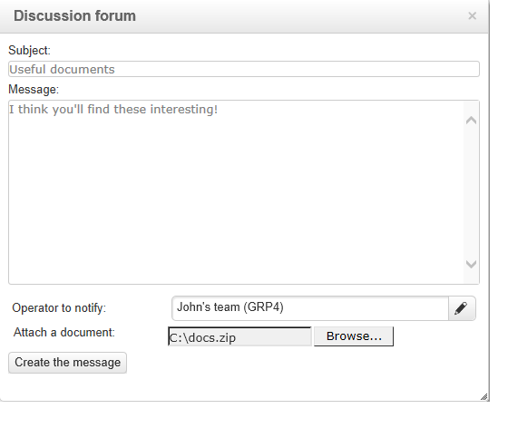

# Fóruns de discussão{#discussion-forums}

Os operadores do Adobe Campaign podem usar fóruns de discussão para compartilhar informações. Os elementos a seguir têm seu próprio fórum: planos, programas, campanhas, recursos, simulações, estoques. Cada operador também tem um fórum pessoal. Todas as discussões são públicas, mesmo em fóruns pessoais.

Os operadores podem se inscrever em um fórum para receber um email de notificação sempre que uma mensagem for postada.

## Acessar um fórum {#accessing-a-forum}

Para visitar o fórum de uma campanha, operador etc., vá para o painel e clique no link **[!UICONTROL Forum]** no canto superior direito. Esse link também oferece o número total de mensagens no fórum.

## Usar um fórum {#using-a-forum}

Mensagens e suas respostas são mostradas em ordem cronológica (da mais nova para a mais antiga).

Para exibir o conteúdo de uma mensagem, clique em seu cabeçalho.

**Iniciar uma nova discussão**

Para iniciar uma nova discussão, clique no botão **[!UICONTROL Add a discussion]** no canto superior direito. A caixa **[!UICONTROL Discussion forum]** aparecerá (veja abaixo).

**Postar uma mensagem em uma discussão existente**

Para postar uma mensagem em uma discussão existente, abra a mensagem que deseja responder e clique no link **[!UICONTROL Reply]** no canto superior esquerdo. A caixa **[!UICONTROL Discussion forum]** aparecerá (veja abaixo).

Quando responder a uma mensagem, a pessoa que postou a mensagem original receberá uma notificação.

**Escrever uma mensagem**

Na caixa **[!UICONTROL Discussion forum]**:

1. Insira o texto no campo **[!UICONTROL Message]** e um título de discussão no campo **[!UICONTROL Subject]**.

   

1. Se necessário:

   * Se desejar que alguém que não se inscreveu no fórum participe da discussão, use o campo **[!UICONTROL Operator to notify]**. O operador receberá um e-mail de notificação para esta mensagem específica (eles não serão inscritos no fórum). Para notificar vários operadores, selecione um grupo de operadores.
   * Para adicionar um anexo à mensagem, clique em **[!UICONTROL Browse]**. O anexo também será incluído no e-mail de notificação. Os anexos só podem ser enviados individualmente: para enviar vários arquivos, é necessário compactá-los.

1. Clique em **[!UICONTROL Create the message]** para publicar no fórum.

>[!NOTE]
>
>Assim que a mensagem for postada no fórum, ela não poderá mais ser alterada ou excluída.

## Postar no fórum pessoal de um operador {#posting-to-the-personal-forum-of-an-operator}

Você poderá postar uma mensagem no fórum de um operador se, por exemplo, sua mensagem não disser respeito a uma campanha específica, mas ainda desejar acompanhar a conversa sobre o Adobe Campaign. Os fóruns pessoais são públicos e todos os operadores verão sua mensagem. O operador receberá uma mensagem sempre que alguém postar no seu fórum pessoal.

Para acessar o fórum de um operador:

* Se você tiver os direitos necessários para acessar o nó do explorador **[!UICONTROL Administration > Access management > Operators]**, abra o painel do operador desejado e clique no link **[!UICONTROL Forum]** no canto superior direito.
* Caso contrário, localize o nome do operador no Adobe Campaign (por meio de uma mensagem publicada no fórum por este operador ou uma tarefa atribuída a ele) e clique nele para acessar seu painel. Também é possível pedir ao administrador para criar uma visualização da pasta do operador.

## Assinar um fórum {#subscribing-to-a-forum}

A inscrição de um fórum permite seguir as discussões. Inscritos receberão uma notificação por e-mail sempre que uma mensagem for postada no fórum. Este e-mail conterá o corpo da mensagem e quaisquer anexos. Para responder a uma mensagem, clique no corpo do e-mail e, em seguida, faça login na interface da Web do Adobe Campaign. Quando se inscrever em um fórum, essas informações ficam visíveis para todos.

* Para se inscrever em um fórum, clique no botão **[!UICONTROL Follow discussions]** na seção superior direita acima da lista de mensagens.

   

   A seção fica azul e mostra que está inscrito no fórum.

* Para cancelar a inscrição de um fórum, clique no botão **[!UICONTROL Unsubscribe]**.

   

* O painel pessoal lista os fóruns inscritos. Clique no link **[!UICONTROL Subscription to discussion forums]** para exibir a lista e, em seguida, clique no item que lhe interessa para acessar seu fórum.

   

* Para ver quem se inscreveu em um fórum, clique no link **[!UICONTROL List of subscribers to this discussion forum]** acima da lista de mensagens.

   

## Verificar entrega de notificação {#checking-notification-delivery}

Se os operadores inscritos em um fórum não receberem notificações conforme esperado:

* Verifique se os endereços de email estão inseridos nos perfis de operador.
* Vá para o nó **[!UICONTROL Administration > Production > Technical workflows > Campaign processes]** e verifique se o workflow **[!UICONTROL Jobs in discussion forums]** foi iniciado e está livre de erros.
* Exibir os logs do delivery:

   * Na página inicial do Adobe Campaign, vá para **[!UICONTROL Campaigns > Navigation > Deliveries]**, então abra o delivery de **[!UICONTROL Discussion forum notification]**.
   * No explorer, acesse **[!UICONTROL Administration > Production > Objects created automatically > Technical deliveries > Workflow notifications]**, em seguida clique em **[!UICONTROL Discussion forum notifications]**.
   Na caixa **[!UICONTROL Discussion forum notifications]**, os logs do delivery são encontrados na guia **[!UICONTROL Edit > Delivery]**. Também é possível visualizá-los nas guias **[!UICONTROL Tracking > Log]** e **[!UICONTROL Exclusion causes]**.
