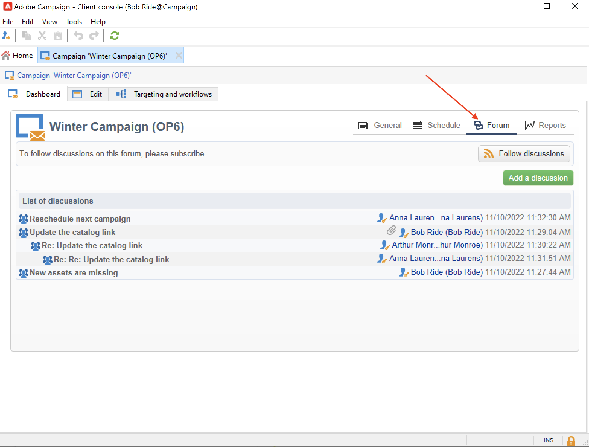

# Fóruns de discussão{#discussion-forums}

Os operadores do Adobe Campaign podem usar fóruns de discussão para compartilhar informações. Os seguintes elementos têm seu próprio fórum: planos, programas, campanhas, recursos de marketing, simulações, estoques. Cada operador também tem um fórum pessoal. Todas as discussões são públicas, mesmo em fóruns pessoais.

Os operadores podem se inscrever em um fórum para receber um email de notificação sempre que uma mensagem for postada.

## Acessar um fórum {#accessing-a-forum}

Para acessar um fórum, navegue até um painel e clique no **[!UICONTROL Forum]** no canto superior direito.

As mensagens e suas respostas são mostradas da mais nova para a mais antiga.

Para iniciar um novo thread, clique no **[!UICONTROL Add a discussion]** no canto superior direito. A caixa **[!UICONTROL Discussion forum]** aparecerá (veja abaixo).

Insira o texto no campo **[!UICONTROL Message]** e um título de discussão no campo **[!UICONTROL Subject]**.

Os operadores que já postaram uma mensagem neste fórum são notificados por padrão. Você pode selecionar um operador adicional para notificar. Para notificar vários operadores, selecione um grupo de operadores.

É possível adicionar um anexo à mensagem, usando o  **[!UICONTROL Browse...]** botão. O anexo também será incluído no e-mail de notificação. Os anexos só podem ser enviados individualmente: para enviar vários arquivos, é necessário compactá-los em um arquivo .zip.

>[!CAUTION]
>
>Assim que a mensagem for postada no fórum, ela não poderá mais ser alterada ou excluída.

## Postar no fórum pessoal de um operador {#posting-to-the-personal-forum-of-an-operator}

Você pode postar uma mensagem no fórum de um operador. Os fóruns pessoais são públicos e todos os operadores podem ver sua mensagem. O operador recebe uma notificação por e-mail sempre que alguém postar em seu fórum pessoal.

Para acessar o fórum de um operador, você pode:

* Navegue até o **[!UICONTROL Administration > Access management > Operators]** pasta do explorador do Campaign, selecione o operador para abrir seu painel e clique na guia **[!UICONTROL Forum]** no canto superior direito.
* Encontre o nome do operador na interface do usuário do Adobe Campaign (por meio de uma mensagem publicada no fórum por este operador, uma tarefa atribuída a ele) e clique nela para acessar o painel do operador.

## Assinar um fórum {#subscribing-to-a-forum}

A inscrição em um fórum permite seguir todas as discussões. Depois de se inscrever, você receberá uma notificação por e-mail sempre que uma mensagem for postada no fórum.

Para responder a uma mensagem, clique no corpo do e-mail e, em seguida, faça login na interface da Web do Adobe Campaign.

* Para se inscrever em um fórum, clique no botão **[!UICONTROL Follow discussions]** na seção superior direita acima da lista de mensagens.

  A seção fica azul e mostra que está inscrito no fórum.

* Para cancelar a inscrição de um fórum, clique no botão **[!UICONTROL Unsubscribe]**.

* O painel pessoal lista os fóruns inscritos. Clique no link **[!UICONTROL Subscription to discussion forums]** para exibir a lista e, em seguida, clique no item que lhe interessa para acessar seu fórum.

  

## Solução de problemas de entrega de notificação {#checking-notification-delivery}

Se os operadores inscritos em um fórum não receberem notificações conforme esperado:

* Verifique se os endereços de email estão inseridos nos perfis de operador.
* Navegue até o **[!UICONTROL Administration > Production > Technical workflows > Campaign processes]** pasta do explorador do Campaign e verifique a **[!UICONTROL Jobs in discussion forums]** o fluxo de trabalho é iniciado sem erros.
* Verifique os logs do delivery:

   * Na página inicial do Adobe Campaign, navegue até **[!UICONTROL Campaigns > Navigation > Deliveries]**, em seguida, abra a **[!UICONTROL Discussion forum notification]** entrega.
   * No explorador do Campaign, navegue até **[!UICONTROL Administration > Production > Objects created automatically > Technical deliveries > Workflow notifications]** e, em seguida, clique em **[!UICONTROL Discussion forum notifications]**.

  Na caixa **[!UICONTROL Discussion forum notifications]**, os logs da entrega são encontrados na guia **[!UICONTROL Edit > Delivery]**. Também é possível visualizá-los nas guias **[!UICONTROL Tracking > Log]** e **[!UICONTROL Exclusion causes]**.
