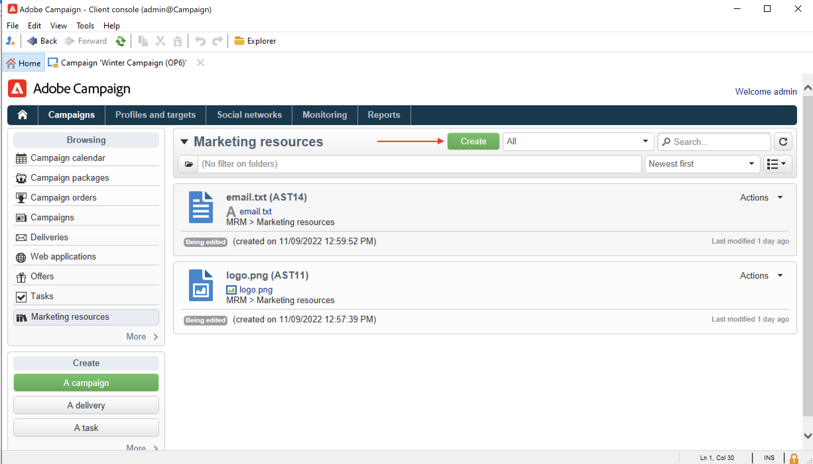
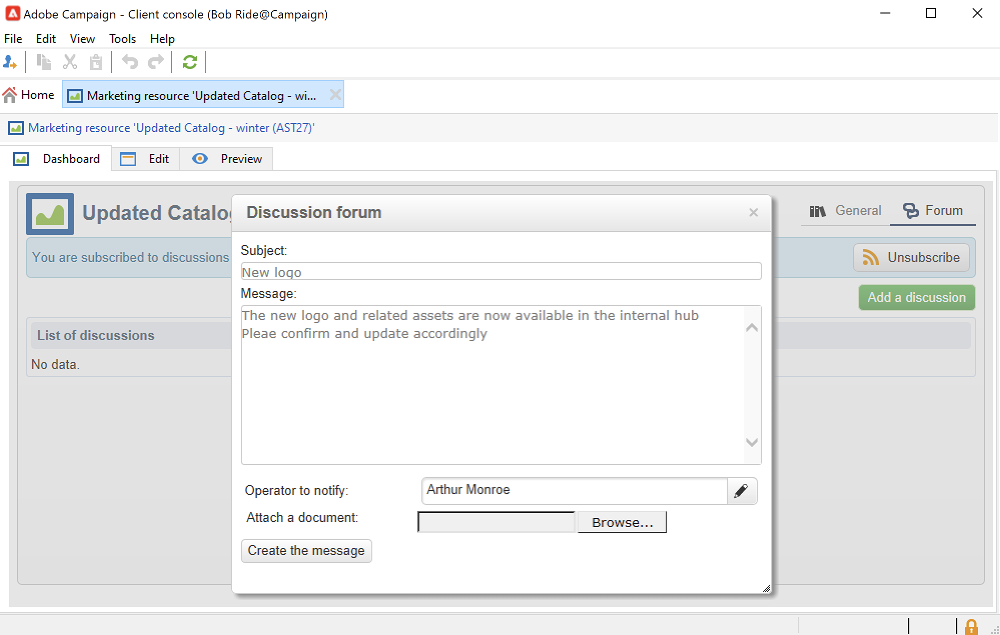
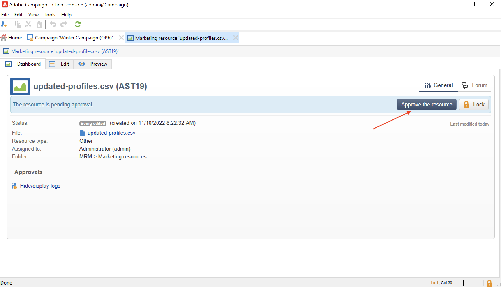

# Gerenciar recursos de marketing{#managing-marketing-resources}

Use o Adobe Campaign para gerenciar e rastrear os recursos de marketing envolvidos no ciclo de vida da campanha. Esses recursos de marketing podem ser um whitepaper, um arquivo de dados, um logotipo ou qualquer outro ativo relacionado a uma campanha.

Para cada recurso de marketing gerenciado pelo Adobe Campaign, você pode acompanhar o status e o histórico a qualquer momento e visualizar a versão atual.

Por padrão, os recursos de marketing são armazenados no **[!UICONTROL MRM > Marketing resources]** pasta do explorador do Campaign.

## Adicionar um recurso de marketing {#adding-a-marketing-resource}

Para adicionar um recurso de marketing, siga as etapas abaixo:

1. Navegue até o **[!UICONTROL Campaigns]** e selecione **[!UICONTROL Marketing resouces]**.

1. Clique no botão **[!UICONTROL Create]**.
   
1. Arraste e solte o arquivo na janela Marketing resource para carregá-lo no servidor do Campaign. Você também pode usar a variável **[!UICONTROL Upload file to server...]** link.
   

Quando o upload estiver concluído, o recurso será adicionado à lista de recursos disponíveis.

## Gerenciar recursos de marketing {#manage-marketing-resources}

Depois de carregado, o recurso de marketing fica disponível para todos os operadores do Adobe Campaign. Eles podem exibi-lo, fazer uma cópia para modificá-lo ou atualizar o arquivo no servidor.

Use o **[!UICONTROL Assigned to]** lista suspensa na **[!UICONTROL Edit]** para selecionar o operador responsável pelo recurso.

Você também pode selecionar os operadores ou grupos de operadores responsáveis pela validação e publicação de recursos. Para acessar essas opções, clique no link  **[!UICONTROL Advanced parameters]** link.

Esses operadores são notificados por email quando o processo de validação de recursos é iniciado.

Se nenhum revisor estiver selecionado, o recurso **[!UICONTROL cannot be]** fica sujeito a aprovação.

Use o **[!UICONTROL Audit]** para adicionar um leitor de prova e definir uma data de disponibilidade para o recurso. Além dessa data, ele aparecerá com o status **[!UICONTROL Late]**.

>[!NOTE]
>
>A guia **[!UICONTROL History]** contém os logs de download e de atualização do recurso. O botão **[!UICONTROL Details]** permite visualizar a versão selecionada.
>
>A guia **[!UICONTROL Audit]** permite monitorar qualquer ação realizada no recurso: aprovações, rejeições de aprovações, comentários relacionados ou publicações.

### Bloquear/desbloquear um recurso {#locking-unlocking-a-resource}

Depois de criado, os recursos estão disponíveis no painel de recursos de marketing e os operadores podem editá-los e modificá-los.

Quando um operador começa a trabalhar em um recurso, a prática recomendada é bloqueá-lo para impedir que outros operadores o modifiquem ao mesmo tempo. O recurso é então reservado: ele permanece acessível, mas não pode ser publicado ou atualizado no servidor por outro operador.

Um recurso de marketing só poderá ser bloqueado se não tiver sido aprovado.

Para bloquear um recurso, clique no link **[!UICONTROL Lock]** no painel de recursos.

Quando o recurso tiver sido atualizado, clique no link **[!UICONTROL Lock]** no painel de recursos para disponibilizar para todos os operadores novamente.

Uma mensagem especial notifica todos os operadores que tentarem acessá-lo:

A variável **[!UICONTROL Tracking]** indica o nome do operador que bloqueou o recurso.

>[!NOTE]
>
>Somente o operador que bloqueou o recurso e os operadores com direitos de Administrador estão autorizados a desbloquearem um recurso.

### Fóruns de discussão {#discussion-forums}

Para cada recurso, a variável **[!UICONTROL Forum]** permite que os participantes compartilhem informações.

Saiba mais na [Fóruns de discussão](discussion-forums.md) seção.

### Processo de aprovação {#approval-process}

A data esperada de disponibilidade é exibida nos detalhes do recurso, se ela foi especificada na guia **[!UICONTROL Tracking]**. Depois que essa data for atingida, é possível executar o processo de aprovação usando o botão **[!UICONTROL Submit for approval]** no painel de recursos. O status do recurso é alterado para **[!UICONTROL Approval in progress]**.

Para aprovar um recurso, clique no link **[!UICONTROL Approve the resource]** no painel.

Os operadores autorizados podem aceitar ou rejeitar aprovações. Essa ação é possível: por meio da mensagem de email enviada (clicando no link da mensagem de notificação) ou pelo Console do cliente (clicando no link **[!UICONTROL Approve]** ) botão.

A janela de aprovação permite inserir um comentário.

Navegue até o **[!UICONTROL Tracking]** para verificar as aprovações.

>[!NOTE]
>
>Além do revisor especificado para cada recurso de marketing, os operadores com direitos de administrador e o gerente de recursos estão autorizados a aprovar um recurso de marketing.

### Publicar um recurso {#publishing-a-resource}

Quando aprovado, o recurso de marketing deve ser publicado. O processo de publicação deve estar sujeito à implementação específica de acordo com os requisitos da empresa. Isso significa que os recursos podem ser publicados em uma extranet ou em qualquer outro servidor, informações específicas podem ser enviadas para um provedor de serviços externo etc.

Para publicar um recurso, clique no botão **[!UICONTROL Publish]** na zona de edição do painel de recursos de marketing.

É possível também automatizar a publicação de um recurso por meio de um workflow.

Publicar um recurso significa torná-lo disponível para uso (por outra tarefa, por exemplo). Publicações como tal variam dependendo da natureza do seu recurso: para um panfleto, publicar pode significar enviar o arquivo para uma impressora, para uma agência da Web, pode significar publicá-lo em um site etc.

Para que o Adobe Campaign publique, você precisa criar um workflow adequado e vinculá-lo ao recurso. Para fazer isso, abra a caixa do recurso **[!UICONTROL Advanced settings...]** e selecione o fluxo de trabalho desejado no campo **[!UICONTROL Post-processing]**.

O fluxo de trabalho é executado:

* Quando o revisor clicar no link **[!UICONTROL Publish resource]** (ou, se nenhum revisor foi definido, a pessoa encarregada do recurso).
* Se o recurso for gerenciado por meio de uma tarefa de criação de recurso de marketing, ele será executado quando a tarefa for definida como **[!UICONTROL Finished]**, desde que o **[!UICONTROL Publish the marketing resource]** estiver marcada na tarefa. [Saiba mais](creating-and-managing-tasks.md#marketing-resource-creation-task))

Se um fluxo de trabalho não for iniciado imediatamente (se ele for interrompido, por exemplo), o status do recurso será alterado para **[!UICONTROL Pending publication]**. Quando o fluxo de trabalho for iniciado, o status do recurso será alterado para **[!UICONTROL Published]**. Este status não leva em conta os possíveis erros no processo de publicação. Verifique o status do seu workflow para verificar se ele foi executado corretamente.

## Vincular um recurso a uma campanha {#linking-a-resource-to-a-campaign}

### Referência a um recurso de marketing {#referencing-a-marketing-resource}

Os recursos de marketing podem ser associados a campanhas, desde que esse recurso tenha sido selecionado na variável [template de campanha](../campaigns/marketing-campaign-templates.md).

Navegue até o **[!UICONTROL Edit > Documents > Resources]** no painel de campanha e clique em **[!UICONTROL Add]** para selecionar o recurso relacionado.

Você pode filtrar recursos por status, natureza ou tipo ou aplicar um filtro personalizado.

Use o **[!UICONTROL Details]** botão para editar e visualizar o recurso.

### Adicionar um recurso de marketing a um delivery outline {#adding-a-marketing-resource-to-a-delivery-outline}

Os recursos de marketing podem ser associados a deliveries por meio de delivery outlines.

Saiba mais sobre delivery outlines [nesta seção](../campaigns/marketing-campaign-deliveries.md).

Para fazer isso, clique com o botão direito em um delivery outline e selecione **Novo > Recurso**.

Insira o nome do ativo e selecione-o no campo **Recurso de marketing** lista suspensa.

## Gerenciamento de estoque {#stock-management}

Você pode associar um recurso de marketing a um ou mais estoques para gerenciar seus suprimentos e exibir um aviso no painel em caso de estoque insuficiente.

Para associar um recurso de marketing a um estoque, siga as etapas abaixo:

1. Editar um estoque ou criar um novo estoque. Saiba mais sobre estoques em [nesta seção](../campaigns/providers--stocks-and-budgets.md#stock-management).

1. Adicione uma linha de estoque e selecione o recurso de marketing correspondente.

   

   É possível editar o recurso selecionado por meio da **[!UICONTROL Edit the link]** ícone localizado à direita do recurso depois de selecioná-lo.

1. Especifique o estoque inicial e o alerta de estoque e salve.

O estoque é indicado no recurso de marketing **Estoques** guia.
