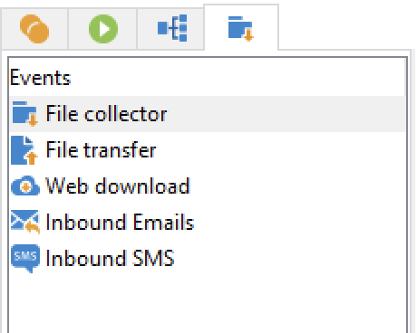

# Atividades de fluxos de trabalho{#wf-activities}

As atividades do workflow são agrupadas por categoria, em quatro guias diferentes.

Dependendo das suas permissões, da sua implementação e do contexto em que o fluxo de trabalho foi criado, as atividades disponíveis podem ser diferentes.

Por exemplo, os workflows criados em uma campanha têm um **Deliveries** , com todos os canais. Esta guia não está disponível em [fluxo de trabalho técnico](technical-workflows.md).

Os workflows técnicos têm uma configuração específica **Eventos** que não está disponível em [workflows da campanha](campaign-workflows.md).

Todas as atividades são detalhadas nas seções abaixo:

* [Atividades de direcionamento](targeting-activities.md)
* [Atividades de controle de fluxo](flow-control-activities.md)
* [Atividades de ações](action-activities.md)
* [Atividades de evento](event-activities.md)
* [Atividades específicas do fluxo de trabalho da campanha](../campaigns/marketing-campaign-deliveries.md)
