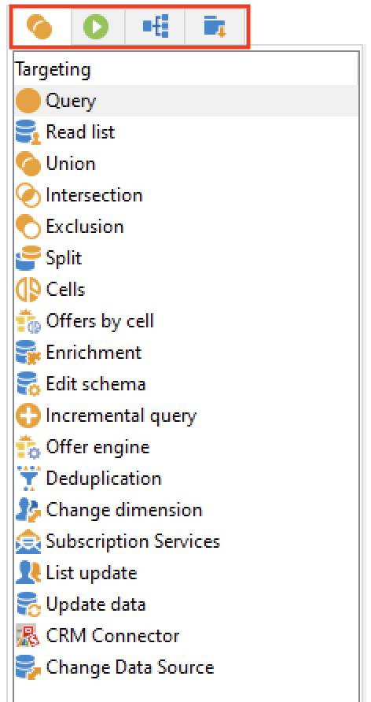

# Atividades de fluxos de trabalho{#wf-activities}

As atividades de workflow são agrupadas por categoria, em quatro guias diferentes.

Dependendo das suas permissões, da sua implementação e do contexto em que o fluxo de trabalho é criado, as atividades disponíveis podem ser diferentes.

Por exemplo, os fluxos de trabalho criados em uma campanha têm uma guia **Deliveries** específica, com todos os canais. Esta guia não está disponível em [workflow técnico](technical-workflows.md).

Os fluxos de trabalho técnicos têm uma guia **Eventos** específica que não está disponível nos [fluxos de trabalho da campanha](campaign-workflows.md).

Todas as atividades estão detalhadas nas seções abaixo:

* [Atividades de direcionamento](targeting-activities.md)
* [Atividades de controle de fluxo](flow-control-activities.md)
* [Atividades de ações](action-activities.md)
* [Atividades de evento](event-activities.md)
* [Atividades específicas de fluxo de trabalho de campanha](../campaigns/marketing-campaign-deliveries.md)
