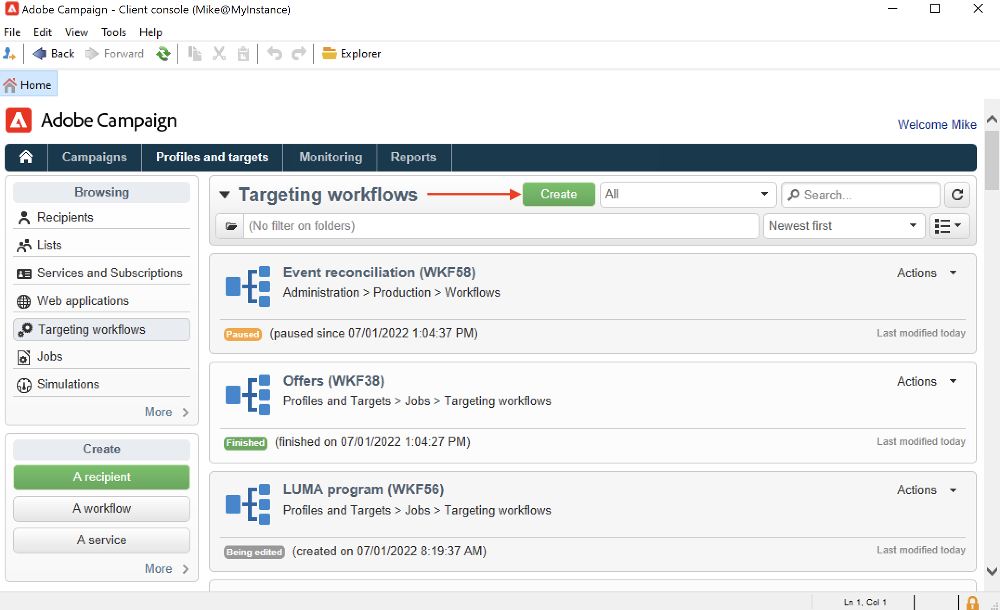
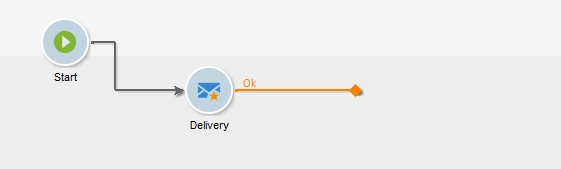
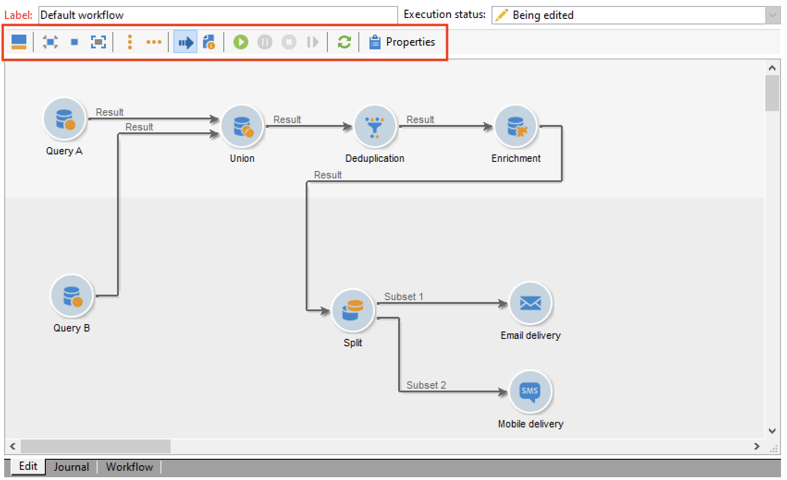
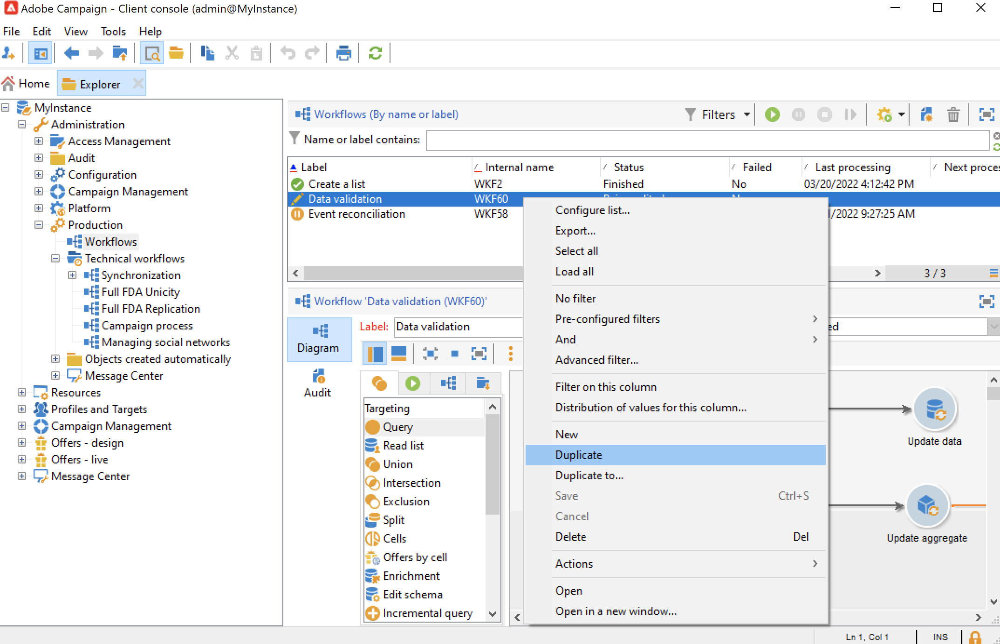

# Criar um fluxo de trabalho {#build-a-workflow}

## Criar um novo fluxo de trabalho {#create-a-new-workflow}

O fluxo de criação do workflow depende do tipo de workflow. Você pode:

* Crie [workflows para construção do target](#targeting-workflows) a partir do nó **[!UICONTROL Profiles and Targets]** > **[!UICONTROL Jobs]** > **[!UICONTROL Targeting workflows]** do Explorer ou a partir da guia **[!UICONTROL Profiles and Targets]** da home page, por meio da subguia **[!UICONTROL Targeting workflows]**.

  

* Criar [Fluxos de trabalho de campanha](#campaign-workflows) a partir da guia **[!UICONTROL Targeting and workflows]** de uma campanha

* Crie [workflows técnicos](#technical-workflows) a partir do nó **[!UICONTROL Administration]** > **[!UICONTROL Production]** > **[!UICONTROL Technical workflows]** do Explorer. A prática recomendada é criar uma pasta de workflow específica para salvar seus workflows técnicos.

Clique no botão **[!UICONTROL New]** acima da lista de fluxos de trabalho.

Insira um rótulo e clique em **[!UICONTROL Save]**.

## Adicionar e vincular atividades {#add-and-link-activities}

Defina agora as várias atividades e as vincule no diagrama. Nessa fase de configuração, podemos ver o rótulo do diagrama e o status do fluxo de trabalho (Edição em andamento). A seção inferior da janela é usada para editar apenas o diagrama. Ela contém uma barra de ferramentas, uma paleta de atividades (à esquerda) e o próprio diagrama (à direita).

>[!NOTE]
>
>Se a paleta não for exibida, clique no primeiro botão na barra de ferramentas do fluxo de trabalho para exibi-la.

As atividades são agrupadas por categoria nas diferentes guias da paleta. As guias e atividades disponíveis podem variar dependendo do tipo de fluxo de trabalho (fluxo de trabalho técnicos, de segmentação ou da campanha).

* A primeira guia contém atividades de direcionamento e de manipulação de dados. Essas atividades são detalhadas em [Atividades de direcionamento](targeting-activities.md).
* A segunda guia contém as atividades de agendamento, que são usadas principalmente para coordenar outras atividades. Essas atividades são detalhadas em [Atividades de controle de fluxo](flow-control-activities.md).
* A terceira guia contém ferramentas e ações que podem ser usadas no fluxo de trabalho. Essas atividades são detalhadas em [Atividades da ação](action-activities.md).
* A quarta guia contém atividades que dependem de um determinado evento, como o recibo de um email ou a entrada de um arquivo em um servidor. Essas atividades são detalhadas em [Atividades de evento](event-activities.md).

Criação do diagrama

1. Adicione uma atividade ao selecioná-la na paleta e move-la para o diagrama usando uma operação de arrastar e soltar.

   Adicione uma atividade de **Iniciar** e, em seguida, uma atividade **Entrega** no diagrama.

   

1. Vincule as atividades ao arrastar a atividade de transição **Iniciar** e soltar na atividade de **Entrega**.

   

   Você pode vincular automaticamente uma atividade à atividade anterior ao colocar a nova atividade no final da transição.

1. Adicione as atividades necessárias e as vincule conforme mostrado no diagrama abaixo.

   

>[!CAUTION]
>
>É possível copiar e colar atividades dentro de um mesmo fluxo de trabalho. No entanto, não recomendamos atividades de copiar e colar em fluxos de trabalho diferentes. Algumas configurações anexadas a atividades como Entrega e Scheduler podem gerar conflitos e erros ao executar o fluxo de trabalho de destino. Em vez disso, recomendamos usar **Duplicate** nos fluxos de trabalho. Para obter mais informações, consulte [Duplicar fluxos de trabalho](#duplicate-workflows).

Você pode alterar a exibição e o layout do gráfico usando os seguintes elementos:

* **Usar a barra de ferramentas**

  A barra de ferramentas de edição do diagrama oferece acesso às funções de layout e de execução do fluxo de trabalho.

  

  Isso permite adaptar o layout da ferramenta de edição: exibição da paleta e da visão geral, tamanho e alinhamento de objetos gráficos.

  

  Os ícones relacionados ao progresso e à exibição de logs são detalhados nestas seções:

   * [Exibir progresso](monitor-workflow-execution.md#displaying-progress)
   * [Exibir logs](monitor-workflow-execution.md#displaying-logs)

* **Alinhamento de objeto**

  Para alinhar ícones, selecione-os e clique no ícone **[!UICONTROL Align vertically]** ou **[!UICONTROL Align horizontally]**.

  Use a tecla **CTRL** para selecionar várias atividades dispersas ou desmarcar uma ou mais atividades. Clique no plano de fundo do diagrama para desmarcar tudo.

* **Gestão de imagens**

  Você pode personalizar a imagem do plano de fundo do diagrama, bem como aquelas relacionadas às várias atividades. Consulte [Alterar imagens de atividade](change-activity-images.md).

## Configurar atividades {#configure-activities}

Clique duas vezes em uma atividade para configurá-la ou clique com o botão direito do mouse e selecione **[!UICONTROL Open...]**.

>[!NOTE]
>
>As atividades de fluxo de trabalho da campanha são detalhadas [nesta seção](activities.md).

As primeiras guias contêm a configuração básica. A guia **[!UICONTROL Advanced]** contém os parâmetros adicionais, que são usados principalmente para definir o comportamento em caso de erro, especificando a duração da execução para uma atividade e para inserir um script de inicialização.

Para entender melhor as atividades e melhorar a legibilidade do fluxo de trabalho, você pode inserir comentários nas atividades.

Esses comentários são exibidos automaticamente quando os operadores navegam pela atividade.

## Modelos de fluxo de trabalho {#workflow-templates}

Os modelos de fluxos de trabalho possuem a configuração geral das propriedades e possivelmente uma série de atividades concatenadas em um diagrama. Essa configuração pode ser reutilizada para criar novos fluxos de trabalho com um determinado número de elementos pré-configurados

Você pode criar novos modelos de fluxo de trabalho com base em modelos existentes ou alterar um fluxo de trabalho para um modelo diretamente.

Os modelos de fluxo de trabalho são armazenados no nó **[!UICONTROL Resources > Templates > Workflow templates]** do Explorer.

Além das propriedades usuais do fluxo de trabalho, as propriedades do modelo permitem especificar o arquivo de execução para fluxos de trabalho criados com base nesse modelo.

## Fluxos de trabalho duplicados {#duplicate-workflows}

É possível duplicar diferentes tipos de fluxos de trabalho: Após a duplicação, as modificações do fluxo de trabalho não são transferidas para a cópia do fluxo de trabalho.

A Adobe recomenda duplicar um fluxo de trabalho em vez de executar uma cópia/colagem das atividades. Quando uma atividade é copiada, todas as suas configurações são mantidas. Para atividades de canal, o objeto de delivery associado à atividade também é copiado, o que pode levar a grandes problemas.

1. Clique com o botão direito do mouse em um fluxo de trabalho.
1. Clique em **Duplicate**.

   

1. Na janela do fluxo de trabalho, altere o rótulo do fluxo de trabalho.
1. Clique em **Save**.

