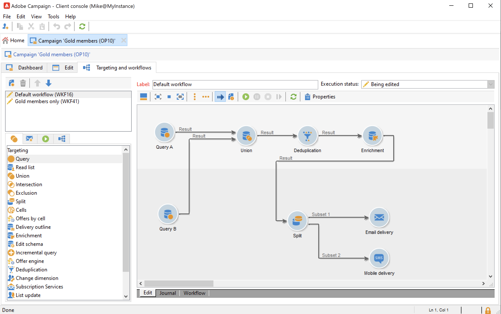
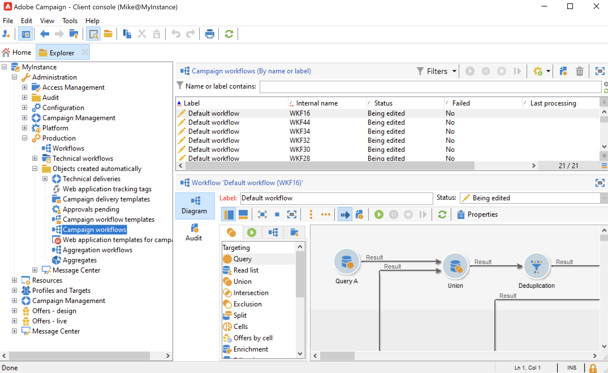

# Fluxos de trabalho da campanha {#campaign-workflows}

Para cada campanha, você pode criar fluxos de trabalho que serão executados na guia **[!UICONTROL Targeting and workflows]**. Esses fluxos de trabalho são específicos da campanha.

Esta guia contém as mesmas atividades que todos os fluxos de trabalho. [Saiba mais](#implementation-steps-)

Além de campanhas de segmentação, os fluxos de trabalho da campanha permitem criar e configurar entregas inteiramente para todos os canais disponíveis. Após ser criado no fluxo de trabalho, essas entregas estão disponíveis no painel da campanha.

Todos os fluxos de trabalho da campanha são centralizados no nó **[!UICONTROL Administration > Production > Objects created automatically > Campaign workflows]**.

Workflows da campanha e exemplos de implementação são detalhados em [esta seção](../campaigns/marketing-campaign-target.md).
