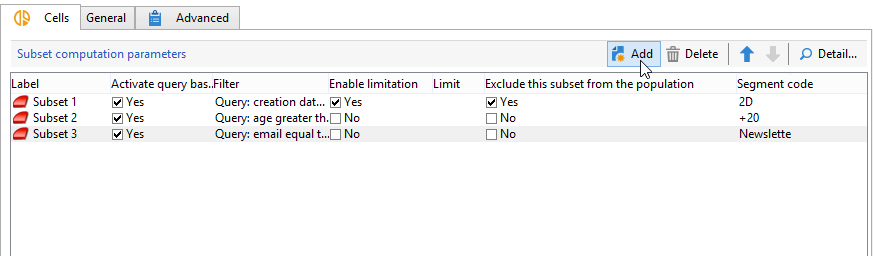

# Células{#cells}

A variável **[!UICONTROL Cells]** A atividade fornece uma visualização dos vários subconjuntos como colunas de dados. Ele facilita a manipulação de subconjunto e também foi projetado para aproveitar os recursos de personalização.



Essa atividade pode ser configurada para inserir parâmetros específicos com base nas necessidades do usuário. Por padrão, os detalhes de cada subconjunto são detalhados em uma janela dedicada por meio das guias **[!UICONTROL Cells]** e **[!UICONTROL Advanced]**.


No exemplo abaixo, o formulário de entrada foi modificado: a **[!UICONTROL Data]** A guia foi adicionada para habilitar a associação de uma oferta e um nível de prioridade para cada subconjunto.


Para essa configuração, as seguintes informações foram adicionadas ao formulário do fluxo de trabalho, no **[!UICONTROL Administration > Configurations > Input forms]** nó do explorador do Adobe Campaign:

```
<container img="nms:miniatures/mini-enrich.png" label="Data">
                <input xpath="@code"/>
                <container xpath="select/node[@alias='@numTest']">
                  <input alwaysActive="true" expr="'long'" type="expr" xpath="@type"/>
                  <input alwaysActive="true" expr="'Priority'" type="expr" xpath="@label"/>
                  <input label="Priority" maxValue="12" minValue="0" type="number"
                         xpath="@value" xpathEditFromType="@type"/>
                </container>
                <container xpath="select/node[@alias='@test']">
                  <input alwaysActive="true" expr="'string'" type="expr" xpath="@type"/>
                  <input alwaysActive="true" expr="'Identifier'" type="expr" xpath="@label"/>
                  <input label="Cell identifier" xpath="@value"/>
                </container>
                <container xpath="select/node[@alias='linkTest']">
                  <input alwaysActive="true" expr="'link'" type="expr" xpath="@type"/>
                  <input alwaysActive="true" expr="'nms:offer'" type="expr" xpath="@dataType"/>
                  <input alwaysActive="true" expr="'Offre'" type="expr" xpath="@label"/>
                  <input computeStringAlias="@valueLabel" label="Offers" notifyPathList="@_cs|@valueLabel"
                         schema="nms:offer" type="linkEdit" xpath="@value"/>
                </container>
```

A personalização do formulário de entrada no Adobe Campaign é reservada para usuários especialistas.