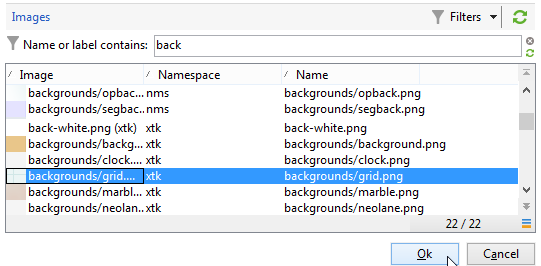
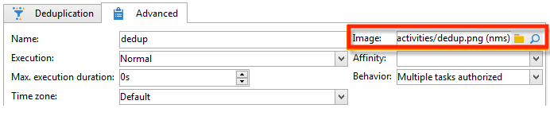

# Alterar imagens de atividade{#change-activity-images}

As imagens usadas nos diagramas dos vários workflows podem ser alteradas. No entanto, elas devem estar em conformidade com determinadas restrições. Estes são os estágios de implementação:

* Para alterar a imagem de fundo, selecione o workflow de direcionamento desejado e clique na guia **[!UICONTROL Properties]**.

  

  Para selecionar a imagem a ser usada, clique no ícone **[!UICONTROL Select link]** à direita do campo **[!UICONTROL Background image]**.

  >[!NOTE]
  >
  >A largura em pixels da imagem do plano de fundo deve ser em múltiplo de 4.

  

  O ícone **[!UICONTROL Edit link]** permite visualizar a imagem selecionada.

* Para alterar a imagem associada a uma atividade, clique duas vezes no objeto e, em seguida, clique na guia **[!UICONTROL Advanced]**.

  Para selecionar a imagem a ser usada, clique no ícone **[!UICONTROL Select link]** à direita do campo **[!UICONTROL Image]**.

  

  O ícone **[!UICONTROL Edit link]** permite visualizar a imagem selecionada.

  

>[!NOTE]
>
>As imagens salvas no nó **[!UICONTROL Administration > Configuration > Images]** da árvore estão disponíveis para seleção.
>  
>As imagens devem estar no formato PNG, com 48x48 pixels, 16 milhões de cores e um plano de fundo transparente.
