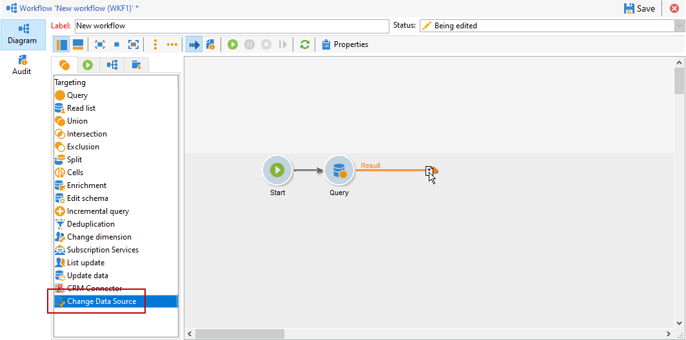
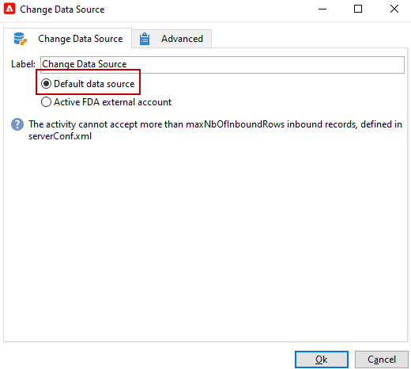

# Alterar fonte de dados {#change-data-source}

Use a atividade **[!UICONTROL Change data source]** para alterar a fonte de dados de uma [tabela de trabalho do fluxo de trabalho](use-workflow-data.md#workflow-temporary-work-table). Essa atividade oferece mais flexibilidade para gerenciar dados em diferentes fontes de dados, como o Federated Data Access (FDA), o banco de dados da Campaign Cloud (FFDA) e o banco de dados local do Campaign.

O fluxo de trabalho **[!UICONTROL Working table]** é usado para manipular e compartilhar dados com as atividades do fluxo de trabalho.

Por padrão, o **[!UICONTROL Working table]** é criado no mesmo banco de dados da fonte de dados que você precisa consultar.
Por exemplo, ao consultar a tabela **[!UICONTROL Recipients]**, armazenada no banco de dados em nuvem, o fluxo de trabalho cria um **[!UICONTROL Working table]** no mesmo banco de dados em nuvem.

Use uma atividade **[!UICONTROL Change Data Source]** para usar uma fonte de dados diferente para sua **[!UICONTROL Working table]**.

Observe que, ao usar a atividade **[!UICONTROL Change Data Source]**, é necessário alternar de volta para o banco de dados em nuvem para continuar a execução do fluxo de trabalho.

>[!IMPORTANT]
>
>Observe que as atividades **[!UICONTROL Change Dimension]** e **[!UICONTROL Change Data source]** não devem ser adicionadas em uma linha. Se você precisar usar ambas as atividades consecutivamente, certifique-se de incluir uma atividade **[!UICONTROL Enrichement]** entre elas. Isso garante a execução adequada e evita possíveis conflitos ou erros.

>[!NOTE]
>
>A atividade **Change Data Source** pode processar no máximo um milhão de registros por execução. Entre em contato com seu representante da Adobe se precisar aumentar esse limite.

Para usar a atividade **[!UICONTROL Change Data Source]**, você deve:

1. Criar um fluxo de trabalho.

1. Consulte seus destinatários alvos com uma atividade de **[!UICONTROL Query]**.

   Para mais informações sobre a atividade **[!UICONTROL Query]**, consulte esta [página](query.md#create-a-query).

1. Adicione uma atividade **[!UICONTROL Change data source]**.

   

1. Edite sua atividade **[!UICONTROL Change data source]** para selecionar **[!UICONTROL Default data source]**.

   A tabela de trabalho, que contém o resultado do query, é então movida para o banco de dados local padrão do Campaign.

   

1. Adicione uma atividade **[!UICONTROL JavaScript code]** para executar operações unitárias na tabela de trabalho.

   Para obter mais informações sobre a atividade **[!UICONTROL JavaScript code]**, consulte [esta página](sql-code-and-javascript-code.md#javascript-code).

1. Adicione outra atividade **[!UICONTROL Change data source]** para alternar de volta para o banco de dados em nuvem.

1. Edite esta atividade e selecione **[!UICONTROL Active FDA external account]** e a conta externa **[!UICONTROL External database]** correspondente.

   

1. Agora, você pode iniciar o seu fluxo de trabalho.
