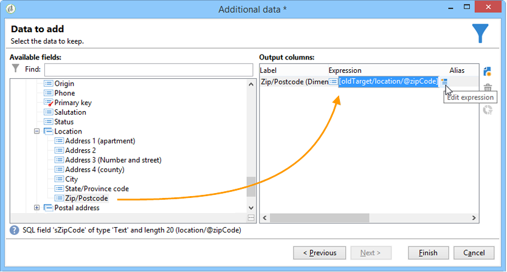

# Mudar dimensão{#change-dimension}

Use o **[!UICONTROL Change dimension]** atividade para alterar o targeting dimension enquanto você constrói um público-alvo. Essa atividade altera o eixo dependendo do template de dados e da dimensão de entrada. Por exemplo, você pode alternar da dimensão &quot;contratos&quot; para a dimensão &quot;clientes&quot;.

Você também pode usar essa atividade para definir as colunas adicionais do novo target e os critérios de desduplicação de dados.

Para configurar o **[!UICONTROL Change dimension]** siga as etapas abaixo:

1. Selecione a nova dimensão do target por meio do campo **[!UICONTROL Change dimension]**.

   

1. Durante a mudança de dimensão, é possível manter todos os elementos ou selecioná-los para serem mantidos na saída. No exemplo a seguir, o número máximo de duplicatas é definido como 2.

   

   Quando você escolhe manter apenas um registro, uma coleção é exibida no schema de trabalho: essa coleção representa todos os registros que não serão direcionados ao resultado final (já que apenas um registro é mantido). Como todas as outras coleções, esta é a que permite calcular agregações ou recuperar informações em colunas.

   Por exemplo, se alterar a dimensão **[!UICONTROL Customers]** para a dimensão **[!UICONTROL Recipients]**, será possível selecionar os clientes de uma loja específica, ao mesmo tempo em que adiciona o número de compras feitas.

1. Se optar por não manter todas essas informações, poderá configurar o modo de gerenciamento duplicatas.

   

   As setas azuis permitem definir a prioridade de processamento duplicatas.

   No exemplo acima, os recipient serão desduplicados em seu endereço de e-mail primeiro e, em seguida, em seu número de conta, se necessário.

1. A guia **[!UICONTROL Result]** permite adicionar mais informações.

   Por exemplo, é possível recuperar o município baseado no código postal utilizando uma função do tipo **Substring**. Para fazer isso:

   * Clique no link **[!UICONTROL Add data...]** e selecione **[!UICONTROL Data linked to the filtering dimension]**.

     

     >[!NOTE]
     >
     >Para obter informações sobre como criar e gerenciar colunas adicionais, consulte [Adicionar dados](query.md#add-data).

   * Selecione a dimensão do target anterior (antes da troca de eixo) e selecione **[!UICONTROL Zip Code]** na árvore secundária **[!UICONTROL Location]** do recipient e clique em **[!UICONTROL Edit expression]**.

     

   * Clique em **[!UICONTROL Advanced selection]** e escolha **[!UICONTROL Edit the formula using an expression]**.

     

   * Use as funções oferecidas na lista e especifique o cálculo a ser executado.

     

   * Finalmente, insira o rótulo da coluna que acabou de criar.

     

1. Execute o workflow para exibir o resultado dessa configuração. Compare os dados nas tabelas antes e depois da atividade de alteração de dimensão e compare a estrutura das tabelas do workflow, conforme mostrado nos exemplos a seguir:

   

   
