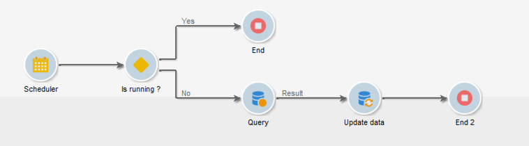

# Coordenar atualizações de dados{#coordinating-data-updates}

Esse caso de uso detalha a criação de um fluxo de trabalho que permite gerenciar atualizações relacionadas ao usar várias execuções de um fluxo de trabalho.

O objetivo é verificar se o processo de atualização terminou antes de executar outra operação de atualização. Para fazer isso, vamos configurar uma variável de instância e permitir que o fluxo de trabalho teste, se a instância estiver em execução, decidir se continua ou não a execução do fluxo de trabalho e realizar a atualização.

Este fluxo de trabalho é composto por:

* Uma atividade do **Scheduler**, que executa o fluxo de trabalho em uma frequência específica.
* Uma atividade **Test** que verifica se o fluxo de trabalho já está em execução.
* Atividades **Query** e **Update data** caso o fluxo de trabalho ainda não estiver em execução, seguido por uma atividade **End** que reinicializa a variável de instância do fluxo de trabalho para falso.
* Uma atividade **End** se o fluxo de trabalho já estiver em execução.

Para criar o fluxo de trabalho, siga as etapas abaixo:

1. Adicione uma atividade do **Scheduler** e configure sua frequência de acordo com suas necessidades.
1. Adicione uma atividade **Test** para verificar se o fluxo de trabalho já está em execução, depois a configure como apresentado abaixo.

   >[!NOTE]
   >
   >&quot;isRunning&quot; é o nome da variável de instância que escolhemos para este exemplo. Essa não é uma variável interna.

   

1. Adicione uma atividade **End** à bifurcação **No.** Dessa forma, nada será executado se o fluxo de trabalho já estiver em execução.
1. Adicione as atividades desejadas à bifurcação **Yes.** Em nosso caso, as atividades **Query** e **Update Data**.
1. Abra a primeira atividade e adicione o comando **instance.vars.isRunning = true** na guia **[!UICONTROL Advanced]**. Dessa forma, a variável de instância é definida como em execução.

   

1. Adicione uma atividade **End** ao final da bifurcação **[!UICONTROL Yes]** e adicione o comando **instance.vars.isRunning = false** na guia **[!UICONTROL Advanced]**.

   Desta maneira, nenhuma ação será executada enquanto o fluxo de trabalho estiver em execução.

   

**Tópicos relacionados:**

* [Evitar várias execuções simultâneas](monitor-workflow-execution.md#preventing-simultaneous-multiple-executions)
* [Atividade Atualizar dados](update-data.md)
