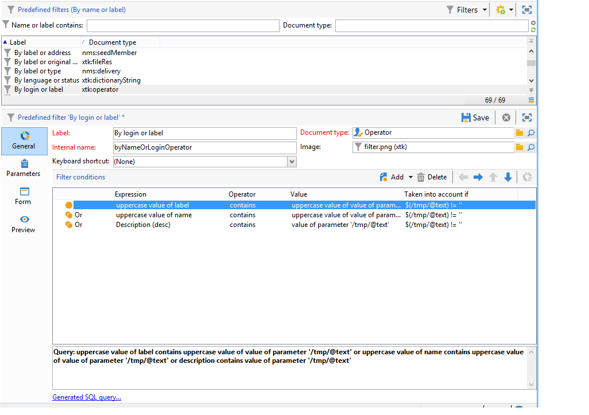

# Criar um filtro {#creating-a-filter}

Os filtros disponíveis no Adobe Campaign são definidos por meio das condições de filtragem criadas usando o mesmo modo operacional usado ao criar consultas no [Editor de consultas](../../v8/start/query-editor.md).

O nó **[!UICONTROL Administration > Configuration > Predefined filters]** contém todos os filtros padrão. Alguns deles são usados em listas e visões gerais. Saiba mais sobre [filtros predefinidos internos](../../v8/audiences/create-filters.md).

Por exemplo, a lista de operadores pode ser filtrada por **[!UICONTROL Active accounts]**:

O filtro correspondente contém a consulta no valor **[!UICONTROL Account disabled]** do esquema **[!UICONTROL Operators]**:

Para a mesma lista, o filtro **[!UICONTROL By login or label]** permite filtrar os dados na lista com base no valor inserido no campo de filtro:

Ele é construído da seguinte maneira:

Para corresponder às condições do filtro, a conta do operador deve verificar uma das seguintes condições:

* Seu rótulo contém os caracteres inseridos no campo de entrada,
* O nome do operador contém os caracteres inseridos no campo de entrada,
* O conteúdo da área de descrição contém os caracteres inseridos no campo de entrada.

>[!NOTE]
>
>A função **[!UICONTROL Upper]** permite desativar a função com diferenciação de maiúsculas e minúsculas.

A coluna **[!UICONTROL Taken into account if]** permite definir os critérios do aplicativo para essas condições de filtro. Aqui, os caracteres **$(/tmp/@text)** representam o conteúdo do campo de entrada vinculado ao filtro:

Aqui, **$(/tmp/@text)=&#39;agency&#39;**

A expressão **$(/tmp/@text)!=&#39;&#39;** aplica cada condição quando o campo de entrada não está vazio.
