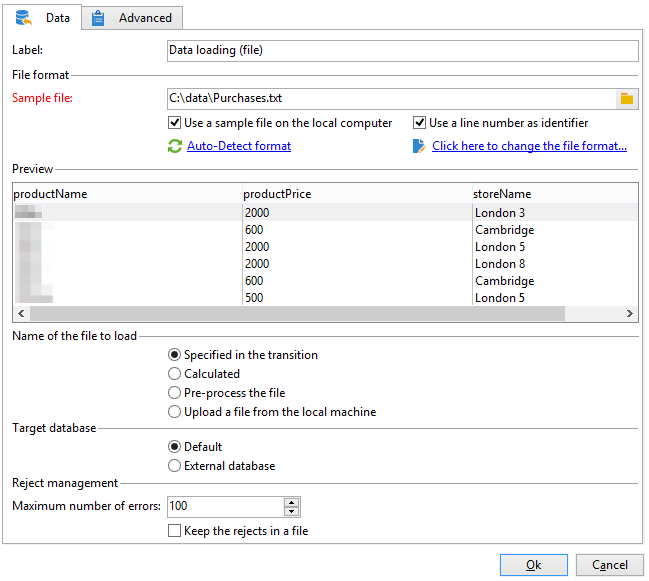

# Criar uma lista de resumo{#creating-a-summary-list}

Esse caso de uso detalha a criação de um workflow, que, após coletar arquivos e a passar por vários enriquecimentos, permite criar uma lista de resumo. O exemplo é baseado em uma lista de contatos que compraram em uma loja.


A seguinte estrutura de dados é usada:


Seu objetivo é:

* Para utilizar as várias opções da atividade de enriquecimento
* Para atualizar os dados do banco de dados após uma reconciliação
* Para criar uma &quot;visualização&quot; global dos dados enriquecidos

Para criar uma lista de resumo, siga estas etapas:

1. Coleta e carregamento de um arquivo &quot;Compras&quot; na tabela de trabalho do workflow
1. Enriquecimento dos dados importados ao criar um link para uma tabela de referência
1. Atualização da tabela &quot;Compras&quot; com os dados enriquecidos
1. Enriquecimento dos dados &quot;Contatos&quot; com um cálculo agregado da tabela &quot;Compras&quot;
1. Criação da lista de resumo

## Etapa 1: carregar o arquivo e reconciliar os dados importados {#step-1--loading-the-file-and-reconciling-the-imported-data}

Os dados a serem carregados são dados relacionados com &quot;Comprar&quot; com o seguinte formato:

```
Product Name;Product price;Store
Computer;2000;London 3
Tablet;600;Cambridge
Computer;2000;London 5
Computer;2000;London 8
Tablet;600;Cambridge
Phone;500;London 5
```

Esses dados estão contidos em um arquivo de texto &quot;Purchases.txt&quot;.

1. Adicione as atividades do **File collector** e **Data loading (file)** ao workflow.

   A atividade **File collector** permite coletar e enviar arquivos de e para o servidor do Adobe Campaign.

   A atividade **Data loading(file)** permite enriquecer a tabela de trabalho do fluxo de trabalho com os dados coletados. Para obter mais informações sobre esta atividade, consulte [esta página](data-loading-file.md).

1. Configure a atividade **File collector** para coletar arquivos de texto (*&#42;txt) do diretório selecionado.

   

   A atividade **File collector** permite gerenciar a ausência de um arquivo no diretório de origem. Para fazer isso, marque a opção **[!UICONTROL Process file nonexistence]**. Neste workflow, uma atividade **Wait** foi adicionada para tentar outra coleção de arquivos se estiver ausente no diretório no momento da coleta.

1. Configure a atividade **Data loading (file)** usando um arquivo de amostra com o mesmo formato dos dados a serem importados.

   

   Clique no link **[!UICONTROL Click here to change the file format...]** para renomear as colunas usando os nomes e rótulos internos da tabela &quot;Purchases&quot;.

   

Após importar os dados, o enriquecimento é executado criando um link para uma tabela de referência que corresponde ao schema &quot;Lojas&quot;.

Adicione a atividade de Enrichment e a configure como a seguir:

1. Selecione o conjunto principal de dados da atividade **Data loading (file)**.

   

1. Clique em **[!UICONTROL Add data]** e selecione a opção **[!UICONTROL A link]**.

   

1. Selecione a opção **[!UICONTROL Define a collection]**.
1. Selecione o schema &quot;Lojas&quot; como target.

   

Para obter mais informações sobre os vários tipos de links, consulte [Enriquecimento e modificação de dados](targeting-workflows.md#enrich-and-modify-data).

Na janela a seguir, é preciso criar uma condição de associação selecionando o campo de origem (no conjunto principal) e o campo do alvo (pertencente ao schema &quot;Lojas&quot;) para configurar a reconciliação de dados.


Agora que o link foi criado, vamos adicionar uma coluna à tabela de trabalho do workflow a partir do schema &quot;Lojas&quot;: o campo &quot;ZipCode Reference&quot;.

1. Abra a atividade de enriquecimento.
1. Clique em **[!UICONTROL Edit additional data]**.
1. Adicione o campo &quot;ZipCode Reference&quot; ao **[!UICONTROL Output columns]**.


Os dados na tabela de trabalho do fluxo de trabalho após esse enriquecimento serão os seguintes:


## Etapa 2: gravar dados enriquecidos na tabela &#39;Purchases&#39; {#step-2--writing-enriched-data-to-the--purchases--table}

Esta etapa detalha como gravar dados importados e enriquecidos na tabela &quot;Compras&quot;. Para fazer isso, precisamos usar uma atividade **Update data** .

Uma reconciliação entre os dados na tabela de trabalho do workflow e a targeting dimension **Purchases** deve ser realizada antes da atualização dos dados na tabela **Purchases**.

1. Clique na guia **[!UICONTROL Reconciliation]** da atividade de enriquecimento.
1. Selecione a dimensão do target, o schema &quot;Purchases&quot; neste caso.
1. Selecione uma &quot;Source expression&quot; para os dados na tabela do workflow (o campo &quot;storeName&quot; neste caso).
1. Selecione um &quot;Destination expression&quot; para os dados na tabela &quot;Purchases&quot; (o campo &quot;storename&quot; neste caso).
1. Marque a opção **[!UICONTROL Keep unreconciled data coming from the work table]**.


Na atividade **Update data**, a seguinte configuração é necessária:

1. No campo **[!UICONTROL Insert or update]**, selecione a opção **[!UICONTROL Operation type]** para evitar a criação de novos registros toda vez que o arquivo for coletado.
1. Selecione o valor **[!UICONTROL By directly using the targeting dimension]** da opção **[!UICONTROL Record identification]**.
1. Selecione o schema &quot;Purchases&quot; como **[!UICONTROL Document type]**.
1. Especifique a lista dos campos a serem atualizados. A coluna **[!UICONTROL Destination]** permite definir os campos do schema &quot;Purchases&quot;. A coluna **[!UICONTROL Expression]** permite selecionar os campos na tabela de trabalho para serem mapeados.
1. Clique na opção **[!UICONTROL Generate an outbound transition]**.


## Etapa 3: enriquecer dados de &#39;Contact&#39; {#step-3--enriching--contact--data-}

O schema &quot;Contats&quot; está vinculado fisicamente ao esquema &quot;Purchases&quot;. Isso significa que é possível usar outra opção da opção &quot;Enrichment&quot;: adição de dados vinculados à dimensão do filtro.

O objetivo deste segundo enriquecimento é criar um agregado no schema de compra para calcular a quantidade total de compras de cada contato identificado.

1. Adicione uma atividade do tipo **query** que permite recuperar todos os **contatos** armazenados.
1. Adicione uma atividade **Enrichment**, então selecione o conjunto principal resultante da query anterior.
1. Clique em adicionar **[!UICONTROL Data]**.
1. Clique na opção **[!UICONTROL Data linked to the targeting dimension]**.
1. Clique na opção **[!UICONTROL Data linked to the filtering dimension]** na janela **[!UICONTROL Select fields to add]**.
1. Selecione o nó **[!UICONTROL Purchases]** e clique em **[!UICONTROL Next]**.

   

1. Altere o campo **[!UICONTROL Collected data]** selecionando a opção **[!UICONTROL Aggregates]**.

   

1. Clique em **[!UICONTROL Next]**.
1. Adicione a seguinte expressão para calcular o total de compras para cada contato: &quot;Sum(@prodprice)&quot;.

   

Para preparar a lista de resumo, é necessário adicionar campos do campo &quot;Purchases&quot; e do primeiro enriquecimento: o campo &quot;ZipCode Reference&quot;.

1. Clique no link **[!UICONTROL Edit additional data...]** na atividade de enriquecimento.
1. Adicione os campos &quot;Store Name&quot; e &quot;Purchases / Zip Code Reference&quot;.

   

1. Clique na guia **[!UICONTROL Properties]**.
1. Altere o segundo link para criar apenas uma linha.

## Etapa 4: criar e adicionar a uma lista de resumo {#step-4--creating-and-adding-to-a-summary-list}

A última etapa envolve gravar todos os dados enriquecidos em uma lista.

1. Adicione uma atividade de **List update** ao workflow. Esta atividade deve ser vinculada à transição de saída da segunda atividade de enriquecimento.
1. Selecione a opção **[!UICONTROL Create the list if necessary (Calculated name)]**.
1. Selecione um valor para o nome calculado. O rótulo escolhido para a lista é a data atual: &lt;%= formatDate(new Date(), &quot;%2D/%2M/%2Y&quot;) %>

Após executar o workflow, a lista incluirá:

* uma lista de contatos,
* uma coluna &quot;Total purchases&quot;,
* uma coluna &quot;Store name&quot;,
* a coluna &quot;Zip Code Reference&quot; inserida para todas as lojas contidas no schema de referência de lojas.


