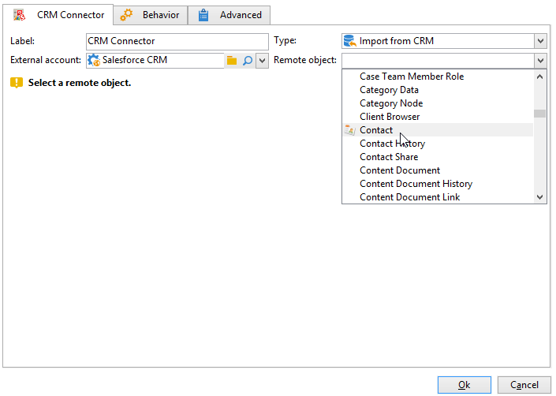

# Conector CRM{#crm-connector}

A atividade do **Conector CRM** permite configurar a sincronização de dados entre o Adobe Campaign e um sistema CRM.

Com essa atividade, você pode:

* Importar do CRM
* Exportar para o CRM
* Importar objetos excluídos no CRM
* Excluir objetos no CRM

Selecione a conta externa que corresponde ao CRM que deseja configurar a sincronização, e depois selecione o objeto a ser sincronizado (contas, oportunidades, contatos, etc.).

Para obter mais informações sobre conectores CRM no Adobe Campaign, consulte [esta seção](https://experienceleague.adobe.com/docs/campaign/campaign-v8/connect/ac-crm/crm.html){target="_blank"}.
