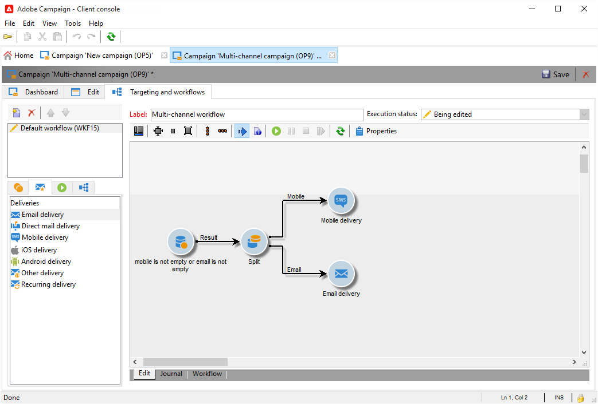

# Entregas entre canais{#cross-channel-deliveries}

Entregas entre canais estão disponíveis na guia **[!UICONTROL Deliveries]** de [atividades do fluxo de trabalho da campanha](campaign-workflows.md).

Selecionar o modelo no qual deseja basear a entrega e definir seu conteúdo.

Você pode especificar um target para o upstream de entrega de fluxo de trabalho usando as diferentes atividades de direcionamento.

No exemplo abaixo, saiba como criar um fluxo de trabalho para enviar um email ou SMS a assinantes de notificação por push e, em seguida, uma notificação por push uma semana depois. Para fazer isso:

1. Crie uma campanha.
1. Na guia **[!UICONTROL Targeting and workflows]** da campanha, adicione uma atividade **[!UICONTROL Query]**.
1. Configurar sua query: selecione os recipients que assinaram notificações por push como o target dimension.

   >[!NOTE]
   >
   >Para as notificações por push, use a dimensão de direcionamento dos **aplicativos de assinante**.

   

1. Adicione as condições de filtro à sua consulta. Nesse caso, selecionamos destinatários com um número de celular ou endereço de email.

   

1. Adicione uma atividade **[!UICONTROL Split]** ao fluxo de trabalho para dividir destinatários com um número de celular e aqueles com um endereço de email.
1. Na guia **[!UICONTROL Delivery]**, selecione um workflow para cada target.

   Crie seu delivery da mesma forma que com um assistente de delivery comum clicando duas vezes na atividade de delivery no seu workflow.

   

1. Adicione e configure uma atividade **[!UICONTROL Wait]** para os destinatários não receberem muitas entregas de uma vez.
1. Adicione uma atividade **[!UICONTROL Split]** para dividir os assinantes de aplicativos móveis iOS ou Android.

   Selecione um serviço para cada um dos sistemas operacionais.

   

1. Selecione e configure uma entrega de aplicativo móvel para cada um dos sistemas operacionais.

   
