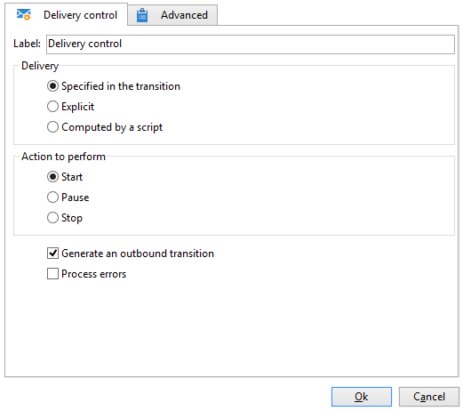

# Controle de entregas{#delivery-control}

Uma ação do tipo **Controle de entrega** permite iniciar, pausar ou parar uma entrega.

Isso pode ser a entrega especificada na transição, uma entrega selecionada explicitamente ou uma entrega calculada por um script. Para obter mais informações, consulte [Delivery](delivery.md).

Se você selecionar **[!UICONTROL Start]**, a atividade executará todas as etapas necessárias para iniciar a entrega (cálculo de direcionamento, preparação de conteúdo, entrega). Se algumas dessas etapas já foram executadas por uma atividade anterior do fluxo de trabalho, elas não serão executadas novamente. Por exemplo, se a estimativa de direcionamento já foi executada por uma atividade do tipo **[!UICONTROL Delivery]** (consulte [Entrega](delivery.md)), a atividade **[!UICONTROL Act on the delivery]** iniciará as etapas restantes (preparação de conteúdo e entrega).

As seguintes opções estão disponíveis:

* **[!UICONTROL Generate an outbound transition]**

  Cria uma transição de saída que será ativada no final da execução. Você pode escolher se quer recuperar ou não o target da entrega.

* **[!UICONTROL Processing errors]**

  Consulte [Processamento de erros](monitor-workflow-execution.md#processing-errors).

## Parâmetros de entrada {#input-parameters}

* deliveryId

  Identificador de entrega, se a ação selecionada for **[!UICONTROL Specified in the transition]**.
