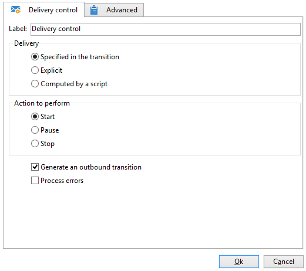

# Controle de delivery{#delivery-control}

Uma ação do tipo **Controle de delivery** permite iniciar, pausar ou parar um delivery.

Isso pode ser o delivery especificado na transição, um delivery selecionado explicitamente ou um delivery calculado por um script. Para obter mais informações, consulte [Delivery](delivery.md).

Se você selecionar **[!UICONTROL Start]**, a atividade executará todas as etapas necessárias para iniciar o delivery (cálculo de direcionamento, preparação de conteúdo, delivery). Se algumas dessas etapas já foram executadas por uma atividade anterior do workflow, elas não serão executadas novamente. Por exemplo, se a estimativa de direcionamento já foi executada por uma atividade do tipo **[!UICONTROL Delivery]** (consulte [Delivery](delivery.md)), a atividade **[!UICONTROL Act on the delivery]** iniciará as etapas restantes (preparação de conteúdo e delivery).

As seguintes opções estão disponíveis:

* **[!UICONTROL Generate an outbound transition]**

   Cria uma transição de saída que será ativada no final da execução. Você pode escolher se quer recuperar ou não o target do delivery.

* **[!UICONTROL Processing errors]**

   Consulte [Processamento de erros](monitor-workflow-execution.md#processing-errors).

## Parâmetros de entrada {#input-parameters}

* deliveryId

Identificador de delivery, se a ação selecionada for **[!UICONTROL Specified in the transition]**.
