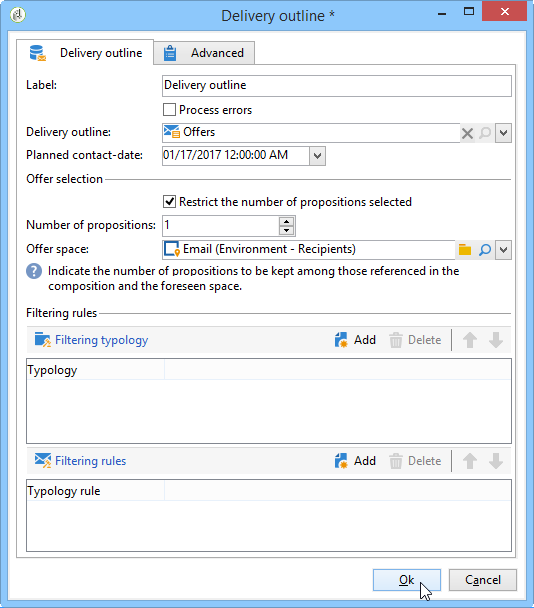

# Delivery outline{#delivery-outline}

A **descrição da entrega** permite usar uma descrição em um fluxo de trabalho de campanha. O outline deve ter sido criado antecipadamente na campanha.

Para configurar a atividade, basta marcar outline desejado e a data de contato planejada. É possível adicionar regras do filtro adicionando tipologias ou regras de tipologia.

## Exemplo: Inserção de uma oferta por meio de uma entrega outline {#example--inserting-an-offer-via-a-delivery-outline}

A atividade de **descrição da entrega**, disponível nos fluxos de trabalho da campanha, permite apresentar ofertas mencionadas em uma descrição da entrega na campanha atual em andamento.

>[!NOTE]
>
>O pacote de **Interaction** deve ser instalado.

1. Em um fluxo de trabalho, adicione uma atividade de descrição da entrega antes de adicionar uma atividade de entrega.
1. Na atividade de descrição da entrega, especifique a descrição que deseja usar.
1. Preencha os campos disponíveis de acordo com sua entrega.
1. Há dois casos possíveis:

   * Se desejar chamar o mecanismo de oferta, marque a caixa **[!UICONTROL Restrict the number of propositions selected]**. Especifique o espaço de oferta e o número de propostas que serão apresentadas na entrega.

     Os pesos da oferta e as regras de elegibilidade serão considerados pelo mecanismo de oferta.

   * Se não marcar a caixa, todas as ofertas na descrição da entrega serão apresentadas sem chamar o mecanismo de oferta.

   A pré-visualização leva em conta o número de ofertas especificadas na entrega. Ao executar um fluxo de trabalho, é o número especificado na descrição da entrega que é levada em conta.

   
