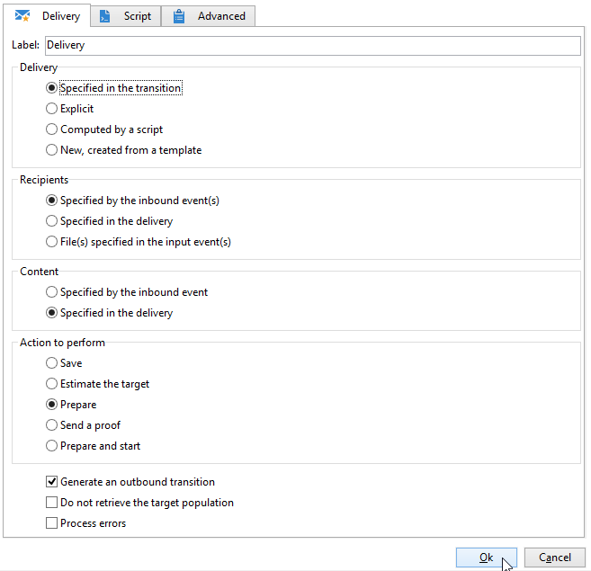

# Entrega{#delivery}


Uma atividade do tipo **Delivery** permite criar uma ação de delivery. Ele pode ser construído usando elementos de entrada.

Para configurá-lo, edite a atividade e insira as opções de delivery.



1. **Delivery**

   É possível:

   * Atue no delivery especificado na transição de entrada. Para fazer isso, selecione a primeira opção de seção **[!UICONTROL Delivery]** da janela.

     Essa opção pode ser usada quando uma atividade de workflow anterior já criou ou especificou o delivery. Isso pode ter sido feito, como no exemplo abaixo, por uma atividade do mesmo tipo que gerou uma transição de saída.

     No exemplo a seguir, o delivery é criado pela primeira vez. O público e o conteúdo são definidos mais tarde. Em seguida, as informações desses três elementos são inseridas novamente em uma nova atividade de delivery usando a transição de entrada para que isso possa ser enviado.

     

   * Selecione diretamente o delivery envolvido. Para fazer isso, selecione a opção **[!UICONTROL Explicit]** e selecione o da lista suspensa no campo **[!UICONTROL Delivery]** Delivery.

     A lista exibe deliveries não concluídos contidos na pasta **Deliveries** por padrão. Para acessar outras campanhas, clique no ícone **[!UICONTROL Select link]**.

     

     Selecione a campanha da lista suspensa no campo **[!UICONTROL Folder]** ou clique em **[!UICONTROL Display sub-levels]** para exibir todos deliveries contidos em subpastas:

     

     Após selecionar a ação de delivery, é possível exibir o conteúdo clicando em **[!UICONTROL Edit link]**.

   * Crie um script para calcular o delivery. Para fazer isto, clique na opção **[!UICONTROL Computed by a script]** e depois insira o script. É possível abrir uma janela de entrada clicando na opção **[!UICONTROL Edit...]**. O exemplo a seguir recupera o identificador do delivery:

     

   * Criação de novo delivery Para fazer isso, selecione a opção **[!UICONTROL New, created from a template]** e selecione o template do delivery no qual o delivery será baseado.

     

     Clique em **[!UICONTROL Select link]** para procurar as pastas e clique em **[!UICONTROL Edit link]** se desejar visualizar o conteúdo do template selecionado.

1. **Recipients**

   Os recipients podem ser especificados pelos eventos de entrada, por exemplo, seguindo uma importação de arquivo ou especificado na ação de delivery. Eles também podem ser armazenados em um ou mais arquivos.

   

1. **Conteúdo**

   O conteúdo da mensagem pode ser definido no delivery ou no evento de entrada.

   

1. **Ação a ser executada**

   Você pode criar o delivery, prepará-lo, iniciá-lo, estimar o target ou enviar uma prova.

   

   Selecione o tipo de ação a ser executada:

   * **[!UICONTROL Save]**: esta opção permite criar o delivery e salvá-lo. Ele não irá analisar nem enviá-lo.
   * **[!UICONTROL Estimate the target]**: essa opção permite calcular o target do delivery para avaliar seu potencial (primeira fase de análise). Esta ação é equivalente a selecionar a opção **[!UICONTROL Estimate the population to be targeted]** e clicar em **[!UICONTROL Analyze]** ao enviar um delivery para o target principal por meio de **Delivery**.
   * **[!UICONTROL Prepare]**: esta opção permite executar o processo de análise completa (cálculo de target e preparação de conteúdo). O delivery não é enviado. Esta ação é equivalente a selecionar a opção **[!UICONTROL Deliver as soon as possible]** e clicar em **[!UICONTROL Analyze]** ao enviar um delivery para o target principal com **Delivery**.
   * **[!UICONTROL Send a proof]**: esta opção permite enviar uma prova do delivery. Esta ação é equivalente ao clicar em **[!UICONTROL Send a proof]** na barra de ferramentas de um delivery com **Delivery**
   * **[!UICONTROL Prepare and start]**: esta opção inicia o processo de análise completa (cálculo de target e preparação de conteúdo) e envia o delivery. Esta ação é equivalente a clicar na opção **[!UICONTROL Deliver as soon as possible]**, **[!UICONTROL Analyze]** e **[!UICONTROL Confirm delivery]** ao enviar um delivery ao target principal com **Delivery**.

   A atividade **[!UICONTROL Act on a delivery]** usada mais no workflow permite iniciar todas as etapas restantes necessárias para iniciar o delivery (cálculo de target, preparação de conteúdo, delivery). Para obter mais informações, consulte [Controle de delivery](delivery-control.md).

   As seguintes opções também estão disponíveis:

   * **[!UICONTROL Generate an outbound transition]**

     Cria uma transição de saída que será ativada no final da execução. Você pode escolher se quer recuperar ou não o target do delivery.

   * **[!UICONTROL Do not recover target]**

     Não recupera o target da ação de delivery realizada.

   * **[!UICONTROL Processing errors]**

     Consulte [Controle de delivery](delivery-control.md).

   A guia **Script** permite modificar os parâmetros de delivery.

   

## Exemplo: workflow de delivery {#example--delivery-workflow}

Crie um novo workflow e adicione atividades conforme mostrado no gráfico abaixo:


Abra a atividade de **Delivery** e defina as propriedades da seguinte maneira:

* Na seção **[!UICONTROL Delivery]**, selecione **[!UICONTROL New, created from a template]** e selecione um template de delivery.
* Na seção **[!UICONTROL Recipients]**, selecione **[!UICONTROL Specified in the delivery]**.
* Na seção **[!UICONTROL Action to execute]**, mantenha a opção **[!UICONTROL Prepare]**.


Clique em **[!UICONTROL OK]** para fechar a janela das propriedades. Você acabou de configurar uma atividade que consiste na criação e preparação de um novo delivery com base em um template de delivery cujo destino será especificado.

Abra a atividade de **Aprovação** e defina as propriedades da seguinte maneira:

1. No campo **[!UICONTROL Assignment type]**, selecione um grupo no qual você está registrado. Se estiver conectado com a conta de administrador, selecione o grupo Administração.
1. Em seguida, insira um título e insira o seguinte texto no corpo da mensagem:

   ```
   Do you wish to approve delivery (<%= vars.recCount %> recipient(s))?
   ```

   Esta é uma mensagem que inclui uma expressão escrita em JavaScript: **[!UICONTROL vars.recCount]** representa o número de recipients direcionados pelo delivery da tarefa anterior. Para obter mais informações sobre expressões JavaScript, consulte [Scripts e modelos do JavaScript](javascript-scripts-and-templates.md).

   

   A tarefa Approval é apresentada em [Approval](approval.md).

## Parâmetros de entrada {#input-parameters}

Identificador de delivery, se a opção **[!UICONTROL Specified in the transition]** estiver selecionada na seção **[!UICONTROL Delivery]**.

* deliveryId
* tableName
* schema

Cada evento de entrada deve especificar um target definido por esses parâmetros.

>[!NOTE]
>
>Esse parâmetro só aparecerá se a opção **[!UICONTROL Specified by inbound event(s)]** estiver selecionada na seção **[!UICONTROL Recipients]**.

* filename

  Nome completo do arquivo gerado se a opção **[!UICONTROL File(s) specified by inbound event(s)]** estiver selecionada na seção **[!UICONTROL Recipients]**.

* contentId

  Identificador de conteúdo se a opção **[!UICONTROL Specified by inbound events]** estiver selecionada na seção **[!UICONTROL Content]**.

## Parâmetros de saída {#output-parameters}

* tableName
* schema
* recCount

Esse conjunto de três valores identifica o target resultante do delivery. **[!UICONTROL tableName]** é o nome da tabela que memoriza os identificadores do target,**[!UICONTROL schema]** é o schema do público (geralmente nms:recipient) e **[!UICONTROL recCount]** é o número de elementos na tabela.

A transição associada ao complemento tem os mesmos parâmetros.

>[!NOTE]
>
>Não há parâmetros de saída quando a opção **[!UICONTROL Do not recover target]** estiver selecionada.
