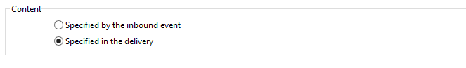

# Entrega{#delivery}

Uma atividade do tipo **Entrega** permite criar uma ação de entrega. Ele pode ser construído usando elementos de entrada.

Para configurá-la, edite a atividade e insira as opções de entrega.


1. **Entrega**

   É possível:

   * Atue na entrega especificada na transição de entrada. Para fazer isso, selecione a primeira opção de seção **[!UICONTROL Delivery]** da janela.

     Essa opção pode ser usada quando uma atividade de workflow anterior já criou ou especificou a entrega. Isso pode ter sido feito, como no exemplo abaixo, por uma atividade do mesmo tipo que gerou uma transição de saída.

     No exemplo a seguir, a entrega é criada pela primeira vez. O público e o conteúdo são definidos mais tarde. Em seguida, as informações desses três elementos são inseridas novamente em uma nova atividade de entrega usando a transição de entrada para que isso possa ser enviado.

     

   * Selecione diretamente a entrega envolvida. Para fazer isso, selecione a opção **[!UICONTROL Explicit]** e selecione o da lista suspensa no campo **[!UICONTROL Delivery]** Entrega.

     A lista exibe entregas não concluídos contidos na pasta **Entregas** por padrão. Para acessar outras campanhas, clique no ícone **[!UICONTROL Select link]**.

     

     Selecione a campanha da lista suspensa no campo **[!UICONTROL Folder]** ou clique em **[!UICONTROL Display sub-levels]** para exibir todas as entregas contidas em subpastas:

     

     Após selecionar a ação de entrega, é possível exibir o conteúdo clicando em **[!UICONTROL Edit link]**.

   * Crie um script para calcular a entrega. Para fazer isto, clique na opção **[!UICONTROL Computed by a script]** e depois insira o script. É possível abrir uma janela de entrada clicando na opção **[!UICONTROL Edit...]**. O exemplo a seguir recupera o identificador da entrega:

     

   * Criação de nova entrega Para fazer isso, selecione a opção **[!UICONTROL New, created from a template]** e selecione o template da entrega no qual a entrega será baseada.

     

     Clique em **[!UICONTROL Select link]** para procurar as pastas e clique em **[!UICONTROL Edit link]** se desejar visualizar o conteúdo do template selecionado.

1. **Recipients**

   Os destinatários podem ser especificados pelos eventos de entrada, por exemplo, seguindo uma importação de arquivo ou especificado na ação de entrega. Eles também podem ser armazenados em um ou mais arquivos.

   

1. **Conteúdo**

   O conteúdo da mensagem pode ser definido na entrega ou no evento de entrada.

   

1. **Ação a ser executada**

   Você pode criar a entrega, prepará-la, iniciá-la, estimar o target ou enviar uma prova.

   

   Selecione o tipo de ação a ser executada:

   * **[!UICONTROL Save]**: esta opção permite criar a entrega e salvá-la. Ele não irá analisar nem enviá-la.
   * **[!UICONTROL Estimate the target]**: essa opção permite calcular o target da entrega para avaliar seu potencial (primeira fase de análise). Esta ação é equivalente a selecionar a opção **[!UICONTROL Estimate the population to be targeted]** e clicar em **[!UICONTROL Analyze]** ao enviar uma entrega para o target principal por meio de **Entrega**.
   * **[!UICONTROL Prepare]**: esta opção permite executar o processo de análise completa (cálculo de target e preparação de conteúdo). A entrega não é enviada. Esta ação é equivalente a selecionar a opção **[!UICONTROL Deliver as soon as possible]** e clicar em **[!UICONTROL Analyze]** ao enviar uma entrega para o target principal com **Entrega**.
   * **[!UICONTROL Send a proof]**: esta opção permite enviar uma prova da entrega. Esta ação é equivalente ao clicar em **[!UICONTROL Send a proof]** na barra de ferramentas de uma entrega com **Entrega**
   * **[!UICONTROL Prepare and start]**: esta opção inicia o processo de análise completa (cálculo de target e preparação de conteúdo) e envia a entrega. Esta ação é equivalente a clicar na opção **[!UICONTROL Deliver as soon as possible]**, **[!UICONTROL Analyze]** e **[!UICONTROL Confirm delivery]** ao enviar uma entrega ao target principal com **Entrega**.

   A atividade **[!UICONTROL Act on a delivery]** usada mais no workflow permite iniciar todas as etapas restantes necessárias para iniciar a entrega (cálculo de target, preparação de conteúdo, entrega). Para obter mais informações, consulte [Controle de entrega](delivery-control.md).

   As seguintes opções também estão disponíveis:

   * **[!UICONTROL Generate an outbound transition]**

     Cria uma transição de saída que será ativada no final da execução. Você pode escolher se quer recuperar ou não o target da entrega.

   * **[!UICONTROL Do not recover target]**

     Não recupera o target da ação de entrega realizada.

   * **[!UICONTROL Processing errors]**

     Consulte [Controle de entrega](delivery-control.md).

   A guia **Script** permite modificar os parâmetros de entrega.

   

## Exemplo: workflow de entrega {#example--delivery-workflow}

Crie um novo workflow e adicione atividades conforme mostrado no gráfico abaixo:


Abra a atividade de **Entrega** e defina as propriedades da seguinte maneira:

* Na seção **[!UICONTROL Delivery]**, selecione **[!UICONTROL New, created from a template]** e selecione um template de entrega.
* Na seção **[!UICONTROL Recipients]**, selecione **[!UICONTROL Specified in the delivery]**.
* Na seção **[!UICONTROL Action to execute]**, mantenha a opção **[!UICONTROL Prepare]**.


Clique em **[!UICONTROL OK]** para fechar a janela das propriedades. Você acabou de configurar uma atividade que consiste na criação e preparação de uma nova entrega com base em um template de entrega cujo destino será especificado.

Abra a atividade de **Aprovação** e defina as propriedades da seguinte maneira:

1. No campo **[!UICONTROL Assignment type]**, selecione um grupo no qual você está registrado. Se estiver conectado com a conta de administrador, selecione o grupo Administração.
1. Em seguida, insira um título e insira o seguinte texto no corpo da mensagem:

   ```
   Do you wish to approve delivery (<%= vars.recCount %> recipient(s))?
   ```

   Esta é uma mensagem que inclui uma expressão escrita em JavaScript: **[!UICONTROL vars.recCount]** representa o número de destinatários direcionados pela entrega da tarefa anterior. Para obter mais informações sobre expressões JavaScript, consulte [Scripts e modelos do JavaScript](javascript-scripts-and-templates.md).

   

   A tarefa Approval é apresentada em [Approval](approval.md).

## Parâmetros de entrada {#input-parameters}

Identificador de entrega, se a opção **[!UICONTROL Specified in the transition]** estiver selecionada na seção **[!UICONTROL Delivery]**.

* deliveryId
* tableName
* schema

Cada evento de entrada deve especificar um target definido por esses parâmetros.

>[!NOTE]
>
>Esse parâmetro só aparecerá se a opção **[!UICONTROL Specified by inbound event(s)]** estiver selecionada na seção **[!UICONTROL Recipients]**.

* filename

  Nome completo do arquivo gerado se a opção **[!UICONTROL File(s) specified by inbound event(s)]** estiver selecionada na seção **[!UICONTROL Recipients]**.

* contentId

  Identificador de conteúdo se a opção **[!UICONTROL Specified by inbound events]** estiver selecionada na seção **[!UICONTROL Content]**.

## Parâmetros de saída {#output-parameters}

* tableName
* schema
* recCount

Esse conjunto de três valores identifica o target resultante da entrega. **[!UICONTROL tableName]** é o nome da tabela que memoriza os identificadores do target,**[!UICONTROL schema]** é o schema do público (geralmente nms:recipient) e **[!UICONTROL recCount]** é o número de elementos na tabela.

A transição associada ao complemento tem os mesmos parâmetros.

>[!NOTE]
>
>Não há parâmetros de saída quando a opção **[!UICONTROL Do not recover target]** estiver selecionada.
