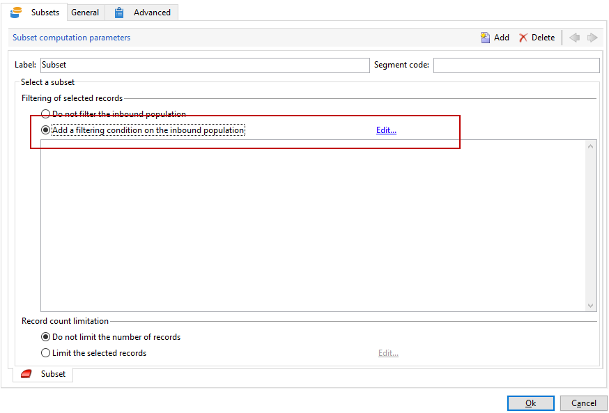

# Enriquecimento de email com campos de data personalizados{#email-enrichment-with-custom-date-fields}


Neste exemplo, queremos enviar um e-mail com campos de dados personalizados para os destinatários que celebram seus aniversários nesse mês. O e-mail incluirá um cupom válido por uma semana antes e depois de seus aniversários.

Precisamos direcionar os destinatários de uma lista que celebram os aniversariantes deste mês com uma atividade **[!UICONTROL Split]**. Em seguida, usando a atividade **[!UICONTROL Enrichment]**, o campo de dados personalizado atuará como as datas de validade no email para a oferta especial do cliente.


Para criar este exemplo, aplique as seguintes etapas:

1. Na guia **[!UICONTROL Targeting and workflows]** da campanha, arraste e solte uma atividade **[!UICONTROL Read list]** para direcionar a lista de destinatários.
1. A lista a ser processada pode ser especificada explicitamente, calculada por um script ou localizada dinamicamente, de acordo com as opções selecionadas e parâmetros definidos aqui.

   

1. Adicione uma atividade **[!UICONTROL Split]** para diferenciar os destinatários que farão aniversário neste mês dos outros destinatários.
1. Para dividir a lista, na categoria **[!UICONTROL Filtering of selected records]**, selecione **[!UICONTROL Add a filtering condition on the inbound population]**. Em seguida, clique em **[!UICONTROL Edit]**.

   

1. Selecione **[!UICONTROL Filtering conditions]** e clique no botão **[!UICONTROL Edit expression]** para filtrar o mês de aniversário do destinatário.

   

1. Clique em **[!UICONTROL Advanced Selection]**, em **[!UICONTROL Edit the formula using an expression]** e adicione a seguinte expressão: Month(@birthDate).
1. Na coluna **[!UICONTROL Operator]**, selecione **[!UICONTROL equal to]**.
1. Filtre ainda mais sua condição, adicionando o mês **[!UICONTROL Value]** da data atual: Month(GetDate()).

   Isso consultará os destinatários cujo mês de aniversário corresponde ao mês atual.

   

1. Clique em **[!UICONTROL Finish]**. Em seguida, na guia **[!UICONTROL General]** da sua atividade **[!UICONTROL Split]**, clique em **[!UICONTROL Generate complement]**, na categoria **[!UICONTROL Results]**.

   Com o resultado **[!UICONTROL Complement]**, é possível adicionar uma atividade de entrega ou atualizar uma lista. Aqui, adicionamos uma atividade **[!UICONTROL End]**.

   

Agora, é necessário configurar a atividade **[!UICONTROL Enrichment]**:

1. Adicione uma atividade **[!UICONTROL Enrichment]** depois do subconjunto para adicionar campos de data personalizados.

   

1. Abra a atividade **[!UICONTROL Enrichment]**. Na categoria **[!UICONTROL Complementary information]**, clique em **[!UICONTROL Add data]**.

   

1. Selecione **[!UICONTROL Data linked to the filtering dimension]** e, em seguida, **[!UICONTROL Data of the filtering dimension]**.
1. Clique no botão **[!UICONTROL Add]**.

   

1. Adicione um **[!UICONTROL Label]**. Em seguida, na coluna **[!UICONTROL Expression]**, clique em **[!UICONTROL Edit expression]**.

   

1. Primeiro, precisamos direcionar a semana antes da data de nascimento como a **Validity start date** com a seguinte **[!UICONTROL Expression]**: `SubDays([target/@birthDate], 7)`.

   

1. Depois, para criar o campo personalizado **Validity end date** que direciona a semana após a data de nascimento, é necessário adicionar a **[!UICONTROL Expression]**: `AddDays([target/@birthDate], 7)`.

   É possível adicionar um rótulo à expressão.

   

1. Clique em **[!UICONTROL Ok]**. Agora o enriquecimento está pronto.

Após a atividade **[!UICONTROL Enrichment]**, você pode adicionar uma entrega. Nesse caso, adicionamos uma entrega de email para enviar uma oferta especial com datas de validade para celebrar os aniversários dos clientes no mês atual.

1. Arraste e solte uma atividade **[!UICONTROL Email delivery]** após a atividade **[!UICONTROL Enrichment]**.

   

1. Clique duas vezes na atividade **[!UICONTROL Email delivery]** para começar a personalizar a entrega.
1. Adicione um **[!UICONTROL Label]** à entrega e clique em **[!UICONTROL Continue]**.
1. Clique em **[!UICONTROL Save]** para criar a entrega de email.
1. Verifique na **[!UICONTROL Approval]** guia da entrega de e-mail **[!UICONTROL Properties]** se a opção **[!UICONTROL Confirm delivery before sending option]** está marcada.

   Em seguida, inicie o workflow para enriquecer a transição de saída com as informações de direcionamento.

   

Agora é possível começar a projetar a entrega de email com os campos de data personalizados criados na atividade **[!UICONTROL Enrichment]**.

1. Clique duas vezes na atividade **[!UICONTROL Email delivery]**.
1. Adicione suas extensões do target ao email. Elas devem estar dentro da seguinte expressão para configurar o formato de suas datas de validade:

   ```
   <%=
           formatDate(targetData.alias of your expression,"%2D.%2M")  %>
   ```

1. Clique em . Selecione **[!UICONTROL Target extension]** e então as datas de validade personalizadas criadas anteriormente com a atividade **[!UICONTROL Enrichment]** para adicionar a extensão à expressão formatDate.

   

1. Configure seu conteúdo de e-mail conforme necessário.

   

1. Visualize seu e-mail para verificar se os campos de data personalizados foram corretamente configurados.

   

Seu e-mail está pronto. É possível começar a enviar as provas e confirmar a entrega para enviar os e-mails de aniversário.
