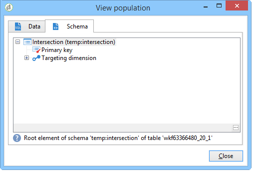

# Enriquecer dados{#enriching-data}

## Sobre o enriquecimento de dados {#about-enriching-data}

Este caso de uso detalha possíveis usos da atividade **[!UICONTROL Enrichment]** em um fluxo de trabalho de direcionamento. Para obter mais informações sobre como usar a atividade **[!UICONTROL Enrichment]**, consulte [Enriquecimento](enrichment.md).

Um caso de uso sobre como enriquecer uma entrega de email com datas personalizadas também está disponível [nesta seção](email-enrichment-with-custom-date-fields.md).

Os contatos do banco de dados de marketing recebem um convite para participar de uma competição por meio de um aplicativo Web. Os resultados da competição são recuperados na tabela **[!UICONTROL Competition results]**. Esta tabela está vinculada à tabela de contatos (**[!UICONTROL Recipients]**). A tabela **[!UICONTROL Competition results]** contém os seguintes campos:

* Competition name (@game)
* Trial number (@trial)
* Score (@pontuação)

Um contato encontrado na tabela **[!UICONTROL Recipients]** pode ser vinculado a várias linhas na tabela **[!UICONTROL Competition results]**. A relação entre essas duas tabelas é do tipo 1-n. Aqui está um exemplo dos logs de resultados de um destinatário:

O objetivo desse caso de uso é enviar entregas personalizadas às pessoas que faziam parte da competição mais recente, dependendo de suas pontuações mais altas. O destinatário com a pontuação mais alta obtém o primeiro prêmio, o destinatário com a segunda pontuação mais alta recebe um prêmio de consolação e todos os outros obtêm uma mensagem desejando uma sorte melhor da próxima vez.

Para configurar esse caso de uso, criamos o seguinte workflow para construção do target:

Para criar o workflow, aplique as seguintes etapas:

1. Duas atividades **[!UICONTROL Query]** e uma atividade **[!UICONTROL Intersection]** são adicionadas para direcionar novos assinantes que entraram por último na competição.
1. A atividade **[!UICONTROL Enrichment]** é usada para adicionar dados armazenados na tabela **[!UICONTROL Competition results]**. O campo **[!UICONTROL Score]**, onde ocorrerá a personalização de entrega, é adicionado à tabela de trabalho do fluxo de trabalho.
1. A atividade do tipo **[!UICONTROL Split]** é usada para criar subconjuntos de destinatários com base em pontuações.
1. Para cada subconjunto, uma atividade **[!UICONTROL Delivery]** é adicionada.

## Etapa 1: Direcionamento {#step-1--targeting}

O primeiro query é usado para direcionar recipients que foram adicionados ao banco de dados nos últimos seis meses.

O segundo query é usado para direcionar os recipients que faziam parte da última competição.

Em seguida, uma atividade tipo **[!UICONTROL Intersection]** é adicionada para direcionar os destinatários incluídos no banco de dados nos últimos seis meses e que entraram na última competição.

## Etapa 2: Enriquecimento {#step-2--enrichment}

Neste exemplo, saiba como personalizar entregas de acordo com o campo **[!UICONTROL Score]** armazenado na tabela **[!UICONTROL Competition results]**. Esta tabela tem um relacionamento de tipo 1-n com a tabela de destinatários. A atividade **[!UICONTROL Enrichment]** é usada para adicionar dados de uma tabela vinculada à dimensão do filtro à tabela de trabalho do fluxo de trabalho.

1. Na tela de edição da atividade de enriquecimento, selecione **[!UICONTROL Add data]**, então **[!UICONTROL Data linked to the filtering dimension]** e clique em **[!UICONTROL Next]**.

   

1. Em seguida, selecione a opção **[!UICONTROL Data linked to the filtering dimension]**, selecione a tabela **[!UICONTROL Competition results]** e clique em **[!UICONTROL Next]**.

   

1. Digite um ID e um rótulo e selecione a opção **[!UICONTROL Limit the line count]** no campo **[!UICONTROL Data collected]**. No campo **[!UICONTROL Lines to retrieve]**, selecione &#39;1&#39; como um valor. A atividade de enriquecimento adicionará uma única linha da tabela **[!UICONTROL Competition results]** à tabela de trabalho do fluxo de trabalho para cada destinatário. Clique em **[!UICONTROL Next]**.

   

1. Neste exemplo, devemos recuperar a pontuação mais alta do destinatário, mas apenas da última competição. Para fazer isso, adicione um filtro ao campo **[!UICONTROL Competition name]** para excluir todas as linhas relacionadas às competições anteriores. Clique em **[!UICONTROL Next]**.

   

1. Vá para a tela **[!UICONTROL Sort]** e clique no botão **[!UICONTROL Add]**, selecione o campo **[!UICONTROL Score]** e marque a caixa na coluna **[!UICONTROL descending]** para classificar os itens dos campos **[!UICONTROL Score]** em ordem decrescente. Para cada destinatário, a atividade de enriquecimento adiciona uma linha que corresponde à pontuação mais alta para o último jogo. Clique em **[!UICONTROL Next]**.

   

1. Na janela **[!UICONTROL Data to add]**, clique duas vezes no campo **[!UICONTROL Score]**. Para cada destinatário, a atividade de enriquecimento adicionará somente o campo **[!UICONTROL Score]**. Clique em **[!UICONTROL Finish]**.

   

Clique com o botão direito do mouse na transição de entrada da atividade de enriquecimento e selecione **[!UICONTROL Display the target]**. A tabela de trabalho contém os seguintes dados:

O schema vinculado é:

Renovar esta operação na transição de saída da atividade de enriquecimento. Podemos ver que os dados vinculados às pontuações do destinatário foram adicionados. A pontuação mais alta de cada destinatário foi recuperada.

O schema correspondente também foi enriquecido.

## Etapa 3: Divisão e entrega {#step-3--split-and-delivery}

Para classificar os destinatários com base em suas pontuações, uma atividade **[!UICONTROL Split]** é adicionada após o enriquecimento.

1. Um subconjunto do primeiro (**Vencedor**) foi definido para incluir o destinatário com a pontuação mais alta. Para fazer isso, defina uma limitação do número de registros, aplique uma classificação decrescente à pontuação e limite o número de registros a 1.

   

1. O subconjunto do segundo (**Segundo lugar**) inclui o destinatário com a segunda pontuação mais alta. A configuração é igual ao primeiro subconjunto.

   

1. O terceiro subconjunto (**perdedores**) contém todos os outros destinatários. Acesse a guia **[!UICONTROL General]** e marque a caixa **[!UICONTROL Generate complement]** para direcionar todos os destinatários que não atingiram as duas pontuações mais altas.

   

1. Adicione uma atividade do tipo **[!UICONTROL Delivery]** para cada subconjunto, usando um template de entrega diferente para cada um.

   
