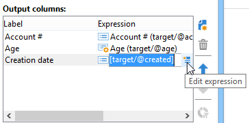

# Extração de dados (arquivo){#extraction-file}

Você pode extrair dados de uma tabela de workflow em um arquivo externo usando a atividade **[!UICONTROL Data extraction (file)]**.

>[!CAUTION]
>
>Essa atividade sempre deve ter uma transição de entrada que contenha os dados a serem extraídos.

Para configurar a extração de dados, siga as seguintes etapas:

1. Especifique o nome do arquivo de output: esse nome pode conter variáveis, inseridas por meio do botão de personalização à direita do campo.
1. Clique em **[!UICONTROL Edit the file format...]** para selecionar os dados que serão extraídos.

   

   A opção **[!UICONTROL Handle groupings (GROUP BY + HAVING)]** adiciona uma etapa extra para filtrar o resultado final do agregado, por exemplo, em um determinado tipo de pedido, clientes que fizeram mais de 10 pedidos, etc.

1. Se necessário, você pode adicionar novas colunas ao arquivo de output, como, por exemplo, computar ou processar resultados. Para fazer isso, clique no ícone **[!UICONTROL Add]**.

   

   Na linha adicional, clique no ícone **[!UICONTROL Edit expression]** para definir o conteúdo da nova coluna.

   

   Você então acessará a janela de seleção. Clique em **[!UICONTROL Advanced selection]** para escolher o processo a ser aplicado aos dados.

   

   Escolha a fórmula desejada na lista.

   

Você pode definir um pós-processo que será executado durante a extração de dados, permitindo a compactação ou criptografia dos arquivos. Para fazer isso, o comando desejado deve ser adicionado na guia da atividade **[!UICONTROL Script]**.

Para obter mais informações, consulte esta seção: [Compactar ou criptografar um arquivo](use-workflow-data.md#zipping-or-encrypting-a-file).

## Lista de funções agregadas {#list-of-aggregate-functions}

Veja a seguir uma lista de funções agregadas disponíveis:

* **[!UICONTROL Count]** para contar todos os valores não nulos do campo a ser agregado, incluindo valores duplicados (do campo de agregação),

  **[!UICONTROL Distinct]** para contar o número total de valores diferentes e não nulos do campo a ser agregado (valores duplicados são excluídos antes do cálculo),

* **[!UICONTROL Sum]** para calcular a soma dos valores de um campo numérico,
* **[!UICONTROL Minimum value]** para calcular os valores mínimos de um campo (numérico ou não),
* **[!UICONTROL Maximum value]** para calcular os valores máximos de um campo (numérico ou não),
* **[!UICONTROL Average]** para calcular a média dos valores de um campo numérico.
