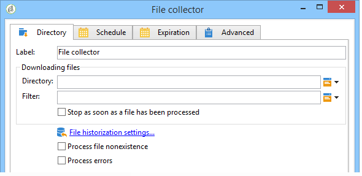
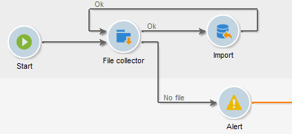

# File collector{#file-collector}

O **File collector** monitora a chegada de um ou mais arquivos em um diretório e ativa sua transição para cada arquivo recebido. Para cada evento, uma variável **[!UICONTROL filename]** contém o nome completo do arquivo recebido. Os arquivos coletados são movidos para outro diretório para fins de arquivamento e para garantir que eles sejam contados apenas uma vez.

Por padrão, o coletor de arquivos é uma tarefa persistente que testa a presença de arquivos nos horários especificados pelo agendamento.

Os arquivos devem estar no servidor no qual o módulo wfserver desse fluxo de trabalho é executado. Se vários módulos wfserver forem implantados em uma única instância, a afinidade das atividades usando esses arquivos ou a afinidade geral do fluxo de trabalho deverá ser especificada.

## Propriedades {#properties}

A primeira guia da atividade **[!UICONTROL File collector]** permite selecionar o diretório de origem e, se necessário, filtrar os arquivos coletados. As outras guias são detalhadas em [Inbound Emails](inbound-emails.md) (guias **[!UICONTROL Schedule]** e **[!UICONTROL Expiry]**).

1. **Download de arquivos**

   * **[!UICONTROL Directory]**

     Diretório contendo os arquivos a serem baixados. Esse diretório deve ser criado antes do servidor: se ele não existir, um erro será gerado.

   * **[!UICONTROL Filter]**

     Somente os arquivos correspondentes a este filtro são considerados. Os outros arquivos no diretório são ignorados. Se o filtro estiver vazio, todos os arquivos no diretório serão considerados. Exemplos de filtro: **&#42;.zip**, **import-&#42;.txt**.

   * **[!UICONTROL Stop as soon as a file has been processed]**

     Se essa opção estiver habilitada, a tarefa terminará após a recepção do primeiro arquivo. Se vários arquivos correspondentes ao filtro estiverem presentes no diretório, somente um será considerado. Essa opção garante que somente um evento será enviado. O arquivo considerado é o primeiro na lista em ordem alfabética.

     Para uma atividade não agendada, se nenhum arquivo correspondente ao filtro for encontrado no diretório especificado, e se a opção **[!UICONTROL Process file nonexistence]** não estiver habilitada, será gerado um erro.

   * **[!UICONTROL Execution schedule]**

     Determina a frequência da verificação de presença do arquivo por meio dos parâmetros da guia **[!UICONTROL Schedule]**.

1. **Tratamento de erros**

   As duas opções seguintes estão disponíveis:

   * **[!UICONTROL Process file nonexistence]**

     Essa opção inicia uma transição especial sempre que nenhum arquivo correspondente ao filtro é encontrado no diretório especificado.

     Se a tarefa não estiver agendada, essa transição será ativada apenas uma vez.

   * **[!UICONTROL Processing errors]**

     Essa opção faz surgir uma transição especial, para ser ativada se um erro for gerado. Nesse caso, o fluxo de trabalho não muda para o status de erro e continua a execução

     Os erros considerados são erros do sistema de arquivos (o arquivo não pôde ser movido, o diretório não pôde ser acessado etc.).

     Essa opção não processa erros relacionados à configuração de atividade, ou seja, valores inválidos.

1. **Historização**

   Consulte a etapa **[!UICONTROL File historization]** aqui: [Download da Web](web-download.md).

A ordem de processamento do arquivo não pode ser determinada. Para processar um conjunto de arquivos sequencialmente, use a opção **[!UICONTROL Stop as soon as a file has been processed]** e crie um loop. Nesse caso, os arquivos serão processados em ordem alfabética. A opção **[!UICONTROL Process file nonexistence]** permite concluir a iteração.

## Parâmetros de saída {#output-parameters}

* filename: nome completo do arquivo. Este é o nome de arquivo depois que ele foi movido para o diretório de historização. Portanto, o caminho é diferente, mas o nome também é diferente se outro arquivo com o mesmo nome já existir no diretório. A extensão é mantida.
