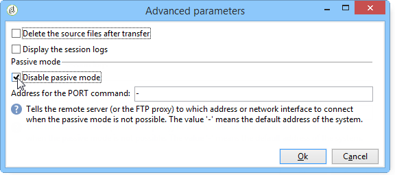

# Transferência de arquivos{#file-transfer}

A atividade de **transferência de arquivos** permite receber ou enviar arquivos, testar a presença de arquivos ou listar arquivos em um servidor. O protocolo usado é Azure Blob Storage, Amazon Simple Storage Service (S3), FTP ou SFTP.
Com S3, Azure Blob Storage ou conexão SFTP, você também pode importar dados de segmento para o Adobe Campaign com uma plataforma de dados do cliente em tempo real. Para obter mais informações, consulte esta [documentação](https://experienceleague.adobe.com/docs/experience-platform/destinations/catalog/email-marketing/adobe-campaign.html?lang=pt-BR).

## Propriedades {#properties}

Use a lista suspensa do campo **[!UICONTROL Action]** para selecionar a ação da atividade.

A configuração depende da ação selecionada.

1. **Recebimento de arquivos**

   Para receber arquivos armazenados em um servidor remoto, selecione **[!UICONTROL File download]** no campo **[!UICONTROL Action]**. Você deve especificar o URL no campo relevante.

   

   Marque **[!UICONTROL Use an external account]** para selecionar uma conta do Azure Blob Storage, S3, FTP ou SFTP configurada no nó **[!UICONTROL Administration > Platform > External accounts]** da árvore. Em seguida, especifique qual diretório no servidor contém o(s) arquivo(s) a ser(em) baixado(s).

   

1. **Transferência de arquivos**

   Para enviar um arquivo a um servidor, selecione **[!UICONTROL File upload]** no campo **[!UICONTROL Action]**. Você deve especificar o servidor alvo na seção do editor **[!UICONTROL Remote server]**. Os parâmetros são os mesmos dos arquivos de entrada. Veja acima.

   O arquivo de origem pode vir da atividade anterior. Nesse caso, a opção **[!UICONTROL Use the file generated by the previous activity]** deve ser selecionada.

   

   Isso também pode envolver um ou mais arquivos. Para selecioná-los, desmarque a opção e clique em **[!UICONTROL Insert]**. Especifique o caminho de acesso do arquivo a ser enviado. Para adicionar outro arquivo, clique em **[!UICONTROL Insert]** novamente. Os arquivos agora têm sua própria guia.

   

   Use as setas para modificar a ordem de exibição das guias: Isso se relaciona à ordem em que os arquivos são enviados para o servidor.

   A opção **[!UICONTROL Keep history of files sent]** permite rastrear os arquivos enviados. Esse histórico é acessível no diretório.

1. **Teste para ver se o arquivo existe**

   Para testar a existência de um arquivo, selecione a opção **[!UICONTROL Test to see if file exists]** no campo **[!UICONTROL Action]**. A configuração do servidor remoto é igual ao do download de arquivos. Para obter mais informações, consulte esta [seção](#properties).

   

1. **Listagem de arquivos**

   Para listar os arquivos, selecione a opção **[!UICONTROL File listing]** no campo **[!UICONTROL Action]**. A configuração do servidor remoto é a mesma do recebimento de arquivos. Para obter mais informações, consulte esta [seção](#properties).

   A opção **[!UICONTROL List all files]**, disponível ao selecionar a ação **[!UICONTROL File listing]**, permite armazenar todos os arquivos presentes no servidor na variável de evento **vars.filenames** em que os nomes dos arquivos são separados por `\n`caracteres.

Há duas opções possíveis para todas as opções de transferência de arquivos:

* A opção **[!UICONTROL Process missing file]** adiciona uma transição que é ativada se nenhum arquivo for encontrado no diretório especificado.
* A opção **[!UICONTROL Process errors]** é detalhada em [Processamento de erros](monitor-workflow-execution.md#processing-errors).

O link **[!UICONTROL Advanced parameters...]** permite acessar as seguintes opções:

* **[!UICONTROL Delete the source files after transfer]**

  Apaga os arquivos no servidor remoto. Se deixar essa opção desmarcada, certifique-se de monitorar manualmente o tamanho do conteúdo arquivado no diretório SFTP.

* **[!UICONTROL Use SSL]**

  Permite usar uma conexão segura pelo protocolo SSL durante transferências de arquivos.

* **[!UICONTROL Display the session logs]**

  Permite recuperar os logs do armazenamento de Blob do Azure, transferência S3, FTP ou SFTP e incluí-los nos logs de fluxo de trabalho.

* **[!UICONTROL Disable passive mode]**

  Permite especificar a porta de conexão que será usada para a transferência de dados.

O link **[!UICONTROL File historization settings...]** permite o acesso a opções detalhadas em [Web download](web-download.md) (etapa **[!UICONTROL File historization]**).

## Parâmetros de entrada {#input-parameters}

* filename

  Nome completo do arquivo enviado.

## Parâmetros de saída {#output-parameters}

* filename

  Complete o nome do arquivo recebido se a opção **[!UICONTROL Use the file generated by the previous activity]** estiver selecionada.
