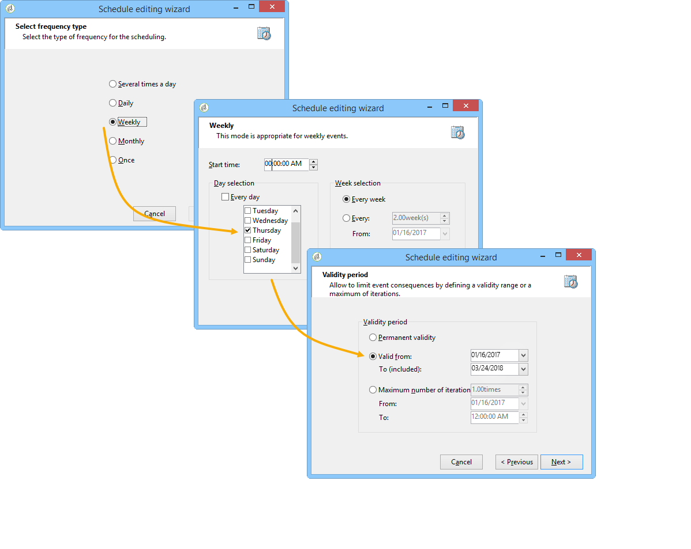

# Consulta incremental{#incremental-query}

Uma consulta incremental permite selecionar periodicamente um target com base em um critério, enquanto exclui as pessoas já alvos desse critério.

A população que já foi alvo é armazenada na memória pela instância de fluxo de trabalho e por atividade, ou seja, dois fluxos de trabalho iniciados do mesmo modelo não compartilham o mesmo log. Por outro lado, duas tarefas baseadas na mesma consulta incremental para a mesma instância de fluxo de trabalho usarão o mesmo log.

A consulta é definida da mesma forma que as consultas padrão, mas sua execução é agendada.

**Tópicos relacionados:**

* [Caso de uso: atualização da lista trimestral usando uma consulta incremental](quarterly-list-update.md)
* [Criação de consulta](query.md#creating-a-query)

>[!CAUTION]
>
>Se o resultado de uma consulta incremental for igual a **0** durante uma de suas execuções, o fluxo de trabalho será pausado até a próxima execução programada da consulta. As transições e as atividades que seguem a consulta incremental não são, portanto, processadas antes da execução a seguir.

Para fazer isso:

1. Na guia **[!UICONTROL Scheduling & History]**, selecione a opção **[!UICONTROL Schedule execution]**. A atividade permanece ativa após a criação e será acionada somente nos horários especificados pelo agendamento para execução da consulta. No entanto, se a opção estiver desabilitada, a consulta será executada imediatamente, **de uma só vez**.
1. Clique no botão **[!UICONTROL Change]**.

   Na janela **[!UICONTROL Schedule editing wizard]**, você pode configurar o tipo de frequência, a recorrência do evento e o período de validade do evento.

   

1. Clique em **[!UICONTROL Finish]** para salvar o cronograma.

   

1. A seção inferior da guia **[!UICONTROL Scheduling & History]** permite selecionar o número de dias que serão considerados no histórico.

   

   * **[!UICONTROL History in days]**

     Os destinatários já alvos podem ser registrados em um número máximo de dias a partir do dia de envio do target. Se esse valor for zero, os destinatários nunca serão removidos do log.

   * **[!UICONTROL Keep history when starting]**

     Essa opção não permite limpar o log quando a atividade estiver habilitada.

   * **[!UICONTROL SQL table name]**

     Esse parâmetro permite sobrecarregar a tabela SQL padrão que contém os dados do histórico.

## Parâmetros de saída {#output-parameters}

* tableName
* esquema
* recCount

Esse conjunto de três valores identifica a população de destino da consulta. **[!UICONTROL tableName]** é o nome da tabela que registra os identificadores de público-alvo, **[!UICONTROL schema]** é o esquema da população (normalmente, nms:recipient) e **[!UICONTROL recCount]** é o número de elementos na tabela.
