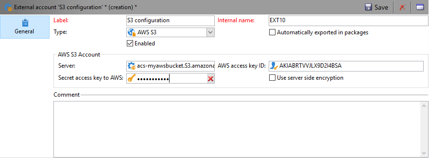
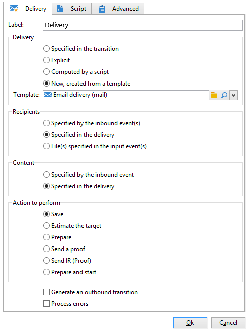

# Carregar conteúdo da entrega{#loading-delivery-content}

Se o conteúdo de entrega estiver disponível em um arquivo HTML localizado em servidores Amazon S3, FTP ou SFTP, é possível carregar facilmente esse conteúdo nas entregas do Adobe Campaign.

Para fazer isso:

1. Se ainda não tiver definido uma conexão entre o Adobe Campaign e o servidor (S)FTP que hospeda os arquivos de conteúdo, crie uma nova conta externa S3, FTP ou SFTP em **[!UICONTROL Administration]** > **[!UICONTROL Platform]** > **[!UICONTROL External Accounts]**. Especifique nesta conta externa o endereço e as credenciais usadas para estabelecer a conexão com o servidor S3 ou (S)FTP.

   Veja um exemplo de uma conta externa S3:

   

1. Crie um novo fluxo de trabalho, por exemplo, em **[!UICONTROL Profiles and Targets]** > **[!UICONTROL Jobs]** > **[!UICONTROL Targeting workflows]**.
1. Adicione uma atividade **[!UICONTROL File transfer]** ao fluxo de trabalho e a configure especificando:

   * A conta externa a ser usada para se conectar ao servidor S3 ou (S)FTP.
   * O caminho do arquivo no servidor S3 ou (S)FTP.

   

1. Adicione uma atividade **[!UICONTROL Delivery]** e conecte-a à transição de saída da atividade **[!UICONTROL File transfer]**. Configure como apresentado a seguir:

   * Entrega: de acordo com suas necessidades, pode ser uma entrega específica que já foi criada no sistema ou uma nova entrega com base em um modelo existente.
   * Destinatários: neste exemplo, é considerado que o target é especificado na própria entrega.
   * Conteúdo: mesmo que o conteúdo seja importado na atividade anterior, selecione **[!UICONTROL Specified in the delivery]**. Como o conteúdo é importado diretamente de um arquivo localizado em um servidor remoto, ele não tem identificador quando processado pelo fluxo de trabalho e não pode ser identificado como proveniente do evento de entrada.
   * Ação a executar: selecione **[!UICONTROL Save]** para salvar a entrega e acessá-la a partir de **[!UICONTROL Campaign management]** > **[!UICONTROL Deliveries]** após a execução do fluxo de trabalho.

   

1. Na guia **[!UICONTROL Script]** da atividade **[!UICONTROL Delivery]**, adicione o seguinte comando para carregar o conteúdo do arquivo importado na entrega:

   ```
   delivery.content.html.source=loadFile(vars.filename)
   ```

   

1. Salve e execute o fluxo de trabalho. Uma nova entrega com o conteúdo carregado é criada em **[!UICONTROL Campaign management]** > **[!UICONTROL Deliveries]**.

