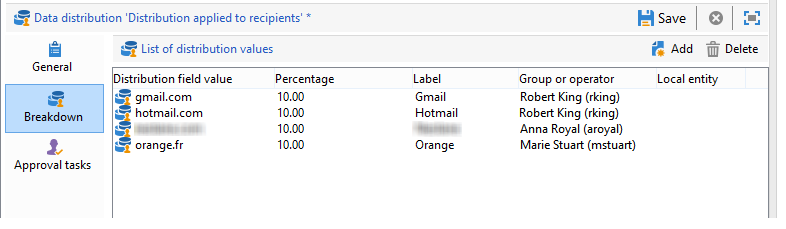

# Usar a atividade de aprovação local{#using-the-local-approval-activity}

A atividade **[!UICONTROL Local approval]** integrada em um workflow de direcionamento permite a configuração de um processo de aprovação do recipient antes que o delivery seja enviado.

>[!CAUTION]
>
>Para usar essa função, é necessário adquirir o módulo Marketing Distribuído, que é uma opção do Campaign. Verifique o contrato de licença.

Para configurar esse caso de uso, criamos o seguinte workflow para construção do target:

As principais etapas do ciclo de aprovação de conteúdo são:

1. A amostragem resultante do direcionamento pode ser limitada graças a uma atividade tipo **[!UICONTROL Split]** que usa um template de distribuição de dados.

   

1. A atividade **[!UICONTROL Local approval]** enviará um email de notificação para cada supervisor local. A atividade permanece pendente até que cada supervisor local aprove os recipients atribuídos a eles.

1. Ao atingir o prazo final para aprovação, o workflow será iniciado novamente. Neste exemplo, a atividade **[!UICONTROL Delivery]** é iniciada e o delivery é enviado aos targets aprovados.

   >[!NOTE]
   >
   >Ao atingir o prazo final, os recipients que não tiverem sido aprovados serão excluídos do target.

   

1. Alguns dias depois, a segunda atividade do tipo **[!UICONTROL Local approval]** envia um email de notificação para cada supervisor local com um resumo das ações executadas pelos contatos (cliques, aberturas etc.).

## Etapa 1: criar o modelo de distribuição de dados {#step-1--creating-the-data-distribution-template-}

O modelo de distribuição de dados permite limitar o público resultante do direcionamento com base no agrupamento de dados, permitindo atribuir cada valor a um supervisor local. Neste exemplo, definimos o campo **[!UICONTROL Email address domain]** como um campo de distribuição e atribuímos um domínio a cada supervisor local

Para obter mais informações sobre como criar um template de distribuição de dados, consulte [Limitação do número de registros de subconjunto por distribuição de dados](split.md#limiting-the-number-of-subset-records-per-data-distribution).

1. Para criar o template de distribuição de dados, vá para o nó **[!UICONTROL Resources > Campaign management > Data distribution]** e clique em **[!UICONTROL New]**.

   

1. Selecione a guia **[!UICONTROL General]**.

   

1. Insira o **[!UICONTROL Label]** e o **[!UICONTROL Distribution context]**. Neste exemplo, selecionamos o schema de direcionamento **[!UICONTROL Recipient]** e o campo **[!UICONTROL Email domain]** como um campo de distribuição. A lista de recipients será dividida por domínio.
1. No campo **[!UICONTROL Distribution type]**, selecione como o valor de limitação de target será expresso na guia **[!UICONTROL Distribution]**. Aqui, escolhemos **[!UICONTROL Percentage]**.
1. No campo **[!UICONTROL Approval storage]**, insira o schema de armazenamento das aprovações que correspondem ao schema de definição do target em uso. Aqui vamos usar o schema de armazenamento padrão: **[!UICONTROL Local approval of recipients]**.
1. Depois clique no link **[!UICONTROL Advanced parameters]**.

   

1. Mantenha a opção **[!UICONTROL Approve the targeted messages]** selecionada de forma que todos os recipients sejam pré-selecionados da lista de recipients a serem aprovados.
1. No campo **[!UICONTROL Delivery label]**, deixamos a expressão padrão (cálculo da string da entrega). O rótulo padrão do delivery será usado na notificação de feedback.
1. Na seção **[!UICONTROL Grouping field]**, selecionamos o campo **[!UICONTROL Gender]** como um campo de agrupamento para exibir recipients nas notificações de aprovação e de feedback.
1. Na seção **[!UICONTROL Edit targeted messages]**, selecionamos o aplicativo web **[!UICONTROL Edit recipients]** e o parâmetro **[!UICONTROL recipientId]**. Nas notificações de aprovação e de feedback, os recipients serão clicáveis e apontarão para a URL da aplicação Web. O parâmetro de URL adicional será **[!UICONTROL recipientId]**.
1. Depois, clique na guia **[!UICONTROL Distribution]**. Para cada domínio, insira os seguintes campos:

   

   * **[!UICONTROL Value]**: insira o valor do nome de domínio.
   * **[!UICONTROL Percentage / Fixed]**: para cada domínio, insira o máximo. número de recipients para os quais você deseja enviar o delivery. Neste exemplo, queremos limitar o delivery a 10% por domínio.
   * **[!UICONTROL Label]**: digite o rótulo do domínio a ser exibido nas notificações de aprovação e de feedback.
   * **[!UICONTROL Group or operator]**: selecione o operador ou grupo de operadores atribuídos ao domínio.

     >[!CAUTION]
     >
     >Verifique se os operadores receberam os direitos apropriados.

## Etapa 2: criar o fluxo de trabalho de direcionamento {#step-2--creating-the-targeting-workflow}

Para configurar esse caso de uso, criamos o seguinte workflow para construção do target:

As seguintes atividades foram adicionadas:

* Duas atividades **[!UICONTROL Query]**,
* Uma atividade **[!UICONTROL Intersection]**,
* Uma atividade **[!UICONTROL Split]**,
* Uma atividade **[!UICONTROL Local approval]**,
* Uma atividade **[!UICONTROL Delivery]**,
* Uma atividade **[!UICONTROL Wait]**,
* Uma segunda atividade **[!UICONTROL Local approval]**,
* Uma atividade **[!UICONTROL End]**.

### Consultas, Intersecção e Split {#queries--intersection-and-split}

O direcionamento de upstream é composto de duas consultas, uma intersecção e um Split. O público resultante do direcionamento pode ser limitado por meio de uma atividade **[!UICONTROL Split]** usando um template de distribuição de dados.

Para obter mais informações sobre como configurar uma atividade Split, consulte [Split](split.md). A criação de um template de distribuição de dados é detalhada em [Limitação do número de registros do subconjunto por distribuição de dados](split.md#limiting-the-number-of-subset-records-per-data-distribution).

Se não quiser limitar o público da query, não utilize as atividades **[!UICONTROL Query]**, **[!UICONTROL Intersection]** e **[!UICONTROL Split]**. Nesse caso, complete o template de distribuição de dados na primeira atividade **[!UICONTROL Local approval]**.

1. Na seção **[!UICONTROL Record count limitation]**, selecione a opção **[!UICONTROL Limit the selected records]** e clique no link **[!UICONTROL Edit]**.

   

1. Selecione a opção **[!UICONTROL Keep only the first records after sorting]** e clique em **[!UICONTROL Next]**.

   

1. Na seção **[!UICONTROL Sort columns]**, adicione o campo no qual a classificação é aplicada. Aqui, escolhemos o campo **[!UICONTROL Email]**. Clique em **[!UICONTROL Next]**.

   

1. Selecione a opção **[!UICONTROL By data distribution]** e o template de distribuição criado anteriormente (consulte [Etapa 1: criação do template de distribuição de dados](#step-1--creating-the-data-distribution-template-)) e clique em **[!UICONTROL Finish]**.

   

No template de distribuição, limitamos o público a 10% por valor de agrupamento, o que coincide com os valores exibidos no workflow (340 como entrada e 34 como saída).

### Notificação de aprovação {#approval-notification}

A atividade **[!UICONTROL Local approval]** permite enviar uma notificação para cada supervisor local.

Para obter mais informações sobre como configurar a atividade **[!UICONTROL Local approval]**, consulte [Aprovação de local](local-approval.md).

Os seguintes campos precisam ser inseridos:

1. Na seção **[!UICONTROL Action to execute]** selecione a opção **[!UICONTROL Target approval notification]**.
1. Na seção **[!UICONTROL Distribution context]** selecione a opção **[!UICONTROL Specified in the transition]**.

   Se não quiser limitar o público-alvo, selecione a opção **[!UICONTROL Explicit]** e insira o template de distribuição criado anteriormente no campo **[!UICONTROL Data distribution]**.

1. Na seção **[!UICONTROL Notification]**, selecione o template do delivery e o assunto a ser usado para o email de notificação. Aqui, escolhemos o template padrão: **[!UICONTROL Local approval notification]**.
1. Na seção **[!UICONTROL Approval schedule]**, mantivemos o prazo de aprovação padrão (3 dias) e adicionamos um lembrete. O delivery será enviado 3 dias após o início da aprovação. Ao atingir o prazo final de aprovação, os recipients que não foram aprovados não serão considerados.

Um email de notificação é enviado pelo **[!UICONTROL Local approval]** atividade para supervisores locais.

### Aguardar {#wait}

A atividade de espera permite adiar o início da segunda atividade de aprovação local que enviará a notificação de feedback de entrega. No campo **[!UICONTROL Duration]**, inserimos o valor **[!UICONTROL 5d]** (5 dias). As ações executadas por recipients em um período de cinco dias após o envio do delivery serão incluídas na notificação de feedback.

### Notificação de feedback {#feedback-notification}

A segunda atividade **[!UICONTROL Local approval]** permite enviar uma notificação de feedback de delivery para cada supervisor local.

Os seguintes campos precisam ser inseridos.

1. Na seção **[!UICONTROL Action to execute]**, selecione **[!UICONTROL Delivery feedback report]**.
1. Na seção **[!UICONTROL Delivery]**, selecione **[!UICONTROL Specified in the transition]**.
1. Na seção **[!UICONTROL Notification]**, selecione o template do delivery e o assunto a ser usado para o email de notificação.

Quando o prazo configurado na atividade de espera é atingido, a segunda atividade do tipo **[!UICONTROL Local approval]** envia o email de notificação a seguir para cada supervisor local:

### Controle de aprovação pelo administrador {#approval-tracking-by-the-administrator}

Toda vez que a atividade de aprovação local começa, uma tarefa de aprovação é criada. O administrador pode controlar cada tarefa de aprovação.

Vá para o workflow para construção do target da sua campanha e clique na guia **[!UICONTROL Local approval tasks]**.

A lista de tarefas de aprovação local também pode ser acessada pela guia **[!UICONTROL Approval tasks]** do template de distribuição de dados.

Selecione a tarefa que deseja monitorar e clique no botão **[!UICONTROL Detail]**. A guia **[!UICONTROL General]** da tarefa de aprovação local permite exibir informações da tarefa. Se necessário, você pode alterar a aprovação e as datas de lembrete.

Essa guia exibe as seguintes informações:

* o rótulo da tarefa e sua ID
* o template de distribuição usado
* o número de mensagens de target
* o workflow e campanha vinculados
* o cronograma da tarefa

A guia **[!UICONTROL Distribution]** da tarefa permite visualizar os logs de aprovação, o status, o número de mensagens direcionadas, a data de aprovação e o operador que aprovou o delivery.

Selecione um log de aprovação e clique no botão **[!UICONTROL Detail]** para exibir mais informações. A guia **[!UICONTROL General]** do log de aprovação local permite exibir informações gerais de log. Você também pode alterar o status de aprovação.

Essa guia exibe as seguintes informações:

* a tarefa de aprovação vinculada
* o status de aprovação (**[!UICONTROL Approved]** ou **[!UICONTROL Pending]**)
* o template de distribuição usado
* o supervisor local que aprovou e a data de aprovação
* o número de mensagens de target e aprovadas

A guia **[!UICONTROL Targeted]** do log de aprovação exibe a lista de recipients alvos e seu status de aprovação. Você pode alterar este status, se necessário.

