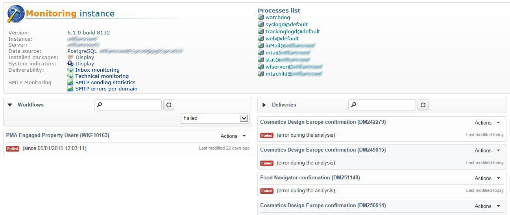

# Monitorar fluxos de trabalho técnicos {#monitoring-technical-workflows}

Os workflows técnicos precisam ser monitorados e ações precisam ser realizas quando falharem.

## Painel de monitoramento de instância {#instance-monitoring-dashboard}

O painel de monitoramento da instância pode ser acessado por meio da guia **[!UICONTROL Monitoring]**.

Em Indicadores do sistema e arquivos principais, verifique se nenhum indicador está realçado em vermelho. Se esse for o caso, e alguns são, você deve:

* Verifique se os processos necessários estão sempre em execução,
* Verifique se nenhum dos processos é muito antigo,
* Verifique se os arquivos de log de diferentes processos não contêm erros recorrentes e alarmantes.

## Workflows técnicos {#technical-workflows}

Os workflows técnicos estão disponíveis em **[!UICONTROL Administration]** > **[!UICONTROL Production]** > **[!UICONTROL Technical workflows]**.

Dependendo do workflow técnico, siga as etapas detalhadas abaixo para garantir que tudo funcione conforme esperado.

Para entender melhor o que cada workflow técnico deve realizar, consulte esta [seção](technical-workflows.md).

Para **[!UICONTROL Database Cleanup workflow ('cleanup')]**:

Verifique o journal para verificar se o tempo decorrido é relativamente constante ao longo do tempo e não interfere em outros workflows.

Para **[!UICONTROL Tracking workflow ('tracking')]**:

Verifique se o workflow de rastreamento é executado como agendado (a cada hora por padrão) e se o journal não realça erros recorrentes. Para obter mais informações, consulte esta [seção](delivery.md).

Para **[!UICONTROL Deliverability update ('deliverabilityUpdate')]**:

1. Verifique se o workflow **[!UICONTROL Deliverability update]** é executado e finalizado com êxito todos os dias.
1. Verifique no journal se as regras estão sendo atualizadas regularmente.

Para **[!UICONTROL Campaign process ('operationMgt', 'deliveryMgt', ...)]**:

1. Examine todos os workflows localizados na pasta **[!UICONTROL Campaign process]**. Para obter mais informações, consulte esta [página](technical-workflows.md).
1. Verifique se os workflows são executados como agendados e se o journal não realça erros recorrentes.

## Supervisão de fluxo de trabalho {#workflow-supervision}

O grupo **[!UICONTROL Workflow supervisors]** deve conter operadores que precisam ser informados sobre falhas e quem pode realizar uma ação a tempo.

Um alerta deve ser gerado e enviado ao grupo correto no caso de problema.

Verifique se cada operador tem um endereço de email válido.

Qualquer workflow que deve ser executado para manter o funcionamento da plataforma, como importações diárias de dados, deve ser declarado como &quot;Produção&quot; (caixa de seleção) e aparecer em negrito.

## Lista de manutenção de fluxo de trabalho {#workflow-maintenance-list}

Todos os workflows técnicos personalizados devem ser documentados em uma planilha que contém:

* Nome e local do workflow.
* Finalidade.
* Agendamento e dependências.
* Operador responsável pelo monitoramento.
* Instruções sobre o que fazer em caso de erro.

## Planejamento e automação do monitoramento {#planning-and-automation-of-monitoring}

O monitoramento do workflow de planejamento aumenta sua eficiência. Algumas tarefas precisam ocorrer diariamente enquanto outras podem ser realizadas semanalmente ou mensalmente.

A definição de workflows em pastas chamadas por recorrência e classificadas por agendamento de execução melhora a eficiência do monitoramento.

A automação do monitoramento reduz a sobrecarga dos recursos e garante que as tarefas sejam agendadas na frequência apropriada.

É possível criar um workflow de monitoramento para enviar um email sempre que determinadas tarefas falharem ou quando uma tabela crítica tornar-se muito grande.

Você pode criar uma exibição para que todos os workflows entre uma área funcional ou todo o sistema sejam monitorados.

Você também pode usar a tarefa do Adobe Campaign ou a funcionalidade do relatório para criar a documentação sob demanda, que está sempre atualizada.
