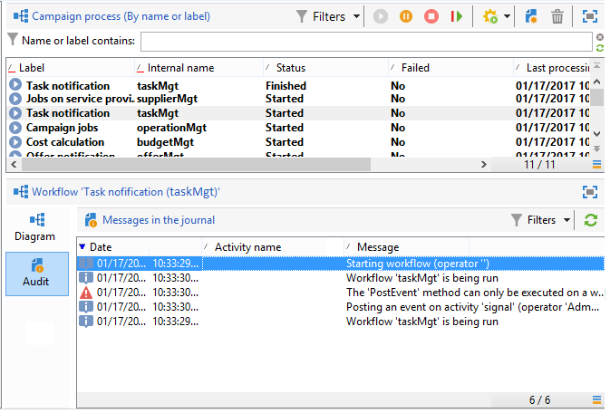
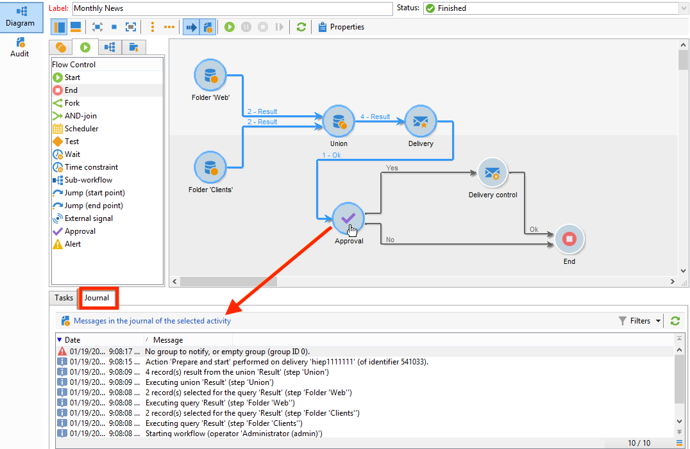
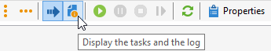
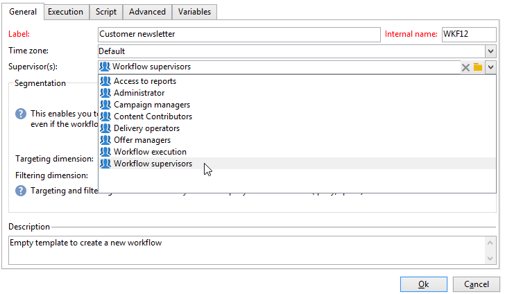
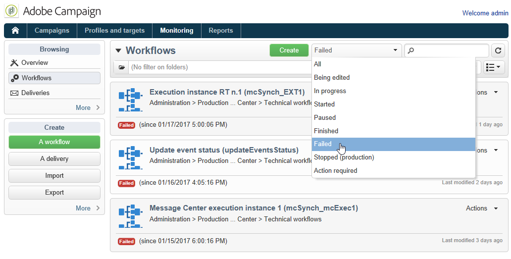

# Monitorar a execução do fluxo de trabalho {#monitoring-workflow-execution}

Esta seção apresenta informações sobre como monitorar a execução de workflows.

Também está disponível [nesta sessão](workflow-supervision.md#supervising-workflows), um caso de uso que detalha a criação de workflows que permite monitorar o status de um conjunto de workflows &quot;pausados&quot;, &quot;interrompidos&quot; ou &quot;com erros&quot;.

Além disso, os administradores da instância podem usar a **Trilha de auditoria** para verificar as atividades, as últimas modificações feitas e o status dos fluxos de trabalho. Saiba mais sobre Trilha de auditoria em  [Documentação do Campaign Classic v7](https://experienceleague.adobe.com/docs/campaign-classic/using/monitoring-campaign-classic/production-procedures/audit-trail.html#accessing-audit-trail){target="_blank"}.

## Exibição do progresso {#displaying-progress}

Você pode monitorar a execução ao exibir o progresso usando o ícone apropriado na barra de ferramentas.

O ícone **[!UICONTROL Display progress information]** permite exibir o status e o resultado da atividade na tela de execução.


Quando essa opção é selecionada, as atividades executadas são exibidas em azul, as atividades pendentes piscam, os avisos são exibidos em laranja e os erros em vermelho. Essa opção também exibe o resultado das atividades na transição de saída, seguido do rótulo do resultado conforme definido nas propriedades da atividade e da duração da tarefa se ela exceder um segundo


## Exibição de logs {#displaying-logs}

O log contém o histórico ou a trilha de auditoria do workflow. Ele registra todas as ações do usuário, todas as operações executadas e erros encontrados. É possível:

* Selecione a guia **[!UICONTROL Tracking]** no detalhe. Esta lista contém todas as mensagens de workflow.

  

* Filtrar as mensagens de log por atividade. Para fazer isso, clique em **[!UICONTROL Display the tasks and the log]** na barra de ferramentas acima do diagrama para exibir as guias **[!UICONTROL Log]** e **[!UICONTROL Tasks]** logo abaixo. Selecionar uma atividade para exibir todas as mensagens relacionadas. Esta lista contém todas as mensagens quando nenhuma atividade é selecionada.

  

  >[!NOTE]
  >
  >Clicar no plano de fundo do diagrama para anular a seleção de todos os elementos.

* Visualizar apenas as mensagens vinculadas a uma determinada tarefa. Para fazer isso, selecione a guia **[!UICONTROL Tasks]** e selecione uma atividade no diagrama para restringir a lista. Clique duas vezes em uma tarefa para exibir as informações. A última guia na janela contém o log.

  

  O botão **[!UICONTROL Details...]** permite a exibição de todas as informações adicionais sobre a execução da atividade. Por exemplo, você pode exibir o operador de validação e, quando aplicável, o comentário inserido durante a aprovação.

>[!NOTE]
>
>O log não é removido quando um workflow é reiniciado. Todas as mensagens são mantidas. Se desejar descartar as mensagens de uma execução anterior, você deve limpar o histórico.

O log exibe a lista cronológica de mensagens de execução relacionadas às atividades do workflow para construção do target.

* Log de uma campanha de target

  Depois da execução da campanha de target, clique na guia **[!UICONTROL Tracking]** para exibir o rastreamento de execução.

  

  Todas as mensagens da campanha são exibidas: campanhas realizadas, assim como avisos ou erros.

* Log de uma atividade

  Você também pode exibir o log de execução e os detalhes de cada atividade. Há duas maneiras de fazer isso:

   1. Selecione a atividade de target e clique no ícone **[!UICONTROL Display the tasks and the log]**.

      

      A seção abaixo do diagrama exibe duas guias: Log e Tasks.

      As atividades selecionadas no diagrama atuam como filtros na lista de logs e tarefas.

      

   1. Clique com o botão direito do mouse na atividade de target e selecione **[!UICONTROL Display logs]**.

      

      O log é exibido em uma janela separada.

## Remoção dos logs {#purging-the-logs}

O histórico do fluxo de trabalho não é removido automaticamente: todas as mensagens são mantidas por padrão. O histórico pode ser eliminado por meio do menu **[!UICONTROL File > Actions]** ou clicando no botão **[!UICONTROL Actions]** localizado na barra de ferramentas acima da lista. Selecione **[!UICONTROL Purge history]**. As opções disponíveis no menu **[!UICONTROL Actions]** estão detalhadas na seção [da barra de ferramentas de Ações](start-a-workflow.md)


## Esquema de fluxo de trabalho e tabelas de trabalho {#worktables-and-workflow-schema}

O workflow transmite tabelas de trabalho que podem ser manipuladas por determinadas atividades. O Adobe Campaign permite, por meio de atividades de Gestão de Dados, modificar, renomear e enriquecer as colunas das tabelas de trabalho do workflow, por exemplo, para alinhar com a nomenclatura dependendo das necessidades do cliente, para coletar informações adicionais sobre o cobeneficiários de um contrato etc.

Também é possível criar vínculos entre várias dimensões de trabalho e definir alterações de dimensão. Por exemplo, para cada contrato registrado no banco de dados, direcione o titular principal e use dados de cotitular nas informações adicionais.

As tabelas de trabalho do workflow é excluído automaticamente quando o workflow fica passivo. Para manter uma tabela de trabalho, salve-a em uma lista por meio da atividade **[!UICONTROL List update]** (consulte [Atualização da lista](list-update.md)).

## Gestão de erros {#managing-errors}

Quando ocorre um erro, o fluxo de trabalho é pausado e a atividade está sendo executada quando a ocorrência do erro pisca em vermelho. Na visão geral do fluxo de trabalho, na guia **[!UICONTROL Monitoring]** - no link **[!UICONTROL Workflows]**, você pode exibir workflows apenas com erros, conforme mostrado abaixo.


No Adobe Campaign Explorer, a lista de workflows exibe uma coluna **[!UICONTROL Failed]** por padrão.


Quando um workflow está com erro, os operadores pertencentes ao grupo de supervisão do workflow são notificados por email, desde que seus endereços de email estejam listados em seus perfis. Esse grupo é selecionado no campo **[!UICONTROL Supervisor(s)]** das propriedades do workflow.



O conteúdo da notificação é configurado no template padrão **[!UICONTROL Workflow manager notification]** : Este modelo é selecionado na guia **[!UICONTROL Execution]** das propriedades do workflow. A notificação mostra o nome do workflow com erro e a tarefa relacionada.

Exemplo de notificação:


O link permite acessar o Console do cliente do Adobe Campaign no modo da Web e trabalhar no workflow com erro após fazer logon.


Você pode configurar o fluxo de trabalho para que ele não seja pausado e continue a execução em caso de erros. Para fazer isso, edite as **[!UICONTROL Properties]** do workflow e, na seção **[!UICONTROL Error management]**, selecione a opção **[!UICONTROL Ignore]** no campo **[!UICONTROL In case of error]**. Você pode então especificar o número de erros consecutivos que podem ser ignorados antes que o processo seja pausado.

Nesse caso, a tarefa com erro é anulada. Esse modo é particularmente adequado para workflows projetados para tentar novamente a campanha mais tarde (ações periódicas).


>[!NOTE]
>
>Você pode aplicar essa configuração individualmente para cada atividade. Para fazer isso, edite as propriedades da atividade e selecione o modo de gerenciamento de erro na guia **[!UICONTROL Advanced]**.

## Processamento de erros {#processing-errors}

Com relação às atividades, a opção **[!UICONTROL Process errors]** exibe uma transição específica que é habilitada ao gerar um erro. Nesse caso, o workflow não entra no modo de erro e a execução continua.

Os erros considerados são erros do sistema de arquivos (o arquivo não pôde ser movido, o diretório não pôde ser acessado etc.).

Essa opção não processa erros relacionados à configuração de atividade, ou seja, valores inválidos. Erros relacionados à configuração com falha não permitirão essa transição (o diretório não existe, etc.).

Se um workflow está pausado (manualmente ou automaticamente após um erro), o botão **[!UICONTROL Start]** reinicia-o a partir de onde parou. A atividade incorreta (ou atividade pausada) será executada novamente. As atividades anteriores não são executadas novamente.

Para executar novamente todas as atividades do workflow, use o botão **[!UICONTROL Restart]**.

Se você modificar atividades já executadas, as alterações não serão consideradas quando a execução do workflow for reiniciada.

Se você modificar atividades não executadas, elas serão consideradas quando a execução do workflow for reiniciada.

Se você modificar atividades em pausa, as alterações não serão consideradas corretamente quando o workflow for reiniciado.

Se possível, recomendamos reiniciar completamente o workflow após realizar as modificações.

## Supervisão de instância {#instance-supervision}

A página **[!UICONTROL Instance supervision]** permite visualizar a atividade do servidor do Adobe Campaign e exibir a lista de fluxos de trabalho e entregas com erros.

Para acessar essa página, acesse a guia **[!UICONTROL Monitoring]** e clique no link **[!UICONTROL General view]**.


Para exibir todos os workflows, clique no link **[!UICONTROL Workflows]**. Use a lista suspensa para exibir os workflows na plataforma com base em seu estado.



Clique no link em um workflow com erros para abri-lo e visualizar seu log.


## Evitar várias execuções simultâneas {#preventing-simultaneous-multiple-executions}

Um único workflow pode ter várias execuções ativas ao mesmo tempo. Isso deve ser evitado em alguns casos.

Por exemplo, você pode ter um scheduler acionando a execução do workflow a cada hora, mas, às vezes, a execução do workflow inteiro demora mais de uma hora. Talvez você queira ignorar a execução se o workflow já estiver em execução.

Se você tiver uma atividade de sinal no início do workflow, talvez queira ignorar o sinal se o workflow estiver em execução.

O princípio geral é o seguinte:


A solução é usar uma variável de instância. As variáveis de instância são compartilhadas por todas as execuções paralelas dos workflows.

Um exemplo de workflow de teste simples:


O **[!UICONTROL Scheduler]** está acionando um evento a cada minuto. A seguinte atividade **[!UICONTROL Test]** vai testar a variável da instância **isRunning** para decidir se continua ou não a execução:


>[!NOTE]
>
>**isRunning** é um nome da variável escolhido para este exemplo. Essa não é uma variável interna.

A atividade imediatamente após o **[!UICONTROL Test]** na ramificação **yes** deve definir a variável da instância no seu **Initialization script**:

```
instance.vars.isRunning = true
```

A última atividade na ramificação **sim** deve reverter a variável para falso em seu **script de Inicialização**:

```
instance.vars.isRunning = false
```

Observe que:

* Você pode verificar o valor atual da variável da instância por meio da guia **Variáveis** nas **Propriedades** do workflow.
* As variáveis de instância são redefinidas quando você reinicia um workflow.
* Em JavaScript, um valor indefinido é falso em um teste, permitindo testar a variável da instância mesmo antes de ter inicializado.
* Você pode monitorar as atividades que não são processadas devido a este mecanismo ao adicionar uma instrução de log ao script de inicialização do final &quot;nenhum&quot;.

  ```
  logInfo("Workflow already running, parallel execution not allowed.");
  ```

Nesta seção é apresentado um caso de uso: [Coordenação de atualizações de dados](coordinate-data-updates.md).

## Manutenção do banco de dados {#database-maintenance}

Os workflows usam muitas tabelas de trabalho que consomem espaço e acabam reduzindo o desempenho da plataforma inteira se não houver manutenção.

O workflow de **limpeza do banco de dados** pode ser acessado por meio do nó **Administração > Produção > Workflows técnicos**, permite excluir dados obsoletos para evitar o crescimento exponencial do banco de dados. O fluxo de trabalho é acionado automaticamente sem a intervenção do usuário.

Você também pode criar workflows técnicos específicos para limpar o consumo de espaço desnecessário de dados. Consulte e esta [seção](#purging-the-logs).

## Manuseio de workflows pausados {#handling-of-paused-workflows}

Por padrão, se um workflow estiver pausado, suas tabelas de trabalho nunca serão apagadas. A partir do build 8880, os workflows pausados por muito tempo são interrompidos automaticamente e suas tabelas de trabalho são removidas. Esse comportamento é acionado da seguinte maneira:

* Os fluxos de trabalho pausados por mais de sete dias aparecem como um aviso no painel de monitoramento (e na API de monitoramento) e uma notificação é enviada ao grupo supervisor.
* O mesmo acontece toda semana, quando o workflow técnico **[!UICONTROL cleanupPausedWorkflows]** é acionado. Para obter mais informações sobre o fluxo de trabalho, consulte [esta seção](delivery.md).
* Após quatro notificações (ou seja, um mês no estado pausado por padrão), o fluxo de trabalho é interrompido incondicionalmente. Um log aparece no fluxo de trabalho após sua interrupção. As tabelas são removidas na próxima execução **[!UICONTROL cleanup]** do workflow

Esses períodos podem ser configurados por meio da opção NmsServer_PausedWorkflowPeriod.

Os supervisores de workflow são notificados. O criador e o último usuário que modificou o workflow também são notificados. Os administradores não recebem as notificações.

## Filtragem de workflows de acordo com seu status{#filtering-workflows-status}

A interface do Campaign Classic permite monitorar o status de execução de todos os workflows na instância usando **visualizações** predefinidas. Para acessar essas exibições, abra o nó **[!UICONTROL Administration]** / **[!UICONTROL Audit]** / **[!UICONTROL Workflows Status]**.

As seguintes visualizações estão disponíveis:

* **[!UICONTROL Running]**: lista todos os workflows em execução.
* **[!UICONTROL Paused]**: lista todos os workflows pausados.
* **[!UICONTROL Failed]**: lista todos os workflows com falha.
* ** ).


Por padrão, essas exibições estão acessíveis na pasta **[!UICONTROL Audit]**. No entanto, é possível recriá-los no local de escolha na árvore de pastas. Dessa forma, eles estarão disponíveis para usuários padrão sem nenhum direito administrativo.

Para fazer isso:

1. Clique com o botão direito do mouse na pasta onde deseja adicionar a exibição.
1. Em **[!UICONTROL Add new folder]** / **[!UICONTROL Administration]**, selecione a exibição que deseja adicionar.
1. Depois que a pasta for adicionada à árvore, certifique-se de configurá-la como uma visualização, para que ela exiba todos os workflows, qualquer que seja a pasta de origem. Para obter mais informações sobre como configurar visualizações, consulte [esta página](../../v8/audiences/folders-and-views.md#turn-a-folder-to-a-view).

Além dessas exibições, é possível configurar as pastas de filtros que permitem filtrar a lista de workflows de acordo com o status de execução. Para fazer isso:

1. Acesse uma pasta do tipo workflow e selecione o menu **[!UICONTROL Filters]** / **[!UICONTROL Advanced filter]**.
1. Configure o filtro para que o campo **[!UICONTROL @status]** do workflow seja igual ao estado escolhido.
1. Salve e nomeie o filtro. Assim ele estará disponível diretamente na lista de filtros.


Para obter mais informações, consulte esta seção.
